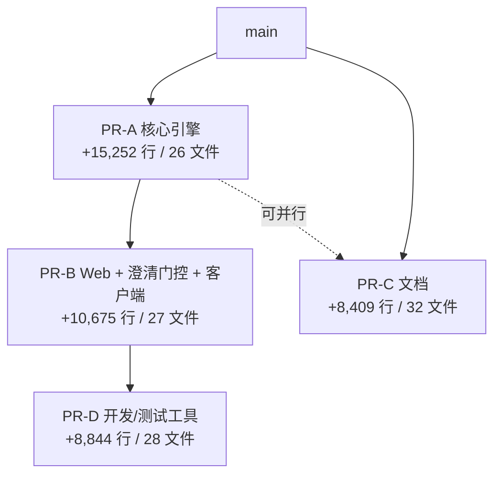

# PR 拆分合入主线操作说明

> **工作指导（长期保留）**：本文件是 `lhq-rag-dev` → `main` 拆 PR / 合入顺序的权威说明。  
> **禁止**在「清理开发文档 / 误暂存文件」类提交中删除本文件。  
> 须随 **PR-A / PR-B / PR-C / PR-D** 与 `lhq-rag-dev` 保留；合入 `main` 后继续留在主线，供后续 PR-B 及日常开发对照。  
> Agent / 协作者改代码、开 PR、拣文件前先读本文。

> 适用分支：`lhq-rag-dev` → `main`  
> 背景：单 PR 约 **+43,180 行**（`113 files`），超过 GitHub Copilot review 上限（约 2 万行），且与 `main` 存在 merge conflicts。  
> 策略：拆成 **4 个独立 PR**，每个 < 2 万行，按依赖顺序合入。

---

## 一、为什么要拆

| 指标 | 数值 |
|------|------|
| 总新增行数 | ~43,180（删 245 行） |
| Copilot review 上限 | ~20,000 |
| `docs/` 占比 | ~19.5%（去掉仍 ~34.8k 行） |
| 最大单文件 | `scripts/image_query_refs.py`（+7,698） |

**结论**：仅剔除 `docs/` 不够；需按**功能模块 + 依赖关系**拆分。

---

## 二、四个 PR 总览



| PR | 分支名建议 | 新增行数 | 合并顺序 | Copilot |
|----|-----------|---------|----------|---------|
| PR-A 核心引擎 | `pr-a-core-engine` | +15,252 | **第 1** | 可 review |
| PR-B Web 产品层 | `pr-b-web-ui` | +10,675 | **第 2**（依赖 A） | 可 review |
| PR-C 文档 | `pr-c-docs` | +8,409 | 随时（可与 A 并行） | 可 review |
| PR-D 开发工具 | `pr-d-dev-tooling` | +8,844 | **第 3**（依赖 B） | 可 review |

推荐时间线：

1. **Week 1**：PR-A 合入；PR-C 可同步提
2. **Week 2**：PR-B 合入
3. **Week 3**：PR-D 合入

---

## 三、各 PR 文件清单

### PR-A：核心 RAG 引擎

**范围**：灌库、检索、rerank、图文关联；不含 Web UI。

```
raganything/__init__.py
raganything/clarify_context.py
raganything/clarify_gate.py
raganything/local_hf_embedding.py
raganything/modalprocessors.py
raganything/naive_relevance.py
raganything/parser.py
raganything/pipeline_rerank.py
raganything/processor.py
raganything/prompt_manager.py
raganything/query.py
raganything/query_timing_trace.py
raganything/table_matrix.py
raganything/utils.py

scripts/rag_pipeline_parse_graph_chat.py
scripts/image_query_refs.py
scripts/build_table_matrix_from_storage.py
scripts/strip_table_flat_from_chunks.py
scripts/list_ingested_docs.py
scripts/naive_relevance.py

tests/testparser_ingest_coalesce.py
pyproject.toml
uv.lock
config/env.example
config/query_steering_profiles.json
env.example

docs/PR拆分合入主线操作说明.md
```

> 本操作说明须随 PR-A 进入 `main`，后续 PR-B/C/D 不得删除。

**合入后验证**：

```powershell
pytest tests/testparser_ingest_coalesce.py -q
uv run python scripts/rag_pipeline_parse_graph_chat.py --help
```

**Copilot review 重点**：`utils.py` 图文配对、`processor.py` coalesce、`image_query_refs.py` 查询配图。

---

### PR-B：Web UI + 查询接线 + 客户端

**范围**：浏览器问答、澄清门控接线、客户端打包；**依赖 PR-A 已合入**。

```
scripts/rag_web_server.py
scripts/query_doc_steering.py
scripts/query_progress_hooks.py
scripts/query_debug_dump.py
scripts/stream_cot_parser.py
scripts/clear_query_llm_cache.py

scripts/client_env_manager.py
scripts/client_launcher.py
scripts/client_launcher_exe.py
scripts/client_paths.py
scripts/client_setup_service.py
scripts/pack_client.bat
scripts/pack_client.ps1
scripts/stage_client_models.bat

web/index.html
web/setup.html
web/static/app.js
web/static/images/nanxing-logo.png
web/static/ingest_ui.js
web/static/setup.css
web/static/setup.js
web/static/styles.css
web/static/vendor/marked.min.js
web/static/vendor/purify.min.js

.gitignore
README.md
README_zh.md
```

**合入后验证**：

```powershell
uv sync --extra web
uv run python scripts/rag_web_server.py
# 浏览器打开 http://127.0.0.1:8765，跑一条 Q&A
```

**Copilot review 重点**：`rag_web_server.py` 流式接口、`query_progress_hooks.py` 钩子链、`app.js` 前端状态。

---

### PR-C：文档

**范围**：设计文档、测试参考答案、fixtures；**不影响运行时，可与 PR-A 并行**。

```
docs/   （整个目录，当前分支相对 main 的全部变更）
```

主要大文件：

- `docs/统一图文关联架构实施方案.md`
- `docs/版本改动记录.md`
- `docs/澄清门控实现说明_v3.md` / `v4.md`
- `docs/网页问答界面.md`
- `docs/fixtures/q15_电控板_ground_truth/`（含 8 张图片）

**注意**：图片为二进制，不占文本行数，但会增加 PR 文件数。

---

### PR-D：开发/测试工具

**范围**：bench、replay、eval、回归脚本；**建议在 PR-B 合入后提交**。

```
scripts/analyze_clarify_threshold.py
scripts/audit_q15_ingest.py
scripts/bench_clarify_green8.py
scripts/bench_probe_timing_green8.py
scripts/build_ragas_ground_truth_shili17.py
scripts/build_voice_script_tests.py
scripts/capture_merged_chunk_ids.py
scripts/debug_q3_citation.py
scripts/dump_query_context.py
scripts/eval_ragas_webpath.py
scripts/extract_voice_green8.py
scripts/fill_voice_script_xlsx.py
scripts/recover_clarify_replay_from_terminal.py
scripts/relevance_distribution_charts.py
scripts/relevance_per_question_charts.py
scripts/replay_clarify_gate_green8.py
scripts/replay_placement_dumps.py
scripts/report_relevance_keywords_shili17_green8.py
scripts/run_demo_question_bank.py
scripts/run_test_cases_report.py
scripts/run_voice_script_tests.py
scripts/run_web_path_q1_13.py
scripts/run_web_path_q1_17.py
scripts/score_query_relevance.py
scripts/standalone_rerank_stress.py
scripts/stress_gpu_vram.py
scripts/test_clarify_gate_batch.py
scripts/time_clarify_gate.py
```

**合入后验证**（任选 smoke）：

```powershell
uv run python scripts/run_web_path_q1_17.py --help
```

---

## 四、操作前准备

### 4.1 确保源分支最新且已解决冲突

在 `lhq-rag-dev` 上先把 `main` 合进来（**merge，不必 rebase**）：

```powershell
git fetch origin
git checkout lhq-rag-dev
git merge origin/main
```

若有冲突，重点处理这 3 个文件（两边改动尽量都保留）：

- `raganything/local_hf_embedding.py`
- `raganything/processor.py`
- `scripts/rag_pipeline_parse_graph_chat.py`

解决后：

```powershell
git add raganything/local_hf_embedding.py raganything/processor.py scripts/rag_pipeline_parse_graph_chat.py
git commit -m "merge: resolve main conflicts on processor, embedding, and pipeline CLI"
git push origin lhq-rag-dev
```

> **说明**：后续 4 个 PR 分支都从**已解决冲突的 `lhq-rag-dev`** 或 **`origin/main`（PR-A 合入后）** 拣文件，避免重复解冲突。

### 4.2 关闭或标记原大 PR

原来的 `lhq-rag-dev → main` 大 PR 可以：

- **关闭（Close）**，改用下面 4 个小 PR；或
- 改为 **Draft**，4 个都合入后自动关闭。

---

## 五、创建各 PR 分支（推荐方法：从 main 拣文件）

核心思路：从干净的 `origin/main` 拉分支，再用 `git checkout lhq-rag-dev -- <路径>` 拣入本 PR 需要的文件。

### 5.1 创建 PR-A

```powershell
git fetch origin
git checkout -b pr-a-core-engine origin/main

git checkout lhq-rag-dev -- `
  raganything/ `
  scripts/rag_pipeline_parse_graph_chat.py `
  scripts/image_query_refs.py `
  scripts/build_table_matrix_from_storage.py `
  scripts/strip_table_flat_from_chunks.py `
  scripts/list_ingested_docs.py `
  scripts/naive_relevance.py `
  tests/testparser_ingest_coalesce.py `
  pyproject.toml uv.lock `
  config/env.example config/query_steering_profiles.json `
  env.example

git add -A
git commit -m "feat: core RAG engine with ingest, rerank, and image pipeline"
git push -u origin pr-a-core-engine
```

在 GitHub 创建 PR：**`pr-a-core-engine` → `main`**，标题示例：

> feat: core RAG engine (ingest, rerank, image pipeline)

---

### 5.2 创建 PR-B（等 PR-A 合入后，或先基于 PR-A 分支开发）

**推荐**：PR-A 合入 `main` 后再做，冲突最少。

```powershell
git fetch origin
git checkout -b pr-b-web-ui origin/main

git checkout lhq-rag-dev -- `
  scripts/rag_web_server.py `
  scripts/query_doc_steering.py `
  scripts/query_progress_hooks.py `
  scripts/query_debug_dump.py `
  scripts/stream_cot_parser.py `
  scripts/clear_query_llm_cache.py `
  scripts/client_env_manager.py `
  scripts/client_launcher.py `
  scripts/client_launcher_exe.py `
  scripts/client_paths.py `
  scripts/client_setup_service.py `
  scripts/pack_client.bat `
  scripts/pack_client.ps1 `
  scripts/stage_client_models.bat `
  web/ `
  .gitignore README.md README_zh.md

git add -A
git commit -m "feat: Web Q&A UI, clarify gate wiring, and client packaging"
git push -u origin pr-b-web-ui
```

在 GitHub 创建 PR：**`pr-b-web-ui` → `main`**

若 PR-A 尚未合入、想提前开 PR-B：可从 `pr-a-core-engine` 分支创建，合入前在 GitHub 上把 base 保持为 `main`，并 rebase 到已合入 A 的 `main`。

---

### 5.3 创建 PR-C（可与 PR-A 并行）

```powershell
git fetch origin
git checkout -b pr-c-docs origin/main

git checkout lhq-rag-dev -- docs/

git add -A
git commit -m "docs: architecture plans, test references, and clarify gate design"
git push -u origin pr-c-docs
```

在 GitHub 创建 PR：**`pr-c-docs` → `main`**

---

### 5.4 创建 PR-D（建议 PR-B 合入后）

```powershell
git fetch origin
git checkout -b pr-d-dev-tooling origin/main

git checkout lhq-rag-dev -- `
  scripts/analyze_clarify_threshold.py `
  scripts/audit_q15_ingest.py `
  scripts/bench_clarify_green8.py `
  scripts/bench_probe_timing_green8.py `
  scripts/build_ragas_ground_truth_shili17.py `
  scripts/build_voice_script_tests.py `
  scripts/capture_merged_chunk_ids.py `
  scripts/debug_q3_citation.py `
  scripts/dump_query_context.py `
  scripts/eval_ragas_webpath.py `
  scripts/extract_voice_green8.py `
  scripts/fill_voice_script_xlsx.py `
  scripts/recover_clarify_replay_from_terminal.py `
  scripts/relevance_distribution_charts.py `
  scripts/relevance_per_question_charts.py `
  scripts/replay_clarify_gate_green8.py `
  scripts/replay_placement_dumps.py `
  scripts/report_relevance_keywords_shili17_green8.py `
  scripts/run_demo_question_bank.py `
  scripts/run_test_cases_report.py `
  scripts/run_voice_script_tests.py `
  scripts/run_web_path_q1_13.py `
  scripts/run_web_path_q1_17.py `
  scripts/score_query_relevance.py `
  scripts/standalone_rerank_stress.py `
  scripts/stress_gpu_vram.py `
  scripts/test_clarify_gate_batch.py `
  scripts/time_clarify_gate.py

git add -A
git commit -m "chore: add bench, replay, and eval tooling scripts"
git push -u origin pr-d-dev-tooling
```

在 GitHub 创建 PR：**`pr-d-dev-tooling` → `main`**

---

## 六、合并顺序与冲突处理

### 推荐合并顺序

```
PR-A → PR-B → PR-D
PR-C 任意时刻（与 A 并行无依赖）
```

### 若 PR-B 与 main 冲突

PR-A 合入后，`main` 已有 `raganything/*` 等文件；开 PR-B 时若基于旧的 `origin/main` 创建，需：

```powershell
git fetch origin
git checkout pr-b-web-ui
git rebase origin/main
# 或 git merge origin/main
# 解决冲突后 push
```

### merge 还是 rebase？

| 场景 | 建议 |
|------|------|
| `lhq-rag-dev` 吸收 `main` 的冲突 | **merge**（一次解决，不需 force push） |
| 小 PR 分支跟进已更新的 `main` | **rebase** 或 **merge** 均可 |
| 已 push 的 PR 分支整理历史 | 避免随意 force push；用 `--force-with-lease` 且确认无他人协作 |

---

## 七、PR 描述模板（复制到 GitHub）

### PR-A

```markdown
## Summary
- 核心库：灌库管线、rerank、图文关联（`raganything/utils.py`、`image_query_refs.py`）
- CLI：`rag_pipeline_parse_graph_chat.py`
- 不含 Web UI 与 bench 脚本

## Depends on
无（第一个合入）

## Test plan
- [ ] `pytest tests/testparser_ingest_coalesce.py -q`
- [ ] `uv run python scripts/rag_pipeline_parse_graph_chat.py --help`
```

### PR-B

```markdown
## Summary
- FastAPI Web 服务 + 浏览器问答 UI
- 澄清门控接线（`query_progress_hooks.py`）
- 客户端打包脚本

## Depends on
- PR-A 已合入 main

## Test plan
- [ ] `uv sync --extra web`
- [ ] `uv run python scripts/rag_web_server.py`
- [ ] 浏览器 Q&A smoke test
```

### PR-C

```markdown
## Summary
- 架构实施方案、澄清门控设计文档、测试参考答案
- 不影响运行时

## Test plan
- [ ] 确认无敏感信息（密钥、内网地址等）
```

### PR-D

```markdown
## Summary
- bench / replay / eval / 回归脚本（开发工具，非生产路径）

## Depends on
- PR-B 已合入 main（`run_web_path_*` 依赖 Web 路径）

## Test plan
- [ ] `uv run python scripts/run_web_path_q1_17.py --help`
```

---

## 八、全部合入后的收尾

1. 确认 4 个 PR 均已 merge 到 `main`
2. 关闭原来的大 PR（若仍开着）
3. 本地同步：

```powershell
git fetch origin
git checkout main
git pull origin main
```

4. 可选：删除远程拆分分支

```powershell
git push origin --delete pr-a-core-engine pr-b-web-ui pr-c-docs pr-d-dev-tooling
```

5. 本地开发分支 `lhq-rag-dev` 可保留作归档，或 rebase 到最新 `main` 后继续开发

---

## 九、快速自查：行数是否仍超限

在任意分支上对比 `main`：

```powershell
git fetch origin
git diff --stat origin/main...HEAD
```

若单 PR 仍 > 2 万行，用下面命令按目录看分布：

```powershell
git diff --numstat origin/main...HEAD
```

重点关注是否误把 `docs/` 或 `run_web_path_*` 混进了 PR-A / PR-B。

---

## 十、常见问题

**Q：能不能只删 `docs/` 让一个 PR 过 Copilot？**
A：不能。去掉 docs 仍约 35k 行，必须按模块拆。

**Q：PR-A 要不要包含 `clarify_gate.py`？**
A：要。澄清算法在库层（`raganything/`），Web 接线在 PR-B。拆库与 UI 更清晰。

**Q：`image_query_refs.py` 体量很大，能否单独成 PR？**
A：可以，但 PR-A 含它仍约 15k 行（当前 +7,698），在限额内；且与 `utils.py` 强耦合，建议同 PR 合入。

**Q：四个 PR 都合完后，`lhq-rag-dev` 还有用吗？**
A：可作为历史归档；新功能建议从最新 `main` 拉分支。

---

*文档生成依据：2026-07-12 对 `lhq-rag-dev` 与 `origin/main` 的 diff 统计（`2665196` 起 `image_query_refs.py` 已剔除 legacy 死代码，较初版统计少约 2.1k 行）。*
