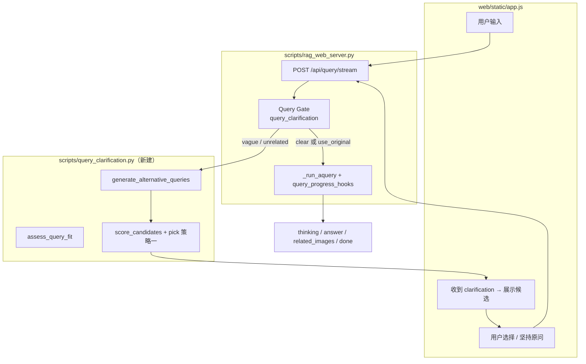

# 多轮问答（模糊问题澄清）实现方案

> **分支**：`chat-interaction`  
> **需求来源**：`docs/多轮问答.txt`  
> **关联文档**：`docs/问答全流程图.md`、`docs/网页问答界面.md`  
> **状态**：已实现（`scripts/query_clarification.py` + Web SSE + 前端澄清 UI）

---

## 1. 背景与目标

### 1.1 问题

用户提问时常出现 **表述模糊**（如「怎么保养」「油要不要加」）或与知识库 **几乎无关** 的说法。此时直接走完整 RAG（检索 → 重排 → 生成）往往：

- 检索噪声大，答案易偏；
- 浪费 LLM 与 rerank 算力；
- 前端无法给用户「把问题说清楚」的机会。

### 1.2 目标

在 **正式生成答案之前** 增加 **查询门控（Query Gate）**：

1. 用可配置的 **匹配度 score** 判断原问题是否足够清晰；
2. 不清晰时，由 LLM **生成 k 条更具体的候选问法**，再对每条做轻量检索打分；
3. 通过 **SSE 多轮交互** 把候选问法交给用户选择（或坚持原问题）；
4. 仅对 **选定/确认后的问句** 调用现有 `rag.aquery` 全流程（与 `client-dev` 配图、steering 行为一致）。

### 1.3 非目标（本期不做）

- 不替代 LightRAG 内部检索算法；
- 不在澄清阶段跑完整 `aquery`（避免双份答案 LLM）；
- 策略二「首次命中即停」本期不实现，仅预留配置项。

---

## 2. 核心概念

### 2.1 双阈值

须满足：**`threshold_lower` < `threshold_upper`**

| 名称 | 含义 | 典型用途 |
|------|------|----------|
| `threshold_lower` | 低阈值（宽松） | Case A：候选问法是否「与库有关」的底线 |
| `threshold_upper` | 高阈值（严格） | 原问是否可直接 RAG；Case B 候选是否「足够清晰」 |

> 原文 `多轮问答.txt` 中 `threshold_two < threshold_one` 即指 **lower < upper**。

### 2.2 匹配度 score（已定）

对 **每一条** 待评估的问句（原问或改写问法）：

1. 调用 **`lightrag.aquery_data`**（与 `dump_query_context.py` 同路径，**不**调答案 LLM）；
2. 在返回的 chunk 列表上取 rerank 后的 **`rerank_score`**（若未开 rerank，则用向量距离换算为相似度，实现时二选一并写死优先级）；
3. **主 score** = **top-3 `rerank_score` 的算术平均**；
4. **日志/debug** 同时记录 **top-1**，便于日后改阈值或对比。

**top-1 与 top-3 平均的区别（调参参考）**

| 聚合方式 | 行为 | 适用 |
|----------|------|------|
| top-1 | 只看最高分的一条 chunk，易被单条噪声抬高 | 希望少打断、多直接答 |
| **top-3 平均（本期默认）** | 要求前几名整体都还行，更稳、更易触发澄清 | 手册场景、模糊问法多 |

### 2.3 三种 band（分情况）

```text
score >= threshold_upper     →  band = clear      → 直接 RAG，不澄清
threshold_lower <= score < threshold_upper
                             →  band = vague      → Case B
score < threshold_lower      →  band = unrelated   → Case A
```

---

## 3. 业务规则（对齐 `多轮问答.txt` + 产品确认）

### 3.1 步骤 1：评估原问

对 **用户原始问题** 计算 `score` 与 `band`，并保留首轮 `aquery_data` 的 chunk 摘要（Case B 给 LLM 用）。

### 3.2 步骤 2：分 band 处理

#### band = clear（`score >= threshold_upper`）

- **不** 进入澄清；
- 直接 `rag.aquery(mix, stream=True, …)`，行为与当前 Web 一致（含 `query_progress_hooks`、`finalize_related_images`）。

#### band = unrelated — Case A（`score < threshold_lower`）

1. **仅** 将 **原始问题** 发给 LLM；
2. LLM 生成 **k** 条语义相近、但更贴近设备手册语境的具体问法（JSON 结构化输出）；
3. 对 **每一条** 候选调用 `assess_query_fit`（即 `aquery_data` + top-3 平均）；
4. **策略一（本期）**：保留所有 **`candidate_score > threshold_lower`** 的候选；
5. 若无候选达标 → SSE 返回「未能找到更贴切的问题，请补充机型/部位/操作」类提示，**不** 调答案 LLM。

#### band = vague — Case B（`threshold_lower <= score < threshold_upper`）

1. 将 **原始问题 + 首轮检索摘要**（若干 chunk 标题/首段，控制 token）发给 LLM；
2. LLM 生成 **k** 条改写问法；
3. 对每条候选做 `assess_query_fit`；
4. **策略一（本期）**：返回所有 **`candidate_score > threshold_upper`** 的候选（全量返回，供用户选）；
5. 若无候选达标 → 仍可展示 score 最高的 1～k 条供参考，并允许 **坚持原问题**（见 3.3）。

### 3.3 候选返回策略（本期 / 后期）

| 策略 | 行为 | 本期 |
|------|------|------|
| **策略一：全量返回** | 每个候选都检索，返回所有过线问句 | **采用** |
| 策略二：首次命中 | 按顺序检索，第一个过线即停止 | 预留 `QUERY_CLARIFY_STRATEGY=first_hit` |

### 3.4 用户操作（多轮交互）

澄清阶段前端提供：

| 操作 | 含义 | 后端 |
|------|------|------|
| 选择某条候选 | 用该句作为最终 query | `clarification_choice` = 候选全文 |
| **仍用原问题** | 用户知悉可能答偏，不拦截 | `clarification_choice` = `"use_original"` |
| 重新输入 | 新一条用户消息（可选） | 新 `query`，重新走 Gate |

---

## 4. 与现有架构的关系

### 4.1 插入点

澄清门控插在 **Web 现有入口之前**，不改变 LightRAG 内部 `kg_query` / `process_chunks_unified` 逻辑。



### 4.2 复用模块

| 模块 | 用途 |
|------|------|
| `raganything.pipeline_rerank` | `query_param_from_env`、`lightrag_global_config` |
| `lightrag.aquery_data` | 澄清阶段检索与打分（无答案 LLM） |
| `query_doc_steering` | 候选问法检索后同样可做 `file_path` / 机型过滤（与现网一致） |
| `query_progress_hooks` | **仅** 在最终 `aquery` 时安装；澄清阶段不装 |
| `image_query_refs` / `finalize_related_images` | 不变，仍在答案流结束前执行 |

### 4.3 与 `client-dev` 配图能力

澄清不改变配图逻辑；**最终** 进入 `aquery` 的文本必须是用户确认后的 query，且仍走 `operate.process_chunks_unified` 钩子同步 chunk（见 `query_progress_hooks.py`）。

---

## 5. 接口设计

### 5.1 请求体扩展（`QueryBody`）

```json
{
  "query": "怎么保养",
  "mode": "mix",
  "stream": true,
  "session_id": "optional-uuid",
  "clarification_choice": null
}
```

续轮示例：

```json
{
  "query": "怎么保养",
  "mode": "mix",
  "stream": true,
  "session_id": "same-uuid",
  "clarification_choice": "use_original"
}
```

或：

```json
{
  "clarification_choice": "高速智能封边机输送链条的保养周期是多久？"
}
```

### 5.2 SSE 事件（新增）

在现有 `status` / `thinking_delta` / `answer_delta` / `related_images` / `done` 之外增加：

| type | 字段 | 说明 |
|------|------|------|
| `clarification` | `band`, `original_query`, `original_score`, `options[]` | 需要用户选择 |
| `clarification` | `options[].query`, `options[].score`, `options[].label` | `label` 为 LLM 一句人话说明（可选） |
| `clarification` | `preview_snippets[]` | Case B 可带 1～2 条检索摘要标题 |
| `clarification_done` | — | 澄清轮结束，无答案流 |
| `gate_skip` | `reason: clear \| use_original` | 调试/前端可选展示 |

**澄清轮** 以 `clarification` + `clarification_done` 结束，**不** 发送 `answer_delta`。

**作答轮** 与现网相同，仍以 `done` 结束。

### 5.3 会话状态（服务端）

单机内存即可：

```python
pending[session_id] = {
    "original_query": str,
    "band": str,
    "candidates": list,
    "created_at": float,
}
```

TTL 建议 10～30 分钟；续问可校验 `session_id` 与 `clarification_choice` 一致性。

### 5.4 可选调试 API

`POST /api/query/assess` — 仅返回 `{score, band, top1, top3_avg, chunk_count}`，不调 LLM 改写，供脚本与运维使用。

---

## 6. 模块与文件规划

| 路径 | 职责 |
|------|------|
| `scripts/query_clarification.py` | Gate 核心：`assess_query_fit`、`generate_alternative_queries`、`run_clarification`、`pick_candidates_strategy_all` |
| `scripts/rag_web_server.py` | `_query_stream_events` 分支；`QueryBody` 字段；SSE 组装 |
| `web/static/app.js` | 澄清卡片 UI、续问 POST、`use_original` 按钮 |
| `env.example` | 阈值与 k、策略、开关 |
| `scripts/probe_query_clarify.py` | CLI：对单条问题打印 band/候选（开发调试用） |
| `docs/多轮问答实现方案.md` | 本文档 |
| `docs/问答全流程图.md` | 后续补一节「澄清门控」 |

### 6.1 `query_clarification.py` 主要函数（草案）

```python
async def assess_query_fit(lightrag, query: str, *, param, global_config) -> AssessResult:
    """aquery_data + top3_avg score + band + preview chunks."""

async def generate_alternative_queries(
    query: str, *, band: str, preview_context: str | None, k: int
) -> list[str]:
    """Case A/B 不同 system prompt；返回 k 条问法."""

async def score_candidates(lightrag, queries: list[str], ...) -> list[CandidateScore]:
    """逐条 assess；策略一不过早 break."""

async def run_clarification(lightrag, query: str, ...) -> ClarificationResult:
    """入口：可能返回 ProceedToRag | NeedUserChoice."""
```

LLM 调用：使用现有 `llm_model_func` / 短 prompt、低 `max_tokens`，输出 **JSON 数组**，便于解析与重试。

---

## 7. 配置项（`env.example` 拟增）

```bash
# --- Query clarification (multi-turn gate) ---
QUERY_CLARIFY_ENABLED=true
QUERY_SCORE_THRESHOLD_LOWER=0.28
QUERY_SCORE_THRESHOLD_UPPER=0.45
QUERY_CLARIFY_K=4
# 本期固定 strategy=all；后期可设 first_hit
QUERY_CLARIFY_STRATEGY=all
# 评估用 top-k 平均（实现写死 k=3，此项仅文档/日志说明）
# QUERY_SCORE_TOP_K=3
```

说明：

- `THRESHOLD_LOWER` 可与现网 `MIN_RERANK_SCORE`（如 0.28）同量级，**须** `< THRESHOLD_UPPER`；
- 上线后用 `probe_query_clarify.py` + `docs/测试问题` 若干模糊句校准两阈值。

---

## 8. LLM Prompt 要点

### 8.1 Case A（无检索上下文）

- 角色：设备维护保养手册问答助手；
- 输入：用户原问；
- 输出：k 条 **可检索的具体问句**（含机型/部位/操作，避免「它」「这个」）；
- 禁止：直接回答问题。

### 8.2 Case B（带检索摘要）

- 在 Case A 基础上增加 `preview_snippets`（chunk 中章节号、保养内容首句）；
- 要求改写句 **贴近手册用语**（如「高速智能封边机」「润滑脂 2#」等领域词）。

### 8.3 安全与解析

- 强制 JSON schema：`{"queries": ["...", "..."]}`；
- 解析失败 → 降级为仅 `use_original` + 提示文案，不阻塞服务。

---

## 9. 实施阶段

| 阶段 | 内容 | 产出 |
|------|------|------|
| **0** | 配置项、`AssessResult` 数据结构、score 算法（top-3 平均 + top-1 日志） | `env.example`、`query_clarification.py` 骨架 |
| **1** | `assess_query_fit` + `probe_query_clarify.py` | 命令行可测 band |
| **2** | `generate_alternative_queries` + `score_candidates`（策略一） | 端到端澄清逻辑（无 UI） |
| **3** | `rag_web_server` SSE + `QueryBody` + session | Postman/curl 可测两轮 |
| **4** | `app.js` 澄清 UI + 坚持原问 | 浏览器可测 |
| **5** | 批测脚本（Web 同路径）、更新 `问答全流程图.md` | 回归 `docs/测试问题` + 模糊样例集 |

---

## 10. 测试计划

### 10.1 用例类型

| 类型 | 示例期望 |
|------|----------|
| 清晰问法 | `docs/测试问题` 第 9 条注油泵 — `band=clear`，无澄清，配图与现网一致 |
| 模糊问法 | 「怎么保养」— `band=vague`，返回 ≥1 条 `score > upper` 的候选 |
| 几乎无关 | 「今天天气」— `band=unrelated`，候选或空 + 引导文案 |
| 坚持原问 | `clarification_choice=use_original` — 必须进入 `aquery`，且可有答案流 |
| 策略一 | 多条候选同时过线时，**全部** 出现在 `options` |

### 10.2 与 Web 对齐

批测/集成测 **禁止** 仅用 `aquery_data` + 手工 rerank 代替 Web；须：

```text
query_progress_hooks → aquery → finalize_related_images
```

澄清测 **单独** 验证 Gate；全链路测在 **选定 query 之后** 执行。

---

## 11. 风险与对策

| 风险 | 对策 |
|------|------|
| 澄清多轮 `aquery_data` × (1+k) 延迟大 | 控制 k≤4；摘要截断；后期策略二 |
| top-3 过严，清晰问也被澄清 | 调低 `upper` 或日志对比 top-1 |
| LLM 改写偏题 | Case B 必带检索摘要；steering 过滤候选检索 |
| 与配图 chunk 不一致 | 仅最终 `aquery` 走 hooks，不在澄清阶段 sync 图片 |

---

## 12. 已确认的产品决策（摘要）

1. **score**：默认 **top-3 rerank_score 平均**，日志保留 top-1。  
2. **候选策略**：本期 **策略一（全量返回）**；策略二仅预留配置。  
3. **用户坚持原问**：**允许**，`clarification_choice=use_original` 直接进入 RAG。

---

## 13. 附录：与原始需求对照

| `多轮问答.txt` | 本方案 |
|----------------|--------|
| 步骤 1 计算 score | `assess_query_fit`（top-3 平均） |
| 情况 A / B | `band` unrelated / vague |
| 生成 k 个问题 | `generate_alternative_queries` |
| 逐个匹配 | `score_candidates` |
| 策略一 / 二 | 本期仅策略一；二预留 `first_hit` |
| （未写）用户交互 | SSE `clarification` + 选候选 / `use_original` |

---

*文档版本：v1.0 · 2026-06-04 · 分支 chat-interaction*
