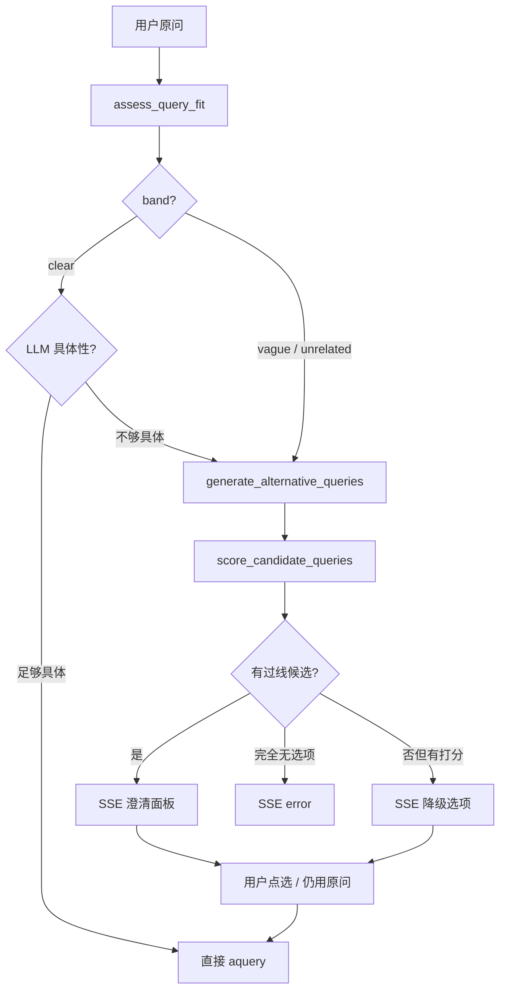
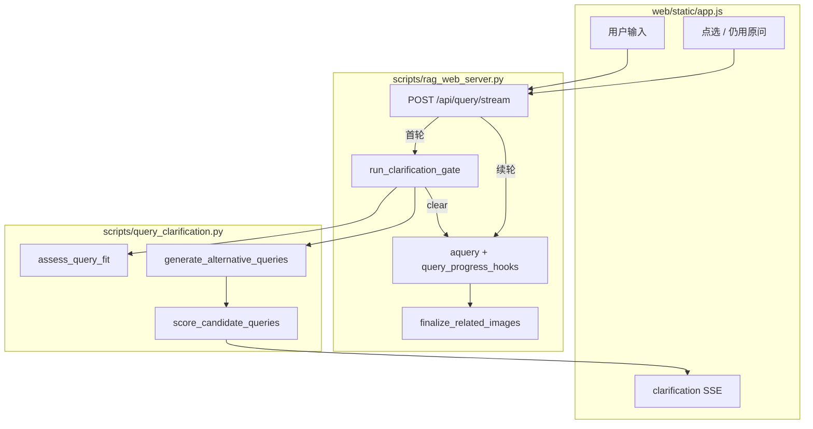

# 多轮问答（模糊问题澄清）实现方案

> **关联文档**：[`问答全流程图.md`](问答全流程图.md) · [`查询配图实现说明.md`](查询配图实现说明.md) · [`网页问答界面.md`](网页问答界面.md) · [`实现方案文档模板.md`](实现方案文档模板.md)  
> **实现位置**：`scripts/query_clarification.py` + Web SSE + 前端澄清 UI

---

## 1. 背景与目标

### 1.1 要解决的问题

用户提问时常出现 **表述模糊**（如「怎么保养」「油要不要加」）或与知识库 **几乎无关** 的说法。若直接进入完整 RAG（检索 → 重排 → 生成）：

- 检索噪声大，答案易偏；
- 浪费 LLM 与 rerank 算力；
- 前端无法给用户「把问题说清楚」的机会。

### 1.2 设计目标

在 **正式生成答案之前** 增加 **查询门控（Query Gate）**：

1. 用可配置的 **匹配度 score** 判断原问题是否足够清晰；
2. 不清晰时，由 LLM **生成 k 条更具体的候选问法**，再对每条做轻量检索打分；
3. 通过 **SSE 多轮交互** 把候选问法交给用户选择（或坚持原问题）；
4. 仅对 **选定/确认后的问句** 调用现有 `rag.aquery` 全流程（含 steering、Plan A 配图）。

### 1.3 刻意不做的事

- 不替代 LightRAG 内部检索算法；
- 澄清阶段 **不** 跑完整 `aquery`（避免双份答案 LLM）；
- 澄清阶段 **不** 安装 `query_progress_hooks`、不产出配图；
- 生产环境默认使用 `QUERY_CLARIFY_STRATEGY=all`（`first_hit` 已实现，一般无需改）。

---

## 2. 关键术语

本节说明后文反复出现的概念与函数，便于对照代码阅读。

### 2.1 `assess_query_fit`

**是什么**：澄清门控的 **核心评估函数**（`scripts/query_clarification.py`）。给定一条问句，判断它与知识库的 **检索匹配程度**，**不** 调用答案 LLM。

**做什么**：

1. 用 `lightrag.aquery_data` 做 **轻量检索**（默认 `naive` 模式、较小 `top_k`，与正式问答的 `mix` 分离）；
2. 对返回的 chunk 取 rerank 分，聚合为 **score**（默认 top-3 平均，见 §2.3）；
3. 根据 score 划分 **band**（`clear` / `vague` / `unrelated`）；
4. 从检索结果截取若干条正文，生成 **`preview_snippets`**（见 §2.2）。

**返回结构**（`AssessResult`）：

| 字段 | 含义 |
|------|------|
| `score` | 主匹配分（top-k rerank 平均） |
| `score_top1` | 最高分单 chunk 的分，便于调参对比 |
| `band` | 清晰 / 模糊 / 几乎无关 三档 |
| `preview_snippets` | 检索摘要，供 LLM 改写与具体性判断 |
| `chunk_count` | 参与打分的 chunk 数量 |

**注意**：门控评估 **不走** `query_doc_steering` 机型过滤；机型隔离在 **正式 `aquery`** 才生效。因此 band 反映「全库轻量检索」匹配度，与最终答案 scope 可能略有差异。

---

### 2.2 `preview_snippets`

**是什么**：`assess_query_fit` 从首轮检索结果里截取的 **短文本摘要列表**（默认最多 4 条，总长约 2400 字符）。

**每条怎么来**：取 chunk 正文前若干字，必要时前缀 `[文件名]`，压缩空白后拼接。

**用在哪里**：

| 场景 | 作用 |
|------|------|
| Case B 问句改写 | 作为 LLM 上下文，让改写句贴近手册用语（章节号、保养条目等） |
| LLM 具体性二次门控 | 与原始问句一起判断：检索分虽高，语义是否仍过于笼统 |
| SSE / 前端 | 通过 `clarification.preview_snippets` 下发；用户可在澄清面板「查看检索摘要」折叠区阅读 |

**不是什么**：不是完整检索上下文，不是答案正文，不参与配图扫描。

---

### 2.3 匹配度 score

对 **原问或每条候选问法**，单独调用一次 `assess_query_fit`，得到一条 score。

计算步骤：

1. `aquery_data` 检索 → chunk 列表；
2. 取各 chunk 的 **`rerank_score`**（未开 rerank 时会尝试补算）；
3. **主 score** = 得分最高的 k 条的 **算术平均**（`QUERY_SCORE_TOP_K`，默认 k=3）；
4. 同时记录 **top-1** 分，写入日志与 SSE。

| 聚合方式 | 行为 | 适用 |
|----------|------|------|
| top-1 | 只看最高分 chunk，易被单条噪声抬高 | 希望少打断、多直接答 |
| **top-k 平均（默认）** | 前几名整体都还行才高分 | 手册场景、模糊问法多 |

---

### 2.4 双阈值与 band

须满足：**`threshold_lower` < `threshold_upper`**（环境变量 `QUERY_SCORE_THRESHOLD_LOWER` / `QUERY_SCORE_THRESHOLD_UPPER`）。

| 阈值 | 环境变量 | 用途 |
|------|----------|------|
| 低阈值 lower | `QUERY_SCORE_THRESHOLD_LOWER` | 划分「几乎无关」：`score < lower` → `unrelated` |
| 高阈值 upper | `QUERY_SCORE_THRESHOLD_UPPER` | 划分「足够清晰」：`score >= upper` → `clear`；**候选问法是否过线**也看 upper |

三种 **band**：

```text
score >= upper          →  clear       可直接 RAG（或经 LLM 具体性二次判断）
lower <= score < upper  →  vague       有指向但模糊 → Case B
score < lower           →  unrelated   几乎无关     → Case A
```

---

### 2.5 其它常用符号

| 名称 | 含义 |
|------|------|
| **Case A** | `band = unrelated`：原问与库匹配极低，改写时 **只** 给 LLM 原问 |
| **Case B** | `band = vague`：有一定指向，改写时给 LLM **原问 + preview_snippets** |
| **`run_clarification_gate`** | 门控总入口：评估原问 → 必要时改写、打分 → 返回 `proceed` / `clarify` / `abort` |
| **`resolve_query_for_rag`** | 用户点选续轮时，把 `clarification_choice` 解析为最终 query |

---

## 3. 业务规则

### 3.1 总览



---

### 3.2 第一步：评估原问

调用 **`assess_query_fit(rag, 原问)`**，得到 `score`、`band`、`preview_snippets`。

**可选二次判断**（`QUERY_CLARIFY_LLM_SPECIFICITY_CHECK=true`，默认开启）：

- 当 `band = clear` 时，再调 **`llm_is_query_specific_enough`**；
- 输入：原问 + `preview_snippets`；
- 若 LLM 返回 `specific_enough = false`，**effective_band 降为 `vague`**，进入澄清；
- 示例：「怎么保养」检索分可能已达 upper，但语义仍笼统。

**不** 使用设备名、口语词表等硬编码规则。

---

### 3.3 第二步：band = clear → 直接作答

- 不进入澄清；
- 走 `rag.aquery`（用户侧栏 RAG 模式，通常 `mix`）；
- SSE 推送 **`gate_skip`**（`reason=clear`，带 `score`）。

---

### 3.4 第三步：band = vague 或 unrelated → 生成并评估候选

#### 3.4.1 生成候选

**`generate_alternative_queries`** 调用 LLM，输出 JSON `{"queries": [...]}`：

| band | LLM 输入 |
|------|----------|
| unrelated（Case A） | 仅原问 |
| vague（Case B） | 原问 + `preview_snippets` |

去重后最多 **`QUERY_CLARIFY_K`** 条（默认 4）。LLM 未生成任何改写 → **`action=abort`**。

#### 3.4.2 评估候选

**`score_candidate_queries`** 对每条候选 **并行** 调用 `assess_query_fit`。

**过线规则**（Case A / B 相同）：保留 **`candidate_score > threshold_upper`** 的候选。

**返回策略**（`QUERY_CLARIFY_STRATEGY`）：

| 策略 | 行为 |
|------|------|
| `all`（默认） | 返回全部过线候选 |
| `first_hit` | 按分排序，第一个过线即返回；无过线时返回最高分 1 条 |

#### 3.4.3 澄清结果

| 情况 | 行为 |
|------|------|
| 有过线候选 | `action=clarify`，写入 session，SSE 展示选项 |
| 无过线但有打分候选 | 仍 `action=clarify`，**降级**返回 top k 问句 + 提示文案；用户可点选或「仍用原问题」 |
| 改写后 options 为空 | `action=abort`，SSE `error` |

---

### 3.5 用户操作

| 操作 | 后端 |
|------|------|
| 选择某条候选 | `clarification_choice` = 候选全文 + `session_id` |
| **仍用原问题** | `clarification_choice` = `"use_original"` |
| 重新输入 | 新 `query`，不带 `clarification_choice`，重新走门控 |
| **重复点选** | 澄清面板保留，下方追加新回答流；`session_id` 复用（TTL 30 分钟） |

续轮 **`resolve_query_for_rag`** → 直接 `aquery`，**跳过**门控，**不** 再发 `gate_skip`。

---

## 4. 与现有架构的关系

### 4.1 插入点

澄清门控在 **`rag_web_server._query_stream_events`** 入口，位于 `query_progress_hooks` 与 `aquery` **之前**。



### 4.2 模块分工

| 模块 | 澄清阶段 | 正式作答阶段 |
|------|----------|--------------|
| `query_clarification.py` | ✅ 评估、改写、打分 | — |
| `lightrag.aquery_data` | ✅ 轻量检索 | — |
| `query_doc_steering` | — | ✅ 机型过滤、提示词 |
| `query_progress_hooks` | — | ✅ 进度 SSE、Plan A chunk 快照 |
| `finalize_related_images` | — | ✅ 配图（见 [`查询配图实现说明.md`](查询配图实现说明.md)） |

澄清与配图 **解耦**：仅最终 `aquery` 结束后才扫 inline 图；用户点选的问句须作为 `aquery` 的 query，配图才与答案一致。

---

## 5. 接口设计

### 5.1 请求体（`QueryBody`）

首轮：

```json
{
  "query": "怎么保养",
  "mode": "mix",
  "stream": true,
  "session_id": null,
  "clarification_choice": null
}
```

续轮（仍用原问）：

```json
{
  "query": "怎么保养",
  "session_id": "same-uuid-hex",
  "clarification_choice": "use_original"
}
```

续轮（选定候选）：

```json
{
  "query": "怎么保养",
  "session_id": "same-uuid-hex",
  "clarification_choice": "高速智能封边机输送链条的保养周期是多久？"
}
```

### 5.2 SSE 事件

| type | 说明 |
|------|------|
| `status`（`phase: clarify`） | 门控进行中 |
| `clarification` | 需用户选择；含 `band`、`original_score`、`options[]`、`preview_snippets[]`、`session_id` |
| `clarification_done` | 澄清轮结束，无答案流 |
| `gate_skip` | 门控放行，进入 `aquery`（续轮不发） |
| `error` | 门控失败或无可选问法 |

澄清轮事件序：`status` → `clarification` → `clarification_done`。

作答轮与现网相同：`retrieval_scope` → `thinking_delta` / `answer_delta` → `related_images` → `done`。

### 5.3 调试

```powershell
# 仅评估 band / score / preview_snippets
uv run python scripts/probe_query_clarify.py "怎么保养" --assess-only

# 完整门控（含改写与候选打分）
uv run python scripts/probe_query_clarify.py "润滑怎么做"
```

HTTP：`POST /api/query/assess` — 仅 `assess_query_fit`，响应含 `band`、`score`、`preview_snippets`。

---

## 6. 配置项

见根目录 **`env.example`**：

```bash
QUERY_CLARIFY_ENABLED=true
QUERY_SCORE_THRESHOLD_LOWER=0.28
QUERY_SCORE_THRESHOLD_UPPER=0.45
QUERY_CLARIFY_K=4
QUERY_CLARIFY_STRATEGY=all
QUERY_SCORE_TOP_K=3
QUERY_CLARIFY_ASSESS_MODE=naive
QUERY_CLARIFY_TOP_K=12
QUERY_CLARIFY_CHUNK_TOP_K=12
QUERY_CLARIFY_LLM_SPECIFICITY_CHECK=true
```

- `lower` 须小于 `upper`；配置反了时代码自动 `upper = lower + 0.12`；
- 门控用 `naive` + 小 top_k，正式答案仍用侧栏 RAG 模式（通常 `mix`）。

---

## 7. 测试与验证

### 7.1 用例类型

| 类型 | 示例 | 期望 |
|------|------|------|
| 清晰问法 | [`测试问题.txt`](测试问题.txt) Q1–Q11 | `band=clear`，无澄清 |
| 模糊问法 | 「残胶怎么弄」「润滑怎么做」 | 常 `vague`，或 clear 经具体性降为 vague |
| 几乎无关 | 「油要不要加」 | 常 `unrelated`；展示候选或降级选项 |
| 仍用原问 | `clarification_choice=use_original` | 进入 `aquery`，可有答案与配图 |

### 7.2 验证命令

**澄清门控**（Web 发问，或 `probe_query_clarify.py`）。

**检索 + 配图 + 文字**（澄清 **之后** 的全链路）：

```powershell
uv run python scripts/compare_query_tuning.py --profiles image_anchor --ids 1,2,3,5,6,7,11 --with-answer
```

`compare_query_tuning` **不执行** Web 门控；脚本额外调 `assess_query_fit` 仅作 `clarify_band` 参考，不能代替澄清 UI 测试。

---

## 8. 主要源码

| 文件 | 职责 |
|------|------|
| `scripts/query_clarification.py` | 门控核心 |
| `scripts/rag_web_server.py` | SSE 分支、`QueryBody`、`/api/query/assess` |
| `web/static/app.js` | 澄清面板、`resumeClarifiedQuery` |
| `scripts/probe_query_clarify.py` | CLI 探针 |

---

*文档版本：v1.3 · 2026-06-10*
