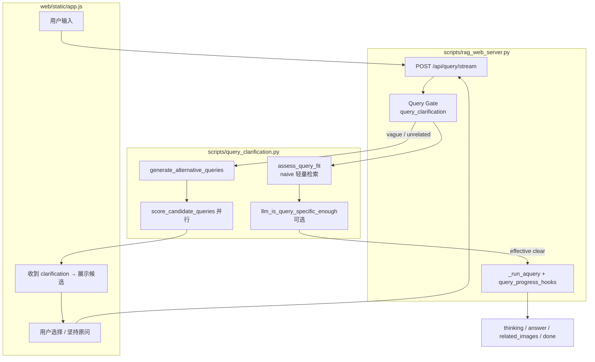

# 多轮问答（模糊问题澄清）实现方案

> **分支**：`chat-interaction`（提交 `85ef6b9` 起）  
> **需求来源**：`docs/多轮问答.txt`  
> **关联文档**：[`问答全流程图.md`](问答全流程图.md)（已含澄清门控）、[`网页问答界面.md`](网页问答界面.md)  
> **状态**：已实现 — `scripts/query_clarification.py` + Web SSE + 前端澄清 UI（选项作答后保留可重选）

---

## 1. 背景与目标

### 1.1 问题

用户提问时常出现 **表述模糊**（如「怎么保养」「油要不要加」）或与知识库 **几乎无关** 的说法。此时直接走完整 RAG（检索 → 重排 → 生成）往往：

- 检索噪声大，答案易偏；
- 浪费 LLM 与 rerank 算力；
- 前端无法给用户「把问题说清楚」的机会。

### 1.2 目标

在 **正式生成答案之前** 增加 **查询门控（Query Gate）**：

1. 用可配置的 **匹配度 score** 判断原问题是否足够清晰；
2. 不清晰时，由 LLM **生成 k 条更具体的候选问法**，再对每条做轻量检索打分；
3. 通过 **SSE 多轮交互** 把候选问法交给用户选择（或坚持原问题）；
4. 仅对 **选定/确认后的问句** 调用现有 `rag.aquery` 全流程（与 `client-dev` 配图、steering 行为一致）。

### 1.3 非目标（本期不做）

- 不替代 LightRAG 内部检索算法；
- 不在澄清阶段跑完整 `aquery`（避免双份答案 LLM）；
- 策略二 `first_hit` 已实现，默认仍用 `all`；生产一般无需改。

---

## 2. 核心概念

### 2.1 双阈值

须满足：**`threshold_lower` < `threshold_upper`**

| 名称 | 含义 | 典型用途 |
|------|------|----------|
| `threshold_lower` | 低阈值（宽松） | Case A：候选问法是否「与库有关」的底线 |
| `threshold_upper` | 高阈值（严格） | 原问是否可直接 RAG；Case B 候选是否「足够清晰」 |

> 原文 `多轮问答.txt` 中 `threshold_two < threshold_one` 即指 **lower < upper**。

### 2.2 匹配度 score（已定）

对 **每一条** 待评估的问句（原问或改写问法）：

1. 调用 **`lightrag.aquery_data`**（与 `dump_query_context.py` 同路径，**不**调答案 LLM）；
2. 在返回的 chunk 列表上取 rerank 后的 **`rerank_score`**（若未开 rerank，则用向量距离换算为相似度，实现时二选一并写死优先级）；
3. **主 score** = **top-3 `rerank_score` 的算术平均**；
4. **日志/debug** 同时记录 **top-1**，便于日后改阈值或对比。

**top-1 与 top-3 平均的区别（调参参考）**

| 聚合方式 | 行为 | 适用 |
|----------|------|------|
| top-1 | 只看最高分的一条 chunk，易被单条噪声抬高 | 希望少打断、多直接答 |
| **top-3 平均（本期默认）** | 要求前几名整体都还行，更稳、更易触发澄清 | 手册场景、模糊问法多 |

### 2.3 三种 band（分情况）

```text
score >= threshold_upper     →  band = clear      → 直接 RAG，不澄清
threshold_lower <= score < threshold_upper
                             →  band = vague      → Case B
score < threshold_lower      →  band = unrelated   → Case A
```

---

## 3. 业务规则（对齐 `多轮问答.txt` + 产品确认）

### 3.1 步骤 1：评估原问

对 **用户原始问题** 调用 `assess_query_fit`：

1. 门控专用轻量检索：默认 **`QUERY_CLARIFY_ASSESS_MODE=naive`**，且 `top_k` / `chunk_top_k` 较小（默认 12），**避免**用完整 `mix` 做门控导致过慢；
2. 计算 `score`（top-3 `rerank_score` 平均）与 `band`；
3. 保留 `preview_snippets`（Case B / 具体性判断给 LLM 用）。

**可选二次判断（已实现）：** 当 `band=clear` 且 `QUERY_CLARIFY_LLM_SPECIFICITY_CHECK=true` 时，再调 LLM 读原问 + 摘要，输出 `specific_enough`。若为 `false`，将 **effective_band 降为 `vague`** 进入澄清（**不用**设备名/口语词表硬编码）。例如「怎么保养」「咋清理残胶」检索分可达 upper，但语义仍笼统。

### 3.2 步骤 2：分 band 处理

#### band = clear（`score >= threshold_upper` 且通过具体性判断）

- **不** 进入澄清；
- 直接 `rag.aquery`（用户所选 **RAG 模式**，通常 `mix`，`stream=True`），行为与现网一致（含 `query_progress_hooks`、`finalize_related_images`）。
- SSE 可选推送 `gate_skip`（`reason=clear`，带 `score`）。

#### band = unrelated — Case A（`score < threshold_lower`）

1. **仅** 将 **原始问题** 发给 LLM；
2. LLM 生成 **k** 条语义相近、但更贴近设备手册语境的具体问法（JSON 结构化输出）；
3. 对 **每一条** 候选调用 `assess_query_fit`（即 `aquery_data` + top-3 平均）；
4. **策略一（本期）**：保留所有 **`candidate_score > threshold_lower`** 的候选；
5. 若无候选达标 → SSE 返回「未能找到更贴切的问题，请补充机型/部位/操作」类提示，**不** 调答案 LLM。

#### band = vague — Case B（`threshold_lower <= score < threshold_upper`）

1. 将 **原始问题 + 首轮检索摘要**（若干 chunk 标题/首段，控制 token）发给 LLM；
2. LLM 生成 **k** 条改写问法；
3. 对每条候选做 `assess_query_fit`；
4. **策略一（本期默认 `QUERY_CLARIFY_STRATEGY=all`）**：返回所有 **`candidate_score > threshold_upper`** 的候选；
5. 若无候选达标 → `score_candidate_queries` **降级**：仍返回已打分的 top k 条 + `message` 提示，并允许 **仍用原问题**（见 3.3）；仅当 LLM 未生成任何改写或完全无选项时 `action=abort`（SSE `error`）。

### 3.3 候选返回策略（本期 / 后期）

| 策略 | 行为 | 本期 |
|------|------|------|
| **策略一：全量返回** | 每条候选 **并行** `assess_query_fit`，返回所有过线问句 | **默认 `all`** |
| 策略二：首次命中 | 按 score 排序后第一个过线即返回 | 已实现 `QUERY_CLARIFY_STRATEGY=first_hit` |

候选打分由 `asyncio.gather` 并行执行，降低「1+k 次检索」的等待时间。

### 3.4 用户操作（多轮交互）

澄清阶段前端提供：

| 操作 | 含义 | 后端 |
|------|------|------|
| 选择某条候选 | 用该句作为最终 query | `clarification_choice` = 候选全文 + `session_id` |
| **仍用原问题** | 用户知悉可能答偏，不拦截 | `clarification_choice` = `"use_original"` |
| 重新输入 | 新一条用户消息 | 新 `query`，**不带** `clarification_choice`，重新走 Gate |
| **重复点选**（已实现） | 作答后在澄清面板下方追加新回答流 | 澄清面板 **不销毁**，`dataset.clarifySessionId` 保留，可换选其它推荐问法 |

续轮请求 **跳过** 门控，直接 `resolve_query_for_rag` → `aquery`。

---

## 4. 与现有架构的关系

### 4.1 插入点

澄清门控插在 **Web 现有入口之前**，不改变 LightRAG 内部 `kg_query` / `process_chunks_unified` 逻辑。



### 4.2 复用模块

| 模块 | 用途 |
|------|------|
| `raganything.pipeline_rerank` | `query_param_from_env`、`lightrag_global_config` |
| `lightrag.aquery_data` | 澄清阶段检索与打分（无答案 LLM）；门控默认 `naive` + 较小 top_k |
| `query_doc_steering` | 候选问法检索后同样可做 `file_path` / 机型过滤（与现网一致） |
| `query_progress_hooks` | **仅** 在最终 `aquery` 时安装；澄清阶段不装 |
| `image_query_refs` / `finalize_related_images` | 不变，仍在答案流结束前执行 |

### 4.3 与 `client-dev` 配图能力

澄清不改变配图逻辑；**最终** 进入 `aquery` 的文本必须是用户确认后的 query，且仍走 `operate.process_chunks_unified` 钩子同步 chunk（见 `query_progress_hooks.py`）。

---

## 5. 接口设计

### 5.1 请求体扩展（`QueryBody`）

```json
{
  "query": "怎么保养",
  "mode": "mix",
  "stream": true,
  "session_id": "optional-uuid",
  "clarification_choice": null
}
```

续轮示例：

```json
{
  "query": "怎么保养",
  "mode": "mix",
  "stream": true,
  "session_id": "same-uuid",
  "clarification_choice": "use_original"
}
```

或：

```json
{
  "clarification_choice": "高速智能封边机输送链条的保养周期是多久？"
}
```

### 5.2 SSE 事件（新增）

在现有 `status` / `thinking_delta` / `answer_delta` / `related_images` / `done` 之外增加：

| type | 字段 | 说明 |
|------|------|------|
| `status` | `phase: clarify`, `text` | 门控进行中（匹配度评估 / 生成推荐问法 / 评估候选） |
| `clarification` | `band`, `original_query`, `original_score`, `score_top1`, `session_id`, `message` | 需要用户选择 |
| `clarification` | `options[].query`, `options[].score`, `options[].score_top1`, `options[].label` | `label` 默认截断问句（≤48 字） |
| `clarification` | `preview_snippets[]` | 最多 4 条 chunk 摘要（可折叠展示） |
| `clarification_done` | — | 澄清轮结束，无答案流 |
| `gate_skip` | `reason`（多为 `clear`）, `score` | 门控 `proceed` 后进入正式 `aquery`；续轮 `use_original` **不**发此事件 |
| `error` | `message` | `action=abort`、门控异常、或无 options 时 |

**澄清轮** 以 `clarification` + `clarification_done` 结束，**不** 发送 `answer_delta`。

**作答轮** 与现网相同，仍以 `done` 结束。

### 5.3 会话状态（服务端）

单机内存即可：

```python
pending[session_id] = {
    "original_query": str,
    "band": str,
    "candidates": list,
    "created_at": float,
}
```

TTL **`_SESSION_TTL_SEC = 1800`（30 分钟）**；`store_clarification_session` 时惰性 `_purge_sessions`。续轮校验：`clarification_choice` 在 session `options` 内则 `gate_reason=chosen`，否则仍接受全文（`chosen`）。

### 5.4 可选调试 API

`POST /api/query/assess` — 仅 `assess_query_fit`，不调改写 LLM、不走答案流。响应示例字段：

```json
{
  "query": "怎么保养",
  "enabled": true,
  "threshold_lower": 0.28,
  "threshold_upper": 0.45,
  "band": "vague",
  "score": 0.42,
  "score_top1": 0.51,
  "chunk_count": 12,
  "preview_snippets": ["..."],
  "error": null
}
```

CLI 对照：`scripts/probe_query_clarify.py`（`--assess-only` 仅评估 band）。

---

## 6. 模块与文件规划

| 路径 | 职责 |
|------|------|
| `scripts/query_clarification.py` | Gate 核心：`assess_query_fit`、`llm_is_query_specific_enough`、`generate_alternative_queries`、`score_candidate_queries`、`run_clarification_gate` |
| `scripts/rag_web_server.py` | `_query_stream_events` 门控分支（`state.lock`）；`QueryBody`；`/api/query/assess` |
| `web/static/app.js` | `showClarificationPanel`、`resumeClarifiedQuery`（面板保留 + 下方追加作答） |
| `env.example` | `QUERY_CLARIFY_*`、`QUERY_SCORE_*` |
| `scripts/probe_query_clarify.py` | CLI 探针 |
| `docs/问答全流程图.md` | 端到端流程（含澄清 SSE） |

### 6.1 `query_clarification.py` 主要函数（已实现）

```python
async def assess_query_fit(rag, query: str, *, mode: str | None = None) -> AssessResult:
    """aquery_data（门控 param）+ rerank + top-k 平均 score + band + preview_snippets."""

async def llm_is_query_specific_enough(rag, query, preview_snippets) -> bool | None:
    """clear 分仍可能笼统；LLM 输出 {"specific_enough": bool}，False 则降为 vague."""

async def generate_alternative_queries(rag, query, *, band, preview_snippets, k) -> list[str]:
    """Case A/B 不同 system prompt；JSON {"queries": [...]}。"""

async def score_candidate_queries(rag, queries, *, band) -> list[CandidateOption]:
    """并行 assess；strategy=all 返回过线项，否则 first_hit；无过线时降级返回 top k。"""

async def run_clarification_gate(rag, query, *, on_status=None) -> ClarificationOutcome:
    """action: proceed | clarify | abort。"""

def resolve_query_for_rag(original, clarification_choice, session_id) -> tuple[str, str]:
    """续轮：use_original | chosen | clear。"""
```

LLM 改写/具体性：复用 `rag.llm_model_func`；解析失败时用 `json_repair` 兜底，改写失败则 `abort` 或仅展示降级选项。

---

## 7. 配置项（`env.example` 拟增）

```bash
# --- Query clarification (multi-turn gate) ---
QUERY_CLARIFY_ENABLED=true
QUERY_SCORE_THRESHOLD_LOWER=0.28
QUERY_SCORE_THRESHOLD_UPPER=0.45
QUERY_CLARIFY_K=4
QUERY_CLARIFY_STRATEGY=all          # 或 first_hit
QUERY_SCORE_TOP_K=3                 # top-k 平均里的 k
QUERY_CLARIFY_ASSESS_MODE=naive     # 门控评估模式（非答案 aquery 的 mix）
QUERY_CLARIFY_TOP_K=12
QUERY_CLARIFY_CHUNK_TOP_K=12
QUERY_CLARIFY_LLM_SPECIFICITY_CHECK=true
```

说明：

- `THRESHOLD_LOWER` 可与现网 `MIN_RERANK_SCORE`（如 0.28）同量级，**须** `< THRESHOLD_UPPER`；若配置反了代码会自动把 `upper = lower + 0.12`；
- 门控检索与正式问答 **分离**：评估用 `naive` + 小 top_k，答案仍用用户侧栏 RAG 模式（通常 `mix`）；
- 调参：`probe_query_clarify.py`、`POST /api/query/assess`、`docs/测试问题` 模糊样例。

---

## 8. LLM Prompt 要点

### 8.1 Case A（无检索上下文）

- 角色：设备维护保养手册问答助手；
- 输入：用户原问；
- 输出：k 条 **可检索的具体问句**（含机型/部位/操作，避免「它」「这个」）；
- 禁止：直接回答问题。

### 8.2 Case B（带检索摘要）

- 在 Case A 基础上增加 `preview_snippets`（chunk 中章节号、保养内容首句）；
- 要求改写句 **贴近手册用语**（如「高速智能封边机」「润滑脂 2#」等领域词）。

### 8.3 安全与解析

- 强制 JSON schema：`{"queries": ["...", "..."]}`；
- 解析失败 → 改写列表为空 → `action=abort` 或 SSE `error`，不进入答案 LLM。

### 8.4 具体性判断（clear 二次门控）

- 输入：原问 + `preview_snippets`（不含答案生成）；
- 输出：`{"specific_enough": true|false}`；
- **禁止**维护设备名/「咋/什么」等硬编码词表；仅 LLM 语义判断；
- `QUERY_CLARIFY_LLM_SPECIFICITY_CHECK=false` 可关闭，完全按 score 分 band。

---

## 9. 实施阶段

| 阶段 | 内容 | 产出 |
|------|------|------|
| **0** | 配置项、`AssessResult`、score 算法 | ✅ |
| **1** | `assess_query_fit` + `probe_query_clarify.py` | ✅ |
| **2** | 改写 + `score_candidate_queries`（并行） | ✅ |
| **3** | `rag_web_server` SSE + `QueryBody` + session + `/api/query/assess` | ✅ |
| **4** | `app.js` 澄清 UI + 坚持原问 + **面板保留可重选** | ✅ |
| **5** | 批测脚本（Web 同路径）、`问答全流程图.md` | 流程图 ✅；批测回归可继续补 |

---

## 10. 测试计划

### 10.1 用例类型

| 类型 | 示例期望 |
|------|----------|
| 清晰问法 | `docs/测试问题` 第 9 条注油泵 — `band=clear`，无澄清，配图与现网一致 |
| 模糊问法 | 「怎么保养」「咋清理残胶」— 检索分可能 `clear`，经 **LLM 具体性** 后进入澄清；或 `band=vague` 直接澄清 |
| 几乎无关 | 「油要不要加」「加什么油」— 常 `band=unrelated`（score≈0），候选或降级选项 + 引导文案 |
| 坚持原问 | `clarification_choice=use_original` — 必须进入 `aquery`，且可有答案流 |
| 策略一 | 多条候选同时过线时，**全部** 出现在 `options` |

### 10.2 与 Web 对齐

批测/集成测 **禁止** 仅用 `aquery_data` + 手工 rerank 代替 Web；须：

```text
query_progress_hooks → aquery → finalize_related_images
```

澄清测 **单独** 验证 Gate；全链路测在 **选定 query 之后** 执行。

---

## 11. 风险与对策

| 风险 | 对策 |
|------|------|
| 澄清多轮 `aquery_data` × (1+k) 延迟大 | 门控默认 **naive + top_k=12**；候选 **并行** gather；k≤8（默认 4） |
| top-3 过严，清晰问也被澄清 | 调 `upper`；或关 `LLM_SPECIFICITY_CHECK`；对比 `score_top1` |
| 高分笼统问漏澄清 | 开启 `QUERY_CLARIFY_LLM_SPECIFICITY_CHECK`（默认开） |
| LLM 改写偏题 | Case B 必带检索摘要；steering 过滤候选检索 |
| 与配图 chunk 不一致 | 仅最终 `aquery` 走 hooks，不在澄清阶段 sync 图片 |

---

## 12. 已确认的产品决策（摘要）

1. **score**：默认 **top-3 rerank_score 平均**（`QUERY_SCORE_TOP_K`），日志/SSE 保留 top-1。  
2. **候选策略**：默认 **all**；**first_hit** 已实现可切换。  
3. **用户坚持原问**：**允许**，`clarification_choice=use_original` 直接进入 RAG。  
4. **高分仍澄清**：**LLM 具体性判断**，不用词表硬编码。  
5. **门控性能**：评估与答案 **分离模式**（naive vs mix）。  
6. **澄清 UI**：选项面板作答后 **保留**，可重复点选其它推荐问法。

---

## 13. 附录：与原始需求对照

| `多轮问答.txt` | 本方案 |
|----------------|--------|
| 步骤 1 计算 score | `assess_query_fit`（top-3 平均） |
| 情况 A / B | `band` unrelated / vague |
| 生成 k 个问题 | `generate_alternative_queries` |
| 逐个匹配 | `score_candidate_queries`（并行） |
| 策略一 / 二 | `QUERY_CLARIFY_STRATEGY=all \| first_hit` |
| （未写）用户交互 | SSE `clarification` + 选候选 / `use_original` + 面板保留重选 |
| （未写）高分笼统问 | `llm_is_query_specific_enough` |

---

*文档版本：v1.1 · 2026-06-06 · 分支 chat-interaction · 对齐提交 `85ef6b9`*
