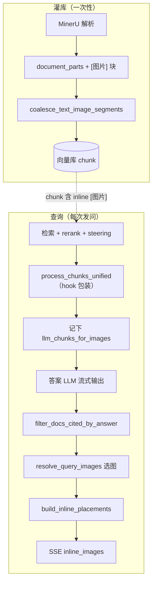
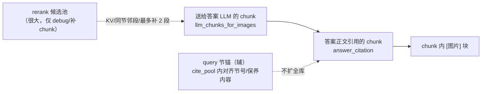
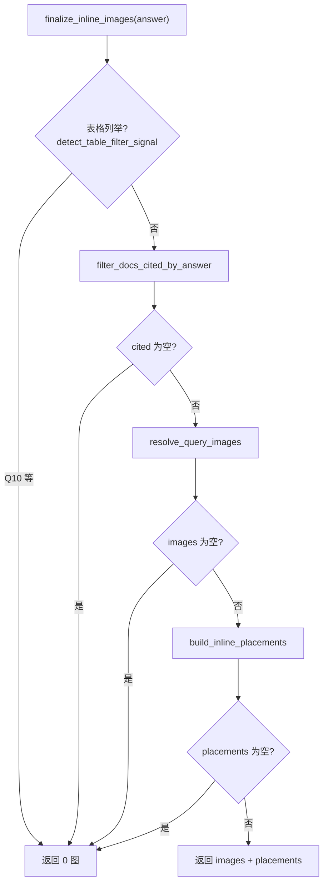
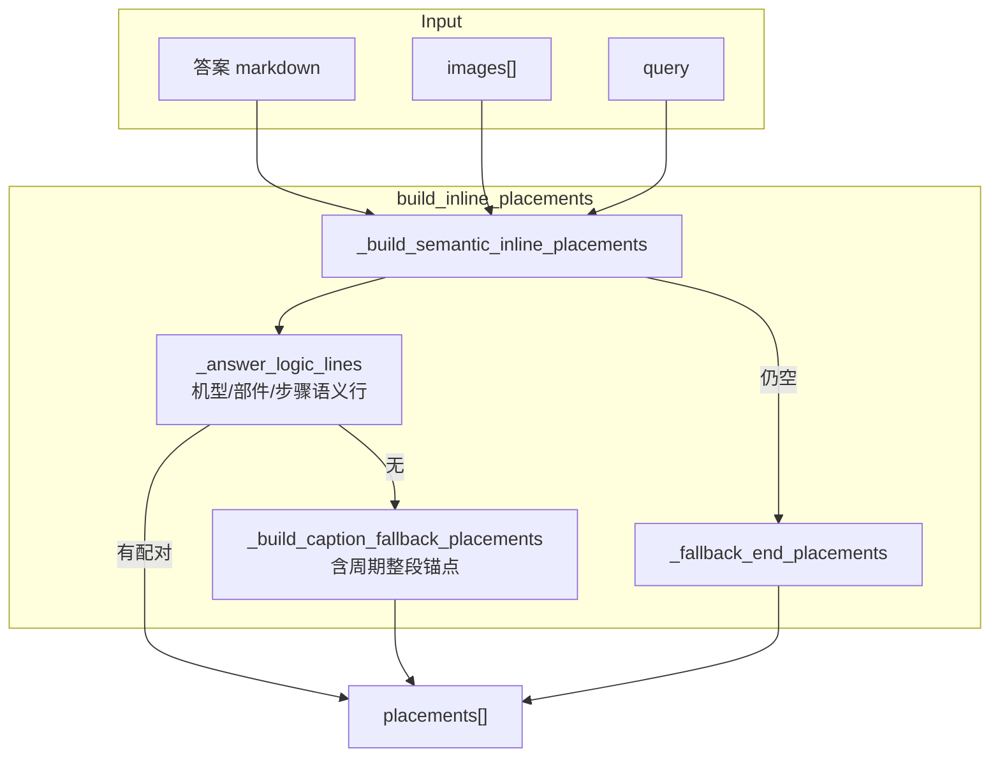
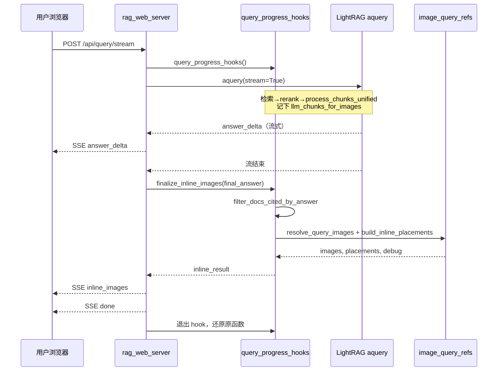

# 查询配图实现说明

> **关联文档**：[`查询配图设计方案.md`](查询配图设计方案.md) · [`配图query锚定实施方案.md`](配图query锚定实施方案.md) · [`配图插入优化实施清单.md`](配图插入优化实施清单.md) · [`测试例参考答案.md`](测试例参考答案.md) · [`问答全流程图.md`](问答全流程图.md)  
> **实现位置**：灌库 `raganything/utils.py` · 查询 `scripts/image_query_refs.py` · 挂接 `scripts/query_progress_hooks.py` · Web `scripts/rag_web_server.py` · 前端 `web/static/app.js`  
> **状态**：阶段 4 完成；Q16/Q17 跨手册 pair 配图 **已收尾**（Web 手测稳定）；全量批测 **16/17**（`scripts/run_web_path_q1_17.py`，报告 `logs/web_path_q1_17/20260614_005940_all.md`）；Git tag `gate_fix_Q16failed`

本文说明：**用户发问 → 文字答案流式输出 → 内联配图** 的完整实现。配图 **不修改** 检索与答案生成（`query_doc_steering.py`），仅在答案 **结束后** 选图并计算插入位置。

**设计原则**（[`.cursor/rules/rag-image-matching.mdc`](../.cursor/rules/rag-image-matching.mdc)）：

- 禁止写死领域词表；匹配依赖 parser 字段（bbox、caption/footnote）、词语重叠、chunk 结构；
- 灌库与查询 **共用** `raganything/utils.py` 中的 term / label 对齐函数；
- 配图扫描范围必须与 **答案 LLM 读到的 chunk** 同源，并再按 **答案正文引用** 收窄。

---

## 1. 端到端总览

### 1.1 两阶段：灌库 vs 查询

| 阶段 | 时机 | 做什么 | 关键代码 |
|------|------|--------|----------|
| **灌库** | PDF 入库（一次性） | 正文与 `[图片]` 块 **合并进同一 chunk** | `coalesce_text_image_segments()` |
| **查询** | 每次问答 | 从 **答案引用的 chunk** 解析 `[图片]` → 选图 → **placement** → SSE 内联展示 | `finalize_inline_images()` |



### 1.2 三层收窄（扫图范围）



**原则**：不在 rerank 全池、不在 MinerU 原始 JSON 上临时补图；主路径从 cited chunk 的 `[图片]` 解析。列举题（Q16/Q17）在 **References 手册 + pair 补图** 边界内扩池（阶段 3 延伸）。

---

## 2. 灌库：正文与图共 chunk

灌库时，`processor.py` 将 MinerU 结构化块转为带 inline `[图片]` 的文本段，再经 `coalesce_text_image_segments` **把紧跟正文的图片块并入同一段**，保证 rerank / 答案 LLM / 配图读到的是 **同一段文字+图元数据**。

```419:451:raganything/utils.py
def coalesce_text_image_segments(segments: List[str]) -> List[str]:
    """Merge each text segment with immediately following ``[图片]`` blocks for indexing.

    Keeps figure metadata in the same vector chunk as the anchor body so rerank +
    steering filter text and inline figures together (Route A ingest).
    """
    out: List[str] = []
    i = 0
    n = len(segments)
    while i < n:
        seg = (segments[i] or "").strip()
        ...
        parts = [seg]
        ...
        while j < n:
            nxt = (segments[j] or "").strip()
            if not nxt or not _is_image_ref_segment(nxt):
                break
            ...
            parts.append(nxt)
            j += 1
        out.append("\n\n".join(parts))
        i = j
    return out
```

**chunk 内 `[图片]` 块示例**（查询时解析）：

```text
保养步骤：…压带轮表面会粘上胶水…

[图片]
图片路径：…/auto/images/c3376a….jpg
页码：7
脚注：压带轮残胶清理
```

> 修改灌库配对逻辑（`context_text_for_image`、`best_image_for_text_item` 等）后需 **重新灌库** 对应 PDF；查询侧只读 chunk 内已有块。

---

## 3. 查询挂接：记下 LLM batch

`scripts/query_progress_hooks.py` 在 `async with query_progress_hooks():` 内包装 LightRAG 的 `process_chunks_unified`：

1. 调用原函数得到 **最终送给答案 LLM 的 chunk**；
2. 可选：`narrow_retrieved_docs_to_anchor_sections`（节号收窄）；
3. `sanitize_retrieved_docs_content`（剥污染）；
4. `_sync_llm_chunks_for_images` → 写入 `_llm_chunks_for_images`（Plan A 同源 batch）。

token 截断导致含 `[图片]` 的 chunk 被裁掉时，可从 rerank 池 **最多补 2 段** 含 inline 图的 chunk（`supplement_llm_docs_with_rerank_figures`）。

---

## 4. 答案结束后：选图 + placement

### 4.1 主入口 `finalize_inline_images`

Web 在 **答案 token 流结束** 后调用（**不** 在流式过程中改答案上下文）：

```826:838:scripts/rag_web_server.py
                    inline_result = finalize_inline_images(answer_text=final_answer)
                    related = inline_result.get("images") or []
                    placements = inline_result.get("placements") or []
                    if related and placements:
                        yield _sse(
                            {
                                "type": "inline_images",
                                "images": related,
                                "placements": placements,
                            }
                        )
```

`finalize_inline_images` 流程：



核心代码：

```115:225:scripts/query_progress_hooks.py
def finalize_inline_images(
    *,
    limit: int | None = None,
    answer_text: str | None = None,
) -> dict[str, Any]:
    """Resolve inline figures cited by the generated answer (Plan A + placements)."""
    ...
    if full_primary and detect_table_filter_signal(q, full_primary):
        ...
    if answer:
        docs, cite_meta = filter_docs_cited_by_answer(answer, docs, query=q)
    ...
    images, debug = resolve_query_images(
        docs_text, roots, query=q, retrieved_docs=docs, limit=limit,
    )
    ...
    placements = build_inline_placements(answer, images_copy, retrieved_docs=docs)
    if placements:
        images = images_copy
    else:
        images = []
        debug["gate"] = {"ok": False, "reason": "no_inline_placements"}
    ...
    return {"images": images, "placements": placements, "debug": debug}
```

| `gate.reason` | 含义 |
|---------------|------|
| `table_filter_listing` | 表格列举题（如 Q10），强制 0 图 |
| `no_answer_cited_chunks` | 答案正文与 LLM chunk 无匹配行 |
| `no_inline_in_cited` | cited chunk 内无通过门控的 `[图片]` |
| `no_inline_placements` | 已选图但算不出插入位置（现保留图廊兜底，Web 仍可见图） |
| `placement_fallback` | 有图无 placement，走底部图廊 |
| `rerank_score_ok` | 正常选图 |

---

## 5. 答案引用收窄

`filter_docs_cited_by_answer` 用 **已生成的答案正文** 对 LLM batch 每 chunk 打分，保留答案里 **确实出现过的段落**。

列举题（「哪些 / 几种…」）额外：从答案 markdown 提取 `**压带轮**` 等 span，**补保留** 带对应图注的 chunk（`listing_span_keep`），避免 Q11 只 cite 部分条目导致缺图。

```1792:1868:scripts/image_query_refs.py
def filter_docs_cited_by_answer(
    answer: str,
    docs: list[dict[str, Any]],
    *,
    query: str | None = None,
) -> tuple[list[dict[str, Any]], dict[str, Any]]:
    """Keep LLM chunks whose body lines appear in the generated answer."""
    ...
    if _is_listing_scope_query(query or ""):
        answer_spans = _answer_listing_spans(answer)
        if len(answer_spans) >= 2:
            ...
            matched = any(
                _label_matches_listing_target(lab, span) for lab in labels
            ) or span in content
            ...
            meta["listing_span_keep"] = True
```

---

## 6. 选图：`resolve_query_images`

```3884:3913:scripts/image_query_refs.py
def resolve_query_images(...) -> tuple[list[dict[str, Any]], dict[str, Any]]:
    debug = explain_query_images(...)  # 全链路 trace，写入 query dump
    if not (debug.get("gate") or {}).get("ok"):
        return [], debug
    images = images_for_api(...)       # 实际 API 输出
    return images, debug
```

**gate 与主路径对齐**：`explain_retrieval_supports_images` 在答案已生成时，与主选图一样调用 `_figure_context_from_answer_docs(..., query=q)` 收窄扫描正文。此前 gate 未传 `query` 时，citation 极窄（如 Q5 仅 1 chunk）会误判 `no_inline_figures_in_primary` 并整题 0 图；主路径带 query 可过，造成批测/Web 偶发不一致。

### 6.1 解析与门控

1. **`extract_image_refs_from_context(figure_context)`** — 从 cited 正文解析 `[图片]` 块；
2. **`_ref_passes_image_align_gate`** — 封面页、query/caption 严重不对齐的候选丢弃；
3. **`_score_ref_for_query`** — 以 chunk rerank 分为主，top chunk 内图加分；
4. **`_select_scored_refs`** — 按场景分支：
   - **列举题** + 多个 listing target → `_select_scored_refs_for_listing`（每 target 一张，如 Q11）；
   - 多手册 → `_select_scored_refs_cross_manual`；
   - 默认 → 每 source 最高分。

张数上限：`RAG_IMAGE_MULTI_LIMIT=0` 表示 **实际 cap 24**（列举题可出多图，不再硬限 4 张）。

```176:189:scripts/image_query_refs.py
def default_image_selection_limit() -> int:
    """Global cap for selected figures; ``0`` env means no practical cap (24)."""
    raw = os.getenv("RAG_IMAGE_MULTI_LIMIT") or "0"
    ...
    if val <= 0:
        return 24
```

### 6.2 API 输出与媒体 URL

`images_for_api` 将路径解析为 `pipeline_parse` 下文件，生成 token URL：

```json
{
  "url": "/api/media/image?token=…",
  "caption": "压带轮残胶清理",
  "page": 7,
  "context": "…"
}
```

`resolve_media_path` 支持 **按文件名** 在 `RAG_WEB_PARSER_OUTPUT_DIR` 下搜索（重灌后 hash 目录变化仍可访问）。

---

## 7. Placement：插在哪一段后面

**Placement** = 后端告诉前端：第 `image_index` 张图，应插在答案里 **哪段文字** 后面。



### 7.1 语义行 placement（主路径）

`build_inline_placements` 仅调 `_build_semantic_inline_placements`；失败时 `_fallback_end_placements`。

`_answer_logic_lines` 从答案抽 **机型 / 部件 / 步骤** 语义行（不依赖 `-` bullet 排版）。要点：

| 场景 | 行为 |
|------|------|
| Q11 单手册部件列举 | `_infer_listing_machine_context` 补 `###` 缺失时的机型；bullet 支持 `**仿形靠板**（仿形靠模）：` |
| Q4 步骤题 | `_is_procedure_steps_query` **禁用**机型推断；步骤行用 **query 主题** 与图注配对 |
| Q3 周期题 | `_is_maintenance_cycle_query` **禁用**机型推断；caption fallback 走 `_cycle_caption_block_placement`（整段锚点，跳过括号旁注） |

### 7.2 列举题 span / pair（Q11 / Q16 / Q17）

列举 span、跨手册 `(机型, 部件)` pair 仍在 semantic 路径内由 logic lines + `_select_scored_refs_for_listing` 等完成；单手册「哪些部件」可触发 cited manual KV 扩池。

### 7.3 语义锚点与 caption fallback

图注与答案字面不同时（如「清洁机床内部」vs「机床内部清洁」），`_find_semantic_anchor_in_answer` / caption fallback 用词对齐与 `effective` 打分选锚点。`anchor_text` 优先用 **答案中实际匹配片段**（整行或整段），便于前端 DOM 定位。

### 7.4 兜底：答案末尾

若正常匹配后仍 **0 个 placement**，`_fallback_end_placements` 将图插在 References 前 **最后一段** 之后（`fallback: answer_end`）。

### 7.4 placement 数据结构

| 字段 | 含义 |
|------|------|
| `anchor_text` | 前端用来找 `<p>` / `<li>` 的锚点字符串 |
| `match_start` / `match_end` | 在纯文本答案中的偏移（debug 用） |
| `image_index` | 对应 `images[]` 下标 |
| `score` | 锚点匹配置信度 |
| `fallback` | 可选，`answer_end` 表示末尾兜底 |

---

## 8. 前端：内联渲染

SSE 事件 `inline_images` 在 **`done` 之前** 发送。`app.js` 收到后：

1. `renderMarkdown` 渲染答案；
2. 用 `answerBodyForPlacement` 剥掉 `### References`，与后端 placement 偏移一致；
3. **偏移优先**：`findInsertPointByOffset` → `findInsertPointForPlacement`（`match_start` 对应逻辑行）；
4. **块级插入**：`insertFigureAfterAnchor` 将 `<figure>` 插在 **`</p>` / `</li>` 之后**（避免插在段内 text 节点后导致浏览器吞图）；
5. **三层兜底**（内联失败时）：答案区末尾追加 → `related-images` 顶部网格。

流式 `done` 时：若已成功插入图（`inlineFiguresApplied`），**不再**全量 `renderMarkdown` 覆盖已插入的 `<figure>`。

**缓存**：`web/index.html` 中 `app.js?v=20260614b`；改前端后需硬刷新。

---

## 9. 时序图（Web 发问）



---

## 10. 调试与批测

| 工具 | 用途 |
|------|------|
| `RAG_QUERY_DEBUG_DUMP=1` | 每次问答写入 `logs/query_dumps/*.json`（含 `images`、`inline_placements`） |
| `scripts/replay_placement_dumps.py` | **离线**回放 placement（无 LLM）；改 placement 后优先跑 |
| `scripts/run_web_path_q1_17.py` | **主回归**：模拟 Web 全路径 + 对照 `测试例参考答案.md` 批测 Q1–Q17 |
| `scripts/run_web_path_q1_13.py` | 子集快速回归（Q1–Q13） |
| `scripts/build_voice_script_tests.py` | 从 Excel「技术问题」表生成 `data/voice_script_tests.json` |
| `scripts/run_voice_script_tests.py` | 智能客服技术话术 RAG 批测（默认 `--group 技术`） |
| Web「开发」面板 | 开关 debug dump、查看最近 dump 路径 |

**配图批测关注**：Q3（周期短答 + 机床外部清洁）、Q4（步骤 + 清洁机床内部）、Q11（三部件各一图）。dump 有 `inline_placements` 但页面无图 → 查 Web 阶段 B / 浏览器缓存。

**阶段 4 全量结果**（`20260614_005940_all.md`）：**16/17**（文字 17/17）。tag `OK0614_no_clarify` 后建议重跑 Q3/Q4/Q11。

Dump 中重点字段：

```json
{
  "images": { "selected": [...], "debug": { "selected_paths", "inline_placements", "answer_citation" } },
  "answer": "…"
}
```

---

## 11. 环境变量

| 变量 | 默认 | 含义 |
|------|------|------|
| `RAG_WEB_PARSER_OUTPUT_DIR` | `data/pipeline_parse` | MinerU 输出根目录；媒体 token 相对此路径 |
| `RAG_IMAGE_MULTI_LIMIT` | `0` | `0` = cap 24；列举题多图 |
| `RAG_IMAGE_ANCHOR_MODE` | `answer`（Web `.env`） | 节锚点扫描模式；`off` 则扫 full cited 正文 |
| `RAG_IMAGE_QUERY_SECTION_ANCHOR` | `true` | 阶段 1：query 在 cite_pool 内节级辅锚（短答案单题） |
| `RAG_IMAGE_INLINE_MIN_PLACE_SCORE` | `0.35` | placement 最低锚点分 |
| `RAG_IMAGE_MIN_RERANK_SCORE` | `0.28` | 选图总门控 rerank 阈值 |
| `RAG_IMAGE_MIN_REF_ALIGN` | `0.28` | 图注与上下文对齐阈值 |
| `RAG_QUERY_DEBUG_DUMP` | `0` | 写 query dump |

完整列表见 `config/env.example`。

---

## 12. 测试例行为速查

| ID | 文字 | 配图预期 |
|----|------|----------|
| Q1–Q2 | 型号 / 电源检查 | 0 图 |
| Q3–Q9 | 单条保养问答 | 1 张，图注与步骤一致 |
| Q10 | 九部件液压油表格 | 0 图（`table_filter_listing`） |
| Q11 | 三部件清残胶 | 最多 3 张，span–图注一一对应 |
| Q12–Q13 | 列举 / 润滑脂 | 与答案条目相关的多张 inline 图 |
| Q15 | 四机型电控板周期 | 多手册各 1 张，机型 scoped |
| Q16 | 三联件油雾器跨机型 | 答案 `(机型, 部件)` 各 1 图；**Web 已收尾**；批测 grader 对非列表格式偶发误报 |
| Q17 | 跨机型残胶列举 | pair 选图 + scoped 内联；涂胶轴/涂胶电机分条 |

详见 [`测试例参考答案.md`](测试例参考答案.md)。

---

## 13. 模块索引

| 模块 | 文件 | 职责 |
|------|------|------|
| 灌库 coalesce | `raganything/utils.py` | 正文+图合并进 chunk |
| 灌库 insert | `raganything/processor.py` | `_build_document_parts_for_ingest`、写入向量库 |
| Hook | `scripts/query_progress_hooks.py` | 记 LLM batch、`finalize_inline_images` |
| 选图 + placement | `scripts/image_query_refs.py` | 解析、门控、打分、placement |
| 检索 steering | `scripts/query_doc_steering.py` | **不在此文档**；不改答案，仅影响 chunk 进 LLM |
| Web SSE | `scripts/rag_web_server.py` | 流式答案 + `inline_images` 事件 |
| 前端 | `web/static/app.js` | `applyInlineImages` |
| 批测 | `scripts/run_web_path_q1_17.py` | Web 路径全量回归 Q1–Q17 |

---

## 14. 与旧版差异（底部 related grid）

| 项目 | 旧版 | 当前 |
|------|------|------|
| SSE 事件 | `related_images` | **`inline_images`**（含 `placements`） |
| 展示 | 答案下方横排 | **段落后 inline `<figure>`**（失败时图廊兜底） |
| 张数 | 硬限 4 | 列举题按 target / pair，cap 24 |
| 扫图范围 | 曾用 rerank 全池 / content_list 补图 | **cited chunk + 列举题受限 KV/pair 补池** |
| placement | 无 | **`build_inline_placements`**：pair 模式（Q16/Q17）、`_pair_component_ref_align`、机型段落 scoped 锚点 |

Legacy 代码块保留在 `image_query_refs.py` 末尾 `if False:` 段，**不在主路径执行**。
