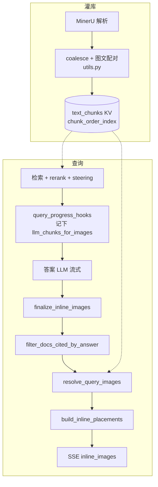
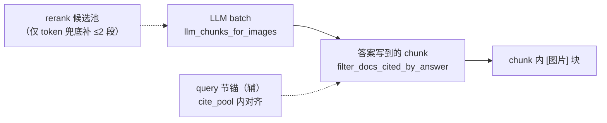
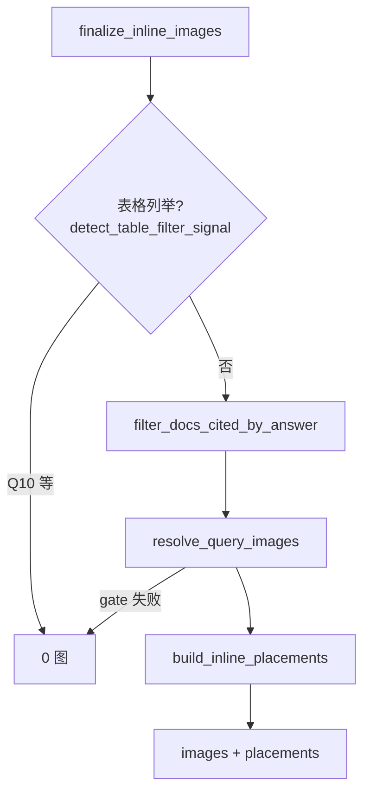
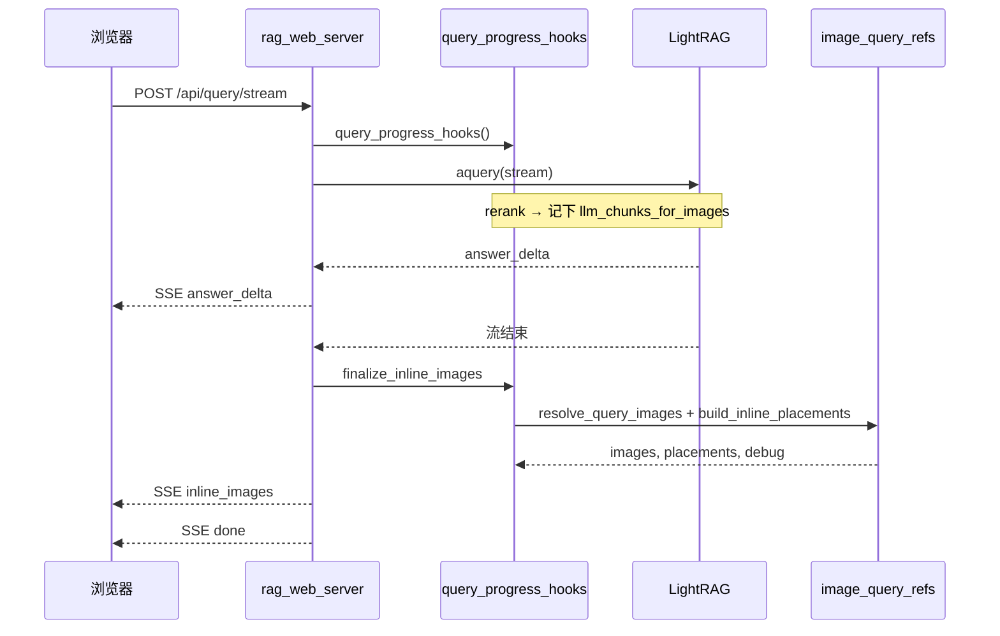

# 查询配图实现说明

> **本文档**：配图 **当前实现** 的唯一说明（灌库 → 检索挂接 → 选图 → placement → Web 内联展示）。  
> **关联**：[`统一图文关联架构实施方案.md`](统一图文关联架构实施方案.md)（架构演进与阶段计划）· [`检索阶段图文关联扩池方案.md`](检索阶段图文关联扩池方案.md)（pre-rerank 扩池，**未实施**）· [`测试例参考答案.md`](测试例参考答案.md) · [`问答全流程图.md`](问答全流程图.md) · [`.cursor/rules/rag-image-matching.mdc`](../.cursor/rules/rag-image-matching.mdc)  
> **代码**：灌库 `raganything/utils.py` · 查询 `scripts/image_query_refs.py` · 挂接 `scripts/query_progress_hooks.py` · Web `scripts/rag_web_server.py` · 前端 `web/static/app.js`  
> **批测基线**（2026-07-09）：[`logs/web_path_q1_17/20260709_130927_all.md`](../logs/web_path_q1_17/20260709_130927_all.md) — 文字 **17/17**，配图脚本 **15/17**，**调整基线 17/17**（Q6 手测 PASS；Q17 熔胶盒暂忽略）；指针 [`latest_baseline.path`](../logs/web_path_q1_17/latest_baseline.path)

配图 **不参与** 答案 LLM 的检索与生成（`query_doc_steering.py` 另文档）；仅在答案 **流式结束后** 选图并计算插入位置。

---

## 1. 设计原则

| 原则 | 说明 |
|------|------|
| **同源** | 配图扫描与「送给答案 LLM 的 chunk」同源，再经答案正文 **citation 收窄** |
| **结构驱动** | 多图由 **答案结构**（机型 bullet、跨机 pair）决定 target 个数，不靠 query 句式路由多套管线 |
| **禁止领域 hardcode** | 不用「步骤 / 型号 / 电控板」等词表做分流；用 parser 字段、节号、term overlap、chunk 序 |
| **灌库查询共用** | `context_text_for_image`、`best_image_for_text_item`、`text_term_alignment_symmetric` 等在 `utils.py` |
| **阈值走 env** | 如 `RAG_IMAGE_MIN_REF_ALIGN`、`RAG_IMAGE_CHUNK_LOCALITY`；完整列表见 `config/env.example` |

---

## 2. 端到端总览

### 2.1 灌库 vs 查询

| 阶段 | 时机 | 做什么 |
|------|------|--------|
| **灌库** | PDF 入库（一次性） | MinerU 块 → 正文 + inline `[图片]` → `coalesce_text_image_segments` 合并进同一 chunk |
| **查询** | 每次问答 | 记下 LLM batch → 答案生成 → citation 收窄 → 选图 → placement → SSE `inline_images` |



### 2.2 扫图范围（三层收窄）



**不做**：用 rerank 全池 / MinerU 原始 JSON 作为主扫图源（列举题在严格边界内的 KV / pair 补池除外）。

---

## 3. 灌库：正文与图共 chunk

`processor.py` 将 MinerU 块转为带 `[图片]` 的文本段；`coalesce_text_image_segments` 把 **紧跟正文** 的图片块并入同一段，使 rerank、LLM、配图读到同一段元数据。

P2 增强（`utils.py`）：`_merge_orphan_heading_segments`、`_lookahead_pair_text_image_segments` 等减少「标题 orphan / 跨行图文分离」。**改 ingest 后需重灌**对应 PDF。

chunk 内 `[图片]` 示例：

```text
保养步骤：…压带轮表面会粘上胶水…

[图片]
图片路径：…/auto/images/c3376a….jpg
页码：7
脚注：压带轮残胶清理
```

灌库配对优先级（与查询一致）：**图注/footnote 对齐 → 阅读顺序 → bbox 距离**（见 `.cursor/rules/rag-image-matching.mdc`）。

---

## 4. 查询挂接

`scripts/query_progress_hooks.py` 在 `async with query_progress_hooks():` 内包装 `process_chunks_unified`：

1. 得到 **最终送给答案 LLM 的 chunk**；
2. 可选节号收窄、内容清洗；
3. `_sync_llm_chunks_for_images` → 全局 `_llm_chunks_for_images`（Plan A 同源 batch）；
4. 答案流结束后 `finalize_inline_images(answer_text=…)`。

token 截断裁掉含图 chunk 时，可从 rerank 池 **最多补 2 段** inline 图 chunk（`supplement_llm_docs_with_rerank_figures`；`RAG_LLM_RERANK_FIGURE_SUPPLEMENT=0` 时关闭）。

---

## 5. 答案结束后：`finalize_inline_images`

Web 在答案 token **流结束** 后调用（`rag_web_server.py`），推送 SSE `inline_images`（在 `done` 之前）。



| `gate.reason` | 含义 |
|---------------|------|
| `table_filter_listing` | 表格列举（如 Q10），强制 0 图 |
| `no_answer_cited_chunks` | 答案与 LLM chunk 无匹配 |
| `no_inline_in_cited` / `no_inline_figures_in_primary` | cited 内无通过门控的 `[图片]` |
| `no_inline_placements` | 有图但算不出 placement（Web 可能有图廊兜底） |
| `rerank_score_ok` | 正常选图 |

---

## 6. 选图：`resolve_query_images` / `images_for_api`

主入口：`resolve_query_images` → `explain_query_images`（debug）→ `images_for_api`（API 输出）。

### 6.1 两条路径

| 路径 | 触发条件 | 行为 |
|------|----------|------|
| **统一** | `RAG_IMAGE_CHUNK_LOCALITY=1` 且 `extract_figure_targets` 命中 unified（**含 single**、≥2 bullet/pair 等） | `_refs_from_unified_figure_targets` → 每 target 调 `_figure_for_target`（**anchor/neighbor 优先**，2.8） |
| **Legacy** | 其余（如单手册 `machine_bullet` 未达 unified 条件） | `_refs_from_retrieved_docs_text` 等 scan/score/select |

debug 标签：`image_selection: unified_figure_targets`。

### 6.2 `FigureTarget` 提取（答案结构，非 query 路由）

```python
FigureTarget(manual_hint, anchor_text, kind, component="")
# kind: "single" | "machine_bullet" | "machine_component_pair" | "answer_bullet"
```

| 答案结构 | 提取 | 典型题 |
|----------|------|--------|
| ≥2 个 (机型, 部件) pair | `_machine_component_listing_pair_targets` | Q16、Q17 |
| ≥2 条 `**机型**` bullet | `_machine_bullet_lines_from_answer` | Q15 |
| ≥2 条 **非机型**列举 bullet | `_answer_bullet_lines_for_figure_targets` | Q11、Q12 |
| 否则 | 单 target：query + answer 合成 anchor | Q3–Q9 |

### 6.3 `_figure_for_target`（统一核心）

对每个 target，在同一手册 scoped 内：

```text
1. manual_chunks ← _load_manual_chunks_for_locality(manual_hint)
2. anchor ← _best_anchor_chunk(manual_chunks, anchor_text, cite_pool=scoped_cite)
3. topic_text ← 答案结构（answer_bullet 的 **部件** 等，非 query 词表）
4. figure ← anchor 含 [图片] → anchor
           elif neighbor（±RAG_CHUNK_ORDER_WINDOW / RAG_IMAGE_CHUNK_LOCALITY_WINDOW）
           elif scoped cite_pool → full pool → content_list
5. topic gate ← _figure_ref_matches_target_topic(topic_text, ref)
6. align gate ← text_term_alignment_symmetric(topic_text, label/context)
```

**不用 query n-gram 过滤配图**（阶段 2.8）；选图与 `build_inline_placements` 挂位分离。

pair 目标（Q16/Q17）走 `_best_figure_doc_for_component`，不依赖整本手册 KV 无界扫图。

### 6.4 Legacy 路径要点

仍用于 Q3–Q11 等单题 / 单手册列举：

1. `extract_image_refs_from_context(figure_context)` — 解析 cited 正文内 `[图片]`；
2. `_ref_passes_image_align_gate` — 封面、严重不对齐丢弃；
3. `_score_ref_for_query` — rerank 分 + chunk 内图加分；
4. `_select_scored_refs` — 列举 / 跨手册 / 默认分支；
5. 列举题 `listing_span_keep`、cited manual KV 扩池、受限 content_list 补图（边界内）。

张数：`RAG_IMAGE_MULTI_LIMIT=0` → 软顶 **24** 张。

### 6.5 Citation 收窄

`filter_docs_cited_by_answer`：用 **已生成答案** 匹配 LLM batch 每 chunk 正文行；去掉 References 段。

列举题额外：从答案抽 `**部件**` span，`listing_span_keep` 保留带对应图注的 chunk（防 Q11 只 cite 部分条目）。

短答案单题：`RAG_IMAGE_QUERY_SECTION_ANCHOR=1` 时在 **cite_pool 内** 用 query 节号 / `保养内容：` 辅锚（不单独开全库搜图线）。

### 6.6 API 输出

`images_for_api` 解析 `pipeline_parse` 路径，生成 token URL：

```json
{
  "url": "/api/media/image?token=…",
  "caption": "压带轮残胶清理",
  "page": 7,
  "source_key": "高速智能封边机维护保养手册.pdf"
}
```

---

## 7. Placement：插在哪一段后面

**选图与挂位分离**：`build_inline_placements(answer, images, query=…)`。

| 步骤 | 函数 | 说明 |
|------|------|------|
| 多机型 bullet | `_build_machine_bullet_manual_placements` | Q15：每机型 bullet 下挂图；`keep_unplaced=True` |
| 主路径 | `_build_semantic_inline_placements` | `_answer_logic_lines` 抽机型/部件/步骤语义行，与 caption 对齐 |
| 兜底 | `_fallback_end_placements` | References 前最后一段后 |

每条 placement 含 `anchor_text`、`match_start`/`match_end`、`image_index`、`score`；前端用偏移或锚点文本定位 DOM。

特殊 gate：周期题（Q3）禁用机型推断；步骤题（Q4）用 query 主题配对；caption fallback 支持「机床外部清洁」vs「清洁机床内部」类字面差异。

离线回放：`scripts/replay_placement_dumps.py`（改 placement 后优先跑，无需 LLM）。

---

## 8. 前端内联展示

SSE 事件 `inline_images`（`images` + `placements`），在 `done` 之前发送。

`web/static/app.js`：

1. `renderMarkdown` 渲染答案；
2. `answerBodyForPlacement` 剥 References，与后端偏移一致；
3. **偏移优先** `findInsertPointByOffset` → 块级 `insertFigureAfterAnchor`（`</p>`/`</li>` 后）；
4. 失败时图廊兜底；`source_key` 维度 dedup 防跨手册同 caption 互杀；
5. `### 机型` 标题用 exact match + h3 序号，避免「自动」误绑「高速自动」。

流式 `done` 时若已插入 `<figure>`，避免全量重渲染覆盖。

---

## 9. 时序（Web）



---

## 10. 环境变量（配图相关）

| 变量 | 默认 | 含义 |
|------|------|------|
| `RAG_IMAGE_CHUNK_LOCALITY` | `1` | 统一多 target 门控；`0` 回退纯 legacy |
| `RAG_IMAGE_CHUNK_LOCALITY_WINDOW` | `8` | order_index 邻居窗口（配图） |
| `RAG_IMAGE_MIN_RERANK_SCORE` | `0.28` | 选图 rerank 门控 |
| `RAG_IMAGE_MIN_REF_ALIGN` | `0.28` | 图注/上下文对齐阈值 |
| `RAG_IMAGE_QUERY_SECTION_ANCHOR` | `1` | 短答案 query 节锚（cite_pool 内） |
| `RAG_IMAGE_MULTI_LIMIT` | `0` | `0` = cap 24 |
| `RAG_IMAGE_INLINE_MIN_PLACE_SCORE` | `0.35` | placement 最低分 |
| `RAG_LLM_RERANK_FIGURE_SUPPLEMENT` | `0` | 是否从 rerank 池补 chunk 进 LLM |
| `RAG_QUERY_CHUNK_LOCALITY` | `1` | LLM 上下文 order_index 邻居（文字） |
| `RAG_QUERY_DEBUG_DUMP` | `0` | 写 `logs/query_dumps/*.json` |
| `RAG_WEB_PARSER_OUTPUT_DIR` | `data/pipeline_parse` | 媒体文件根 |

---

## 11. 调试与回归

| 工具 | 用途 |
|------|------|
| `RAG_QUERY_DEBUG_DUMP=1` | 每次查询 dump（含 `images.debug`、`inline_placements`） |
| `scripts/replay_placement_dumps.py` | 离线回放 placement |
| `scripts/run_web_path_q1_17.py` | **主回归** Q1–Q17，对照 `测试例参考答案.md` |
| Web「开发」面板 | 开关 debug dump |

dump 关键字段：

```json
{
  "images": {
    "debug": {
      "image_selection": "unified_figure_targets",
      "unified_figure_targets": { "targets": [...] },
      "gate": { "ok": true, "reason": "rerank_score_ok" }
    }
  }
}
```

---

## 12. 测试例配图预期

| ID | 配图 | 说明 |
|----|------|------|
| Q1–Q2、Q10、Q14 | 0 | 型号/检查/表格列举/纯文字 |
| Q3–Q9 | 1 | 单条保养，图注与步骤一致 |
| Q11 | ≤3 | 单手册部件列举，span–图注对齐 |
| Q12–Q13 | 多张 | 与答案条目相关 |
| Q15 | 4 | 四机 bullet，各手册 1 张（批测 **✓**） |
| Q16 | 3 | pair target；grader 对 `(注：…)` 脚注偶发误报 |
| Q17 | 8 | pair；批测曾缺「自动/熔胶盒」 |

详见 [`测试例参考答案.md`](测试例参考答案.md)。

---

## 13. 模块索引

| 模块 | 文件 |
|------|------|
| 灌库 coalesce / 配对 | `raganything/utils.py` |
| 灌库写入 | `raganything/processor.py` |
| Hook / finalize | `scripts/query_progress_hooks.py` |
| 选图 + placement | `scripts/image_query_refs.py` |
| 检索 steering（非配图） | `scripts/query_doc_steering.py` |
| Web SSE | `scripts/rag_web_server.py` |
| 前端 | `web/static/app.js` |
| 批测 | `scripts/run_web_path_q1_17.py` |
| 架构演进 | `docs/统一图文关联架构实施方案.md` |

---

## 14. 已知边界与后续

| 项 | 状态 |
|----|------|
| 统一架构阶段 0–2 | **已落地**（`extract_figure_targets` + `_figure_for_target`） |
| LLM neighbor 取消 listing skip | **暂缓**（阶段 3） |
| Pre-rerank figure sibling | **未实施**（阶段 4，见 [`检索阶段图文关联扩池方案.md`](检索阶段图文关联扩池方案.md)） |
| Q3 图注「机床外部」vs「床身」 | 灌库节边界 / 标签对齐；可能需重灌或 align 调参 |
| Q11 多图 / Q17 缺 pair | legacy 列举 + pair 选取；见 dump 对比 |
| 历史文档 | `查询配图设计方案`、`配图query锚定实施方案` 等分阶段记录 **已删除**；以本文 + 统一架构方案为准 |
