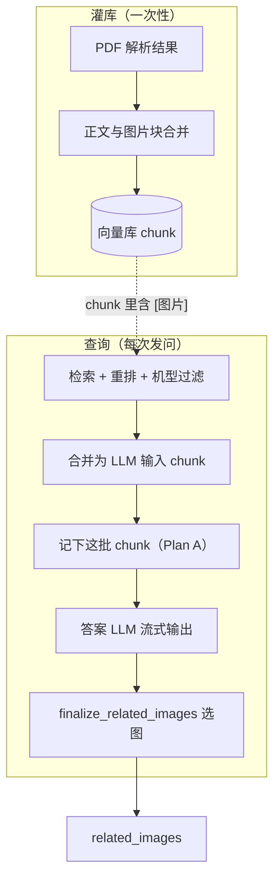
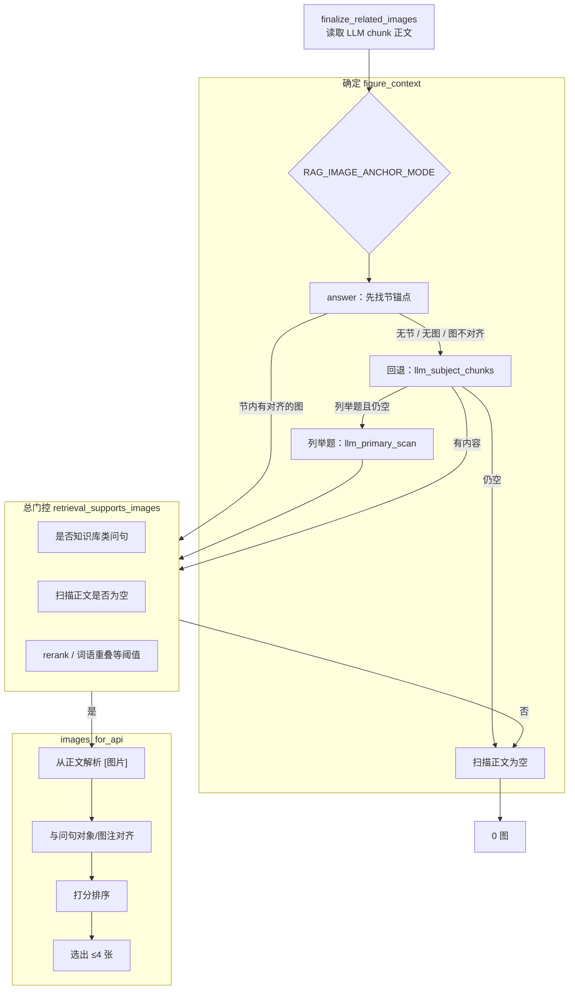
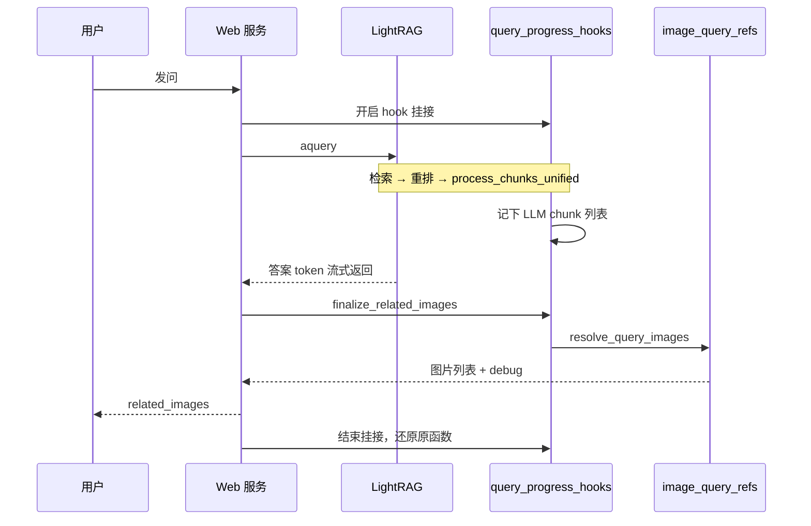

# 查询配图实现说明

> **关联文档**：[`问答全流程图.md`](问答全流程图.md) · [`多轮问答实现方案.md`](多轮问答实现方案.md) · [`实现方案文档模板.md`](实现方案文档模板.md)  
> **实现位置**：灌库 `raganything/utils.py` · 查询 `scripts/image_query_refs.py` · 挂接 `scripts/query_progress_hooks.py`

本文说明：用户发问后，回答下方的「参考资料图片」从哪来、如何与文字答案对齐。

**设计原则**（详见 [`.cursor/rules/rag-image-matching.mdc`](../.cursor/rules/rag-image-matching.mdc)）：不写死领域词表；用 MinerU 解析字段（图注、脚注、位置）和问句—图注文字对齐来选图。

---

## 1. 背景与目标

### 1.1 要解决的问题

手册 PDF 里的图在 **灌库** 时已经和图片路径、页码、图注一起写进向量 chunk。用户 **查询** 时，需要从这些 chunk 里挑出与 **当前问句** 和 **实际用于生成答案的正文** 相符的图，最多展示若干张。

若配图扫描范围比答案 LLM 更广（例如扫 rerank 全池、或查询时再读 MinerU 原始 JSON），容易出现 **答案讲 A 条目、图却是 B 条目** 的错配。

### 1.2 Plan A（当前方案）

**Plan A** 用一句话说：

> **配图只从「最终送给答案 LLM 的那批 chunk」里找图**，和答案看的是同一份正文。

具体 **不做** 的事：

- 不用 rerank 后的全量候选 chunk 单独扫图；
- 不用单独的 `retrieval_context` 字符串兜底扫图；
- 查询时 **不再** 回读 MinerU 的 `content_list` 临时补图。

### 1.3 端到端概览

| 阶段 | 何时 | 做什么 |
|------|------|--------|
| 灌库 | PDF 入库（一次性） | 把图片信息写进 chunk 内的 `[图片]` 块，与邻近正文合并 |
| 挂接 | 每次问答 | 在 LightRAG 内部关键步骤插入我们的代码，记下 LLM 实际用到的 chunk |
| 选图 | 答案流式输出 **结束后** | 从记下的 chunk 里解析 `[图片]`，过滤、打分、选出 ≤4 张 |
| 展示 | 同上 | 通过 SSE `related_images` 发给前端 |



---

## 2. 关键术语

### 2.1 Hook（挂接）是什么

LightRAG 是第三方库，我们 **不改它的源码**，但需要在问答过程的 **特定时刻** 执行自己的逻辑，例如：

- 向前端推送「正在检索…」进度；
- **记下** 最终送给答案 LLM 的 chunk 列表（配图用）。

**Hook** 在这里指：**在一次问答开始前，临时用我们的包装函数替换库里的原函数；问答结束后再还原**。包装函数里会先调用原逻辑，再执行额外步骤。

承担这件事的模块是 **`scripts/query_progress_hooks.py`**。Web 每次 `aquery` 时通过 `async with query_progress_hooks():` 开启挂接，退出时自动还原。

---

### 2.2 `process_chunks_unified` 与「记下 LLM chunk」

检索、重排之后，LightRAG 手里往往有 **很多** 候选片段，不能直接全部塞给答案 LLM（有 token 上限）。**`process_chunks_unified`** 是 LightRAG **内部** 的函数：负责把候选片段 **合并、截断**，得到 **最终送给答案 LLM 的那一批 chunk**。

我们的挂接方式可以理解为：

```text
原流程：  … → process_chunks_unified → 送给 LLM 生成答案

挂接后：  … → 【我们的包装函数】
              ├─ 先调用原来的 process_chunks_unified（行为不变）
              ├─ 把返回的 chunk 列表存一份（_sync_llm_chunks_for_images）
              └─ 再往下走 LLM 生成
```

因此：**存下来的 chunk = 答案 LLM 真正读到的 chunk**，不是 rerank 池里被筛掉的那些。

存盘函数 **`_sync_llm_chunks_for_images`** 还会对这批 chunk 再做一次与正式问答相同的 **机型/文档过滤**（`filter_retrieved_docs_by_query`），然后写入内存变量 `_llm_chunks_for_images`。

---

### 2.3 `[图片]` 块（inline 图）

灌库时，每张图在 chunk 正文里是一段固定格式的文本块，例如：

```text
[图片]
图片路径：…/auto/images/xxx.jpg
页码：5
图注：（MinerU 有则填）
脚注：（MinerU 有则填）
关联正文：…（灌库时根据邻近段落推断）
```

查询配图 **只认** chunk 里这种 `[图片]` 块，不再去别处找路径。正文步骤与图 metadata **在同一块** 里，rerank、LLM、配图读到的内容一致。

---

### 2.4 `finalize_related_images`

**是什么**：配图流程的 **出口函数**（`query_progress_hooks.py`）。在 **答案 LLM 流式输出结束之后**、SSE 发送 `done` 之前调用。

**做什么**：

1. 读取挂接阶段存下的 `_llm_chunks_for_images`；
2. 把 chunk 正文拼成字符串；
3. 调用 `image_query_refs.resolve_query_images` 选图；
4. 结果通过 SSE `related_images` 发给前端。

**不是什么**：不在答案生成过程中调用；澄清门控阶段也不调用（见 [`多轮问答实现方案.md`](多轮问答实现方案.md)）。

---

### 2.5 `resolve_query_images` / `images_for_api`

| 函数 | 作用 |
|------|------|
| **`resolve_query_images`** | 对外总入口：返回 `(图片列表, debug 信息)` |
| **`images_for_api`** | 实际选图：定扫描范围 → 总门控 → 解析 `[图片]` → 对齐过滤 → 打分 → 最多 4 张 |
| **`explain_query_images`** | 与 `resolve_query_images` 同逻辑，侧重 debug 字段，供 dump 使用 |

---

### 2.6 `figure_context`（配图扫描正文）

从 Plan A 的 chunk 正文里，**再裁一段** 专门用来找图，称为 `figure_context`。

为什么要裁：LLM chunk 可能很长；问句往往只对应某一 **节**（如 `2.1.5`）或某一 **保养对象**。先缩小范围，减少误配。

由 **`_context_for_image_scan`** 根据 `RAG_IMAGE_ANCHOR_MODE` 和问句类型决定裁法（见 §4）。

---

### 2.7 节锚点（anchor）与 fallback

**节锚点**：在 LLM chunk 正文里，找与问句最相关的 **章节号/标题行**（如 `2.1.5 压带轮残胶清理`），只在该节范围内的 chunk 里找图。

**fallback（回退）**：锚不到节、或节里没有合适图时，依次尝试：

| 回退名 | 含义 |
|--------|------|
| **`llm_subject_chunks`** | 在全部 LLM chunk 里，找「含图且与问句对象对齐」的块 |
| **`llm_primary_scan`** | 列举题专用：在整段 LLM 正文里扫图 |

若全部失败 → `figure_context` 为空 → **0 图**。

---

### 2.8 问句对象（concrete object）

单条保养/检查题（非「哪些部件…」类列举题）会从问句里抽出 **具体在问什么**，例如：

- 「清理压带轮残胶应该使用什么工具？」→ 对象：`压带轮残胶`
- 「…检查电源开关？」→ 对象：`电源开关`

配图时要求图的图注/关联正文与这个对象 **对得上**，避免仅凭「检查」「开关」等泛词误配到别的条目。

---

## 3. 灌库：图如何进入 chunk

### 3.1 合并正文与图片块

MinerU 解析 PDF 后得到按阅读顺序排列的块（文字、图片、表格）。灌库时：

1. 文字块 → 普通段落；
2. 图片块 → 调用 `build_image_ref_block` 生成上面的 `[图片]` 段；
3. **`coalesce_text_image_segments`**：把 **一段文字 + 紧跟其后的 `[图片]` 块** 合成 **一个** 向量 chunk。

这样，保养步骤文字和图片 metadata 永远绑在同一块里。

### 3.2 「关联正文」从哪来

函数 **`context_text_for_image`**（`raganything/utils.py`）在灌库时为每张图填 `关联正文` 字段，优先级：

1. MinerU 有图注/脚注 → 与上方文字做词语对齐，取最相关行；
2. 无图注 → 同页版式距离最近的文字；
3. 再不行 → 阅读顺序上的邻居段落。

Web 展示 caption 时：优先用块内的 **脚注 / 图注**；若都没有，可从 **关联正文** 里的 `保养内容：…` 提取短标题（函数 `_maintenance_topic_from_text`）。

### 3.3 灌库时的图—文配对

**`best_image_for_text_item`**（仅灌库阶段）：决定某段文字应对应哪张图写入 chunk——有图注的优先按图注对齐；否则取阅读顺序下方第一张无图注的图；再兜底按 bbox 距离。查询阶段 **复用** 同一套 utils 里的对齐思路，但不改灌库结果。

---

## 4. 查询选图流程

### 4.1 总览



### 4.2 `answer` 模式下的扫描分支

默认配置 **`RAG_IMAGE_ANCHOR_MODE=answer`**（Web 与批测 `image_anchor` profile）。

| 情况 | debug 里常见 `reason` / `fallback` | 扫描范围 |
|------|-------------------------------------|----------|
| 找到节号，且节内图与问句对象对齐 | — | 仅该节内 chunk |
| 找不到节号 | `no_anchor` | 先试 `llm_subject_chunks` |
| 有节号但节内无 `[图片]` | `anchor_sections_without_figures` | `llm_subject_chunks` |
| 节内有图但与问句对象不对齐 | `anchor_sections_figures_not_aligned` | `llm_subject_chunks` |
| 上述回退仍空，且为列举题 | `llm_primary_scan` | 整段 LLM chunk 正文 |
| 全部为空 | — | **0 图** |

**列举题**识别：问句含「哪些 / 几种 / 列举 …」等；**不** 把单独的「多少」当作列举（避免「小于多少」误判）。

列举题 **不** 启用严格的单对象门控；选图时尽量为每个列举目标配一张图（`_select_scored_refs_for_listing`）。

### 4.3 对齐与过滤（简述）

对解析出的每个 `[图片]` 候选：

- **总门控** `retrieval_supports_images`：非 KB 问句、扫描正文为空、分数/重叠不足 → 直接 0 图；
- **单条题对象门控**：问句抽出具体对象后，图注/关联正文须与之匹配；
- **逐条过滤** `_ref_passes_image_align_gate`：来源手册一致、节号不冲突、图注与问句/正文对齐等；
- **打分** `_score_ref_for_query` 后取前若干张。

阈值均来自环境变量 `RAG_IMAGE_*`，见 §6。

---

## 5. 时序：从发问到出图



**与 rerank 挂接的关系**：rerank 完成后仍会同步一份候选到 `_retrieved_docs`（供澄清 band、debug 用），但 **配图不再读这份列表**；配图只读 `process_chunks_unified` 之后存下的 `_llm_chunks_for_images`。

---

## 6. Caption 与前端展示

API 每条图大致包含：`url`、`caption`、`page`、`context`。

**Caption 优先级**：

1. 灌库块内的 **脚注**（MinerU `image_footnote`）；
2. **图注**（MinerU `image_caption`）；
3. 从 **关联正文** 提取的 `保养内容：…` 短标题。

页码来自灌库时的 `页码：N`。界面常见格式：**「{caption} 第 {page} 页」**。

图片 URL 经 `/api/media/image?token=…` 鉴权访问。

---

## 7. 环境变量

| 变量 | 默认 | 含义 |
|------|------|------|
| `RAG_IMAGE_ANCHOR_MODE` | `answer` | `off` 扫全部 LLM 正文；`answer` 节锚点 + 回退 |
| `RAG_IMAGE_ANCHOR_MIN_LINE_OVERLAP` | 0.15 | 锚点行与问句词语重叠下限 |
| `RAG_IMAGE_ANCHOR_MAX_SECTIONS` | 1 | 最多取几个节号 |
| `RAG_IMAGE_MIN_RERANK_SCORE` | 0.28 | 配图总门控 rerank 下限 |
| `RAG_IMAGE_MIN_TERM_OVERLAP` | 0.34 | 词语重叠下限 |
| `RAG_IMAGE_MIN_REF_ALIGN` | 0.28 | 图注对齐下限 |
| `RAG_IMAGE_LLM_CHUNK_MIN_SUBJECT` | 0.24 | subject-chunk 回退下限 |
| `RAG_IMAGE_MULTI_LIMIT` | 4 | 列举题最多张数 |
| `RAG_QUERY_DEBUG_DUMP` | 0 | 设为 `1` 时写入 `logs/query_dumps/*.json` |

完整列表见根目录 **`env.example`**。

---

## 8. 调试

### 8.1 Web dump

开发面板开启 **`RAG_QUERY_DEBUG_DUMP=1`**，每次查询在 `logs/query_dumps/` 生成 JSON。配图相关建议先看：

| 字段 | 含义 |
|------|------|
| `images.debug.image_source` | 应为 `llm_chunks`（Plan A） |
| `images.debug.llm_chunk_count` | 参与扫图的 chunk 数量 |
| `images.debug.anchor_scan` | 节锚点、回退原因（`reason` / `fallback`） |
| `images.debug.gate.ok` | 总门控是否通过 |

### 8.2 批测

```powershell
uv run python scripts/compare_query_tuning.py --profiles image_anchor --ids 1,2,3,5,6,7,11 --with-answer
```

脚本走与 Web 相同的 `query_progress_hooks` + `finalize_related_images` 路径；验收用例见 [`测试问题.txt`](测试问题.txt)。

### 8.3 常见问题

| 现象 | 建议先看 | 常见原因 |
|------|----------|----------|
| 0 图 | `gate.ok` | 扫描正文为空；问句对象与图注不对齐；分数过低 |
| 错图 | `image_source` | 若非 `llm_chunks`，说明未走 Plan A |
| 0 图但答案正文提到图 | `anchor_scan.reason` | 节内无图或对象不对齐；strict object 过滤 |
| 列举题少图 | `listing_targets` | 列举目标与图注未对齐 |

---

## 9. 已废弃路径

以下逻辑在 `image_query_refs.py` 末尾以 `if False:` 保留参考，**生产不执行**：

- 单独扫 rerank 全池选图；
- 查询时再读 MinerU `content_list` 补图；
- 用 `retrieval_context` 或 rerank 池驱动 `finalize_related_images`。

扩展新逻辑时：灌库与查询共用 `utils.py` 配对函数；阈值走 env；**不加**领域词表。

---

## 10. 源码索引

| 文件 | 职责 |
|------|------|
| `raganything/utils.py` | 灌库合并、`context_text_for_image`、`best_image_for_text_item` |
| `raganything/processor.py` | 灌库段落构建 |
| `scripts/query_progress_hooks.py` | Hook 挂接、记下 LLM chunk、`finalize_related_images` |
| `scripts/image_query_refs.py` | 扫描、门控、对齐、打分、API 出图 |
| `scripts/compare_query_tuning.py` | 批测 |
| `docs/问答全流程图.md` §5 | 全链路中的配图摘要 |

---

*文档版本：v2.0 · 2026-06-10*
