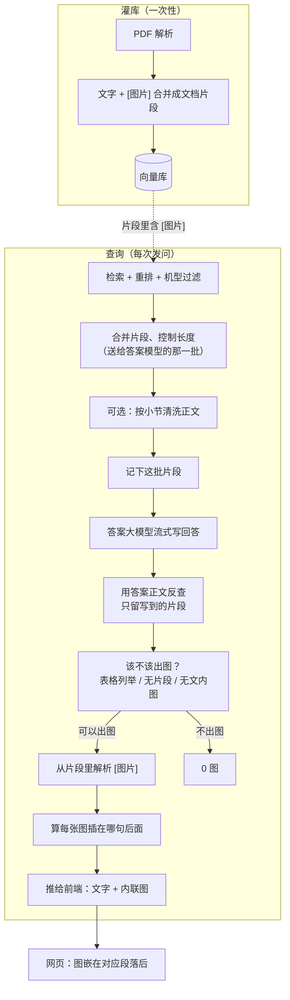
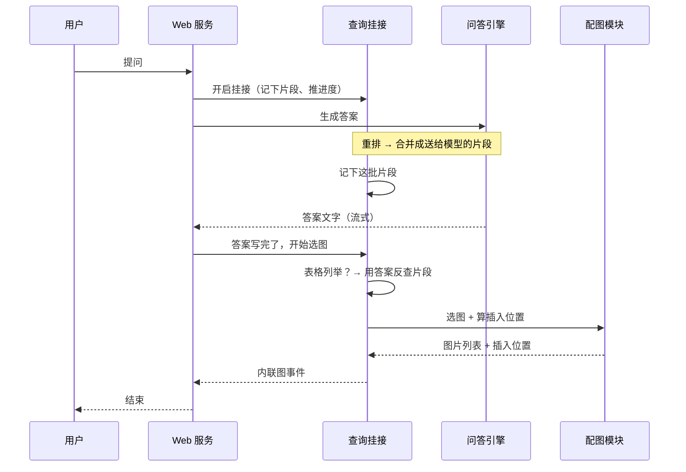
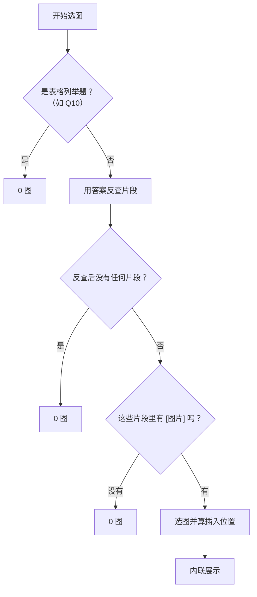
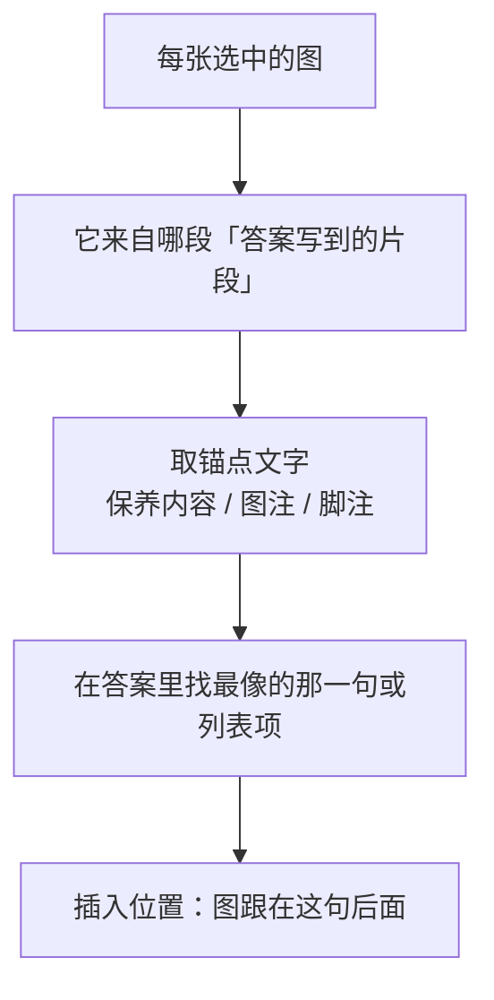

# 查询配图设计方案

> **关联**：[`查询配图实现说明.md`](查询配图实现说明.md)（代码级实现文档，含流程图）· [`配图query锚定实施方案.md`](配图query锚定实施方案.md)（分阶段实施记录）· [`测试例.txt`](测试例.txt) · [`测试例参考答案.md`](测试例参考答案.md)  
> **回退点**：git tag `before_remake_illustration`  
> **状态**：tag `OK0614_no_clarify`（2026-06-14）；Q3/Q4/Q11 placement + Web 贴图加固；全量批测基线见 tag `gate_fix_Q16failed`（16/17）

本文是配图逻辑的设计方案。文字答案的 **检索与生成**（机型过滤、目录补召回、表格列举等，`query_doc_steering.py`）**不在本次范围**——配图只挂在答案流式结束之后的选图与展示，不改变送给答案模型的片段内容。

---

## 0. 术语说明（读下文前先看）

| 说法 | 人话解释 |
|------|----------|
| **chunk（文档片段）** | 灌库时从手册切出来的一小段文本，带页码、来源 PDF 名；是检索和问答的最小单位。 |
| **送给答案模型的片段**（代码里叫 LLM batch） | 检索、重排之后，**真正塞进答案大模型上下文、用来写回答** 的那几段文档片段。不是 rerank 后的全部候选，而是经合并、截断、机型过滤后的 **最终一批**。配图必须与这批 **同源**。 |
| **答案实际用到的片段**（代码里叫 cited / 答案引用收窄） | 答案流式输出 **结束之后**，拿 **已生成的答案正文** 去对照「送给答案模型的片段」：答案里 **确实出现过的段落** 才留下，没写进答案的段落丢掉。避免「答案讲 A、却从同批里的 B 段落抠图」。 |
| **文内图片块**（`[图片]` / inline 图） | 灌库时写在 chunk 正文里的固定格式，含图片路径、页码、图注等；**不是**查询时再去读 MinerU 原始 JSON。 |
| **重排候选池**（rerank 全池） | 重排序后排名前几十的片段集合，比「送给答案模型的片段」 **更大**；只用于调试或 token 不够时 **最多补 2 段** 含文内图的片段，**不能**作为主扫图范围。 |
| **表格列举题** | 如 Q10：问「哪些部件用某种油」，答案应是 **表格式部件名单**，不应再配某一条保养步骤的示意图。 |
| **内联配图** | 图插在 **对应答案句子或列表项后面**，而不是整段答案下方另起一排「参考资料图片」。 |
| **插入位置**（placement） | 某张图应插在答案 **哪一句、哪一条列表项** 后面；由后端算好，前端按位置渲染。 |
| **信任 chunk 模式**（trust） | 默认开启：认为 **片段对了，里面的文内图位置就可信**，不再用问句关键词去猜图注是否匹配。 |

**三层收窄（扫图范围，一句话版）**

> 重排候选池（很大，仅兜底） → **送给答案模型的片段**（与写答案同源） → **答案里真正写到的片段** → 只从这些片段里的 **`[图片]` 块** 取图。  
> **Query 节锚（辅）**：当答案过短或未复述节标题时，在 **citation pool ∪ 同节邻段 ∪（列举题）KV 补池** 内，用 query 对齐 `保养内容：` / 节号，**不**单独开全库第二条搜图线（见 [`配图query锚定实施方案.md`](配图query锚定实施方案.md) 阶段 1–3）。

---

## 1. 要解决的问题

手册 PDF 的图在 **灌库** 时已与路径、页码、图注一起写进文档片段里的 `[图片]` 块。用户 **查询** 时，需要挑出与 **实际用于生成答案的正文** 相符的图。

若扫图范围比写答案时更广——例如扫 **整个重排候选池**、或查询时再读 MinerU 原始 JSON 临时补图——就容易出现 **答案讲 A 条目、图却是 B 条目** 的错配。

### 1.1 目标行为（产品要求）

| 规则 | 示例 |
|------|------|
| 只在 **答案实际写到的片段** 里找图 | 先与「送给答案模型的片段」同源，再按答案正文收窄 |
| 这些片段里 **没有文内图** → **0 图** | Q2 电源开关：有文字步骤，但片段内无 `[图片]` |
| 答案 **只复述表格列举**、没写到带图的保养步骤 → **0 图** | Q10 九个部件液压油名单 |
| 有图则 **按条目需要出图，不限 4 张** | Q11 三个部件清残胶，可出 3 张 |
| 图 **嵌在对应答案文字后面**，不要答案底下单独一排 | 见 §5.3 |

### 1.2 设计约束

- **禁止** 写死领域词表（如「步骤」「型号」列表）；匹配靠 parser 字段、词语重叠、片段结构。
- 灌库与查询 **共用** 同一套配对逻辑；改灌库规则后需 **重新灌库**。
- 默认 **信任 chunk 模式**：片段正确则文内图可信，不用问句去猜图注。

---

## 2. 现状与差距

| 模块 | 当前状态 | 本次需完成 |
|------|----------|------------|
| 灌库 `[图片]` 块 | 已从 cc05c5a 移植 | **验证** 现有知识库格式；改配对才重灌 |
| 记下「送给答案模型的片段」 | 查询挂接里已实现 | **保持** |
| 按答案正文收窄片段 | `filter_docs_cited_by_answer` 已有 | **加强验收**；列举题逐条对齐 |
| 表格列举不出图 | Q10 门控已有 | **保持** |
| 选图上限 | 全局最多 4 张 | **改为按条目需要**，去掉 4 张硬顶 |
| 前端展示 | 答案区外独立图片横排 | **改为内联嵌入** |
| 批测 | 只验文字答案 | **增加配图断言** |

后端主路径 **大部分已有**；本次重点是 **扫图边界验收** + **内联展示**。

---

## 3. 总体架构



**明确不做**

- 不用 **整个重排候选池** 单独扫图（仅 token 不够时最多补 2 段含 `[图片]` 的片段，且仍须被答案正文命中）；
- 查询时不读 MinerU 原始 JSON 临时补图；
- 不用单独的「检索上下文字符串」驱动配图。

---

## 4. 查询选图流程（后端）

### 4.1 时序（从发问到出图）



### 4.2 扫图范围怎么一层层缩小


**第一层 — 送给答案模型的片段**

- 检索、重排后，系统会合并、截断，得到 **答案大模型实际读到的若干段文档**。
- 查询挂接在此时 **快照保存** 这批片段；配图与写答案 **看同一份**。

**第二层 — 答案里写到的片段（答案引用收窄）**

- 答案 **全部生成完后**，用答案正文去匹配第一层里的每一段：
  - 去掉文末「参考资料 / References」；
  - 看答案里是否出现该段的句子，或 `保养步骤：`、`保养内容：` 等字段里的关键词；
  - 跳过目录、纯标题段；
  - 得分不够的段丢掉。
- **没写进答案的段，不参与选图**——这是防 A/B 错配的关键。

**第三层 — 文内图**

- 只在第二层留下的片段里，查找 `[图片]` 块；
- 某段只有文字、没有 `[图片]` → 这段不出图（Q2 常属此类：有步骤文字，无图块）。

### 4.3 什么时候一张图都不出（零图规则）



| 情况 | 例子 |
|------|------|
| 表格列举题 | Q10：只列九个部件名，不配某条保养示意图 |
| 答案与片段对不上 | 反查后为空 → 0 图 |
| 片段有文字但没有 `[图片]` | Q2：电源检查步骤无配图块 → 0 图 |

> **Q10 细节**：是否在「表格列举」要在 **完整的第一层片段** 上判断（因为反查后可能已看不到 HTML 表），判定为列举题则 **直接 0 图**。

### 4.4 怎么从片段里挑出对的图

对 **答案写到的、且含 `[图片]` 的片段**：

1. 图的路径必须就在该片段正文里（文内图，不是外联猜测）；
2. 来源 PDF 与片段一致；去掉封面、只有「保养周期」无实质内容的 caption；
3. **打分**：优先看该片段在重排里的分数；同一段里「文字 + 图」灌库时已绑在一起，不再用问句关键词硬筛；
4. **数量**：取消全局「最多 4 张」；单条保养题通常 1 图；列举题（Q11）按 **答案每一条 ↔ 一个含图片段** 各取 1 张（可少不可乱配）。

### 4.5 图插在哪一句后面（插入位置，新增）

选完图后，再算 **插入位置**（函数 `build_inline_placements`）：



- **单条保养**（Q3–Q9）：通常 1 图，插在相关段落末尾。
- **列举**（Q11）：答案里每写到一个部件，若有一段含对应 `[图片]`，图插在该 **列表项下方**。
- **长列举**（Q12）：只对答案里 **已写出名称** 的条目配图；可少图，不可张冠李戴。
- 对不上答案的图 **丢弃**，宁可少图。

---

## 5. 前端展示改造

### 5.1 现状

- 图片在 **答案文字上方或外侧**，单独一块「参考资料图片」横排展示；
- 与答案段落 **没有对应关系**，容易感觉「答案说一套、图是另一套」。

### 5.2 目标

- 默认 **不再** 在答案区外整排展示；
- 答案仍流式输出纯文字；
- 答案写完后，收到 **内联图** 事件，把每张图 **插到对应段落或列表项后面**。

### 5.3 嵌入规则

| 答案形态 | 图放哪 |
|----------|--------|
| 普通段落 | 相关段落 **末尾** |
| Markdown 列表 | 对应 **列表项下方** |
| 多条列举（Q11） | 每条下面的图对应该条 |
| 没有有效插入位置 | **不显示图** |

图说格式：`{图注} · 第 {页码} 页`（优先用脚注 / 图注 / `保养内容：`）。

### 5.4 推给前端的数据（草案）

```json
{
  "type": "inline_images",
  "images": [ { "url", "caption", "page" } ],
  "placements": [
    {
      "anchor_text": "压带轮",
      "match_start": 120,
      "match_end": 145,
      "image_index": 0
    }
  ]
}
```

- `match_start` / `match_end`：在 **纯文本答案** 里的字符位置，方便前端定位插入点；
- **若没有 placements**，前端 **不展示图**（防止又退化成底部乱排）。

---

## 6. 灌库侧（验证即可）

灌库逻辑已移植；开工前 **抽样检查**：

- 片段里 `[图片]` 含路径、页码、图注等；
- 保养文字与紧跟其后的图 **在同一段**；
- 图注对齐优先，版式距离兜底。

若 Q4/Q5 等片段里根本没有 `[图片]`，应 **改灌库 + 重灌**，而不是查询时去读 MinerU JSON。

---

## 7. 可调参数（环境变量）

| 变量 | 默认 | 人话 |
|------|------|------|
| `RAG_IMAGE_TRUST_LLM_CHUNKS` | `1` | 信任片段内的文内图 |
| `RAG_IMAGE_MULTI_LIMIT` | 改为 `0` | `0` = 不按全局张数截断 |
| `RAG_IMAGE_INLINE_MIN_PLACE_SCORE` | `0.35`（新） | 图与答案句子对不上这么紧就丢弃 |
| `RAG_QUERY_DEBUG_DUMP` | `0` | 开 1 可 dump 选图过程 |

---

## 8. 验收标准（配图）

文字 15 题已有批测；配图按 [`测试例.txt`](测试例.txt)：

| ID | 配图？ | 期望 |
|----|--------|------|
| Q1、Q2、Q10、Q14 | 否 | 0 图 |
| Q3–Q9 | 是 | 图注对上，嵌在相关段落后 |
| Q11 | 是 | 最多 3 张，各跟对应部件条目 |
| Q12、Q13 | 是 | 与答案条目对齐，可少不可乱 |
| Q15 | 可有可无 | 若出图须真实，嵌在对应机型文字后 |

**通过**：图注对 + 无错配 + **无答案底下一排孤立的图**。

---

## 9. 实施阶段

| 阶段 | 做什么 |
|------|--------|
| **P0** | 后端：只从「答案写到的片段」扫图；Q2/Q10 零图；去掉 4 张上限 |
| **P1** | 后端：算插入位置 + 内联图 SSE |
| **P2** | 前端：段内嵌图 + 隐藏旧横排 |
| **P3** | 15 题配图批测 |
| **P4** | 更新 [`查询配图实现说明.md`](查询配图实现说明.md) |

每阶段后跑 **文字 15 题回归**，不改检索 steering 代码。

---

## 10. 风险与回退

| 风险 | 应对 |
|------|------|
| 答案改写太狠，反查片段过严 → 0 图 | 字段关键词加分；列举题略放宽 |
| 反查过宽 → 多图乱配 | 插入位置分数不够就丢图 |
| 回退 | `git checkout before_remake_illustration` |

---

## 11. 确认清单

- [ ] 扫图只走：**送给答案模型的片段 → 答案写到的片段 → 文内 `[图片]`**
- [ ] Q2、Q10 必须 0 图；Q11 等 **内联在条目后**，不要底部横排
- [ ] 取消全局 4 张上限
- [ ] 不改文字检索 / 表格 / 目录逻辑
- [ ] 接受内联图 SSE 格式

---

*文档版本：2026-06-11 v2 · 术语人话化*
