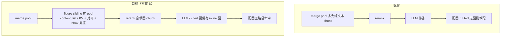

# 检索阶段图文关联扩池方案

> **状态**：📋 方案归档，**暂不实施**（2026-07-02 对话结论）
> **触发对话**：从「BBOX 可以在检索阶段也使用吗？」起，至「rerank 前 figure sibling 扩 pool」推荐路线
> **关联文档**：[`查询配图实现说明.md`](./查询配图实现说明.md) · [`统一图文关联架构实施方案.md`](./统一图文关联架构实施方案.md) · [`.cursor/rules/rag-image-matching.mdc`](../.cursor/rules/rag-image-matching.mdc) · [`raganything/utils.py`](../raganything/utils.py) · [`scripts/query_progress_hooks.py`](../scripts/query_progress_hooks.py)

未来若要启动本优化，可在对话中引用本文档标题或路径。

---

## 1. 背景与目标

### 1.1 现象

检索 / rerank 能召回 **足够答题的正文 chunk**，但该 chunk **不含 inline `[图片]`**；带图的 sibling chunk 分数略低或未进 pool，导致：

- LLM 能答对文字；
- 查询配图主路径从 **cited chunk** 解析 `[图片]` 时 **无图可配**（除非走 Q16/Q17 等列举题特例补图）。

### 1.2 目标

在 **检索链路**（merge pool → rerank → LLM）中，把 MinerU `content_list` 所表达的 **图文关联块** 一并拉进候选 pool，使：

- rerank 对 **带图 chunk** 也有真实分数；
- 进 LLM / cited 的 chunk 更常 **正文 + `[图片]` 同现**；
- **不**依赖领域词表；复用 parser 字段与灌库共用函数。

### 1.3 刻意不做（本方案边界）

- 不让 CrossEncoder / 向量模型 **直接输入 bbox 坐标** 做语义打分；
- 不恢复 `image_query_refs.py` 末尾 **LEGACY 全库 content_list bbox 扫图**（噪声大，已 `if False` 禁用）；
- 不在本阶段改 rerank 模型 / 门控阈值。

---

## 2. 现状结论（对话共识）

### 2.1 bbox / content_list 用在哪里

| 阶段 | 是否直接用 bbox | 说明 |
|------|----------------|------|
| **灌库（ingest）** | ✅ 是（之一） | `utils.py`：`best_image_for_text_item`、`context_text_for_image`、caption 推断；`coalesce_text_image_segments` 图文共 chunk |
| **检索 / rerank / steering** | ❌ 否 | 只对 chunk **文本** 做向量 + CrossEncoder |
| **查询配图（答案后）** | ⚠️ 间接 | 主路径读 cited chunk 内 `[图片]`；Q16/Q17 等再扫 `content_list`（`context_text_for_image` 可能用 bbox） |

**结论**：检索不读 bbox，但检索读的是 **灌库时从 content_list 加工出的 chunk**；content_list **不是没意义**，而是 **原料**；bbox 是灌库/补图时的 **配对信号之一**。

### 2.2 为何仍会出现「有字无图」

1. **`coalesce_text_image_segments` 只合并紧挨着的 `[图片]`**；中间夹块或 token 切分可能把图文拆成两个 chunk。
2. **Rerank 后截断**：带图 sibling 分数低，被 `CHUNK_TOP_K` / `MIN_RERANK_SCORE` 滤掉。
3. **配图在答案之后**：cited 的是纯文本 chunk → 主路径无 inline 图可解析。

### 2.3 工程里已有的部分能力（不够通用）

| 能力 | 位置 | 局限 |
|------|------|------|
| `supplement_table_matrix_before_rerank` | `query_doc_steering.py` + hooks | **表** sibling，rerank **前** 并入 — **可仿照** |
| `supplement_llm_docs_with_rerank_figures` | `image_query_refs.py` | rerank **后**，最多补 **2** 块；图须已在 rerank pool |
| `_expand_pool_with_same_section_neighbors` | `image_query_refs.py` | 偏 citation / 列举配图 |
| `_load_figure_chunks_for_manual_paths` | `image_query_refs.py` | 偏多手册 / Q16/Q17 |
| Route A 灌库 coalesce | `utils.py` | 治本但需重灌，且长段落仍可能切开 |

---

## 3. 方案选项（由易到难）

### 3.1 方案 A — 加强灌库共 chunk（治本，需重灌）

- 优化 `coalesce` / `build_table_aware_ingest_segments` / token 切分，减少「步骤文字」与 `[图片]` 分离。
- 可选：chunk 元数据写入 `linked_image_paths` 或 sibling chunk id，检索时 O(1) 展开。

**优点**：检索逻辑简单。 **缺点**：全量重灌；超长步骤仍可能切开。

### 3.2 方案 B — rerank 前「图文 sibling 扩 pool」（**推荐，对话首选**）

**思路**：merge 出候选 chunk 后、CrossEncoder 前：

```text
merge pool
  → 对每个「无 [图片] 且与 query 相关」的 hit
  → 回查 content_list 或 KV 同手册同节带 [图片] 的 chunk
  → 关联规则：caption/footnote 对齐 → 阅读顺序 → bbox 距离（与 utils.py 一致）
  → 并入 rerank pool（真实 rerank 打分）
  → rerank → steering → LLM
```

**挂点**：`scripts/query_progress_hooks.py` 中 `_apply_rerank_if_enabled`，与 `supplement_table_matrix_before_rerank` **同级**。

**复用**：`raganything/utils.py` 中 `context_text_for_image`、`best_image_for_text_item`、`text_term_alignment_symmetric` 等；**禁止**新增领域词表。

**建议 env（实施时再定默认值）**：

```env
# RAG_FIGURE_SIBLING_PRE_RERANK=1
# RAG_FIGURE_SIBLING_MAX_PER_HIT=1
# RAG_FIGURE_SIBLING_MAX_TOTAL=8
# RAG_FIGURE_SIBLING_MIN_ALIGN=0.28   # 与 RAG_IMAGE_MIN_REF_ALIGN 对齐或复用
```

**风险控制**：

- 仅对 **已在 merge pool 中的无图 chunk** 扩展，不对全库扫 bbox；
- 扩入块必须 **含 `[图片]`** 且通过 query–label/context 对齐阈值；
- 总扩池上限，避免 rerank pairs 再次暴涨（显存 / 耗时）。

### 3.3 方案 C — 仅 LLM 输入前扩 chunk（已有，不足）

沿用 / 加强 `supplement_llm_docs_with_rerank_figures`：若 rerank pool 里从未出现图块，**无法**补回。仅作方案 B 的补充，不能单独解决问题。

### 3.4 方案 D — 恢复查询期 content_list bbox 主路径（不推荐）

`image_query_refs.py` LEGACY `supplement_refs_from_content_lists` 曾对 rerank 全池 bbox 补图，已禁用。若重启须加 **source_hints + 节范围 + 对齐门控**，否则易乱配图。

---

## 4. 推荐实施顺序（未来启动时）

1. **方案 B**：`supplement_figure_sibling_before_rerank`（命名待定），挂 hooks，加 env 与 query dump 统计（扩了几块、是否进 LLM）。
2. **回归**：`scripts/run_web_path_q1_17.py` 中带 `want_images: true` 的题（Q3–Q9、Q11–Q13、Q15–Q17）；对比扩池前后 cited chunk 是否含 `[图片]`。
3. **性能**：监控 rerank pairs 增量、GPU 峰值；与 `RERANK_BATCH_SIZE` / BF16 配置联动。
4. **可选方案 A**：若 B 仍漏 case，再评估重灌 + coalesce 加强。

---

## 5. 架构示意（目标态）



---

## 6. 验收建议（实施时）

| 检查项 | 期望 |
|--------|------|
| 带图 procedure 题（如 Q3 机床外部清洁） | cited / LLM chunks 中可见 `[图片]`，Web 能出图 |
| 不应配图题（Q1/Q2/Q10） | 扩 pool 不引入无关图块 |
| rerank pairs | 增量可控（有 `MAX_TOTAL` 上限） |
| 分数 / 门控 | `rerank_score` 尺度不变；`final_score` 门控回归 green8 / shili17 |
| dump | `merged_chunks_count`、扩 pool 条数、是否含 `[图片]` 可追踪 |

---

## 7. 对话时间线摘要

| 话题 | 结论 |
|------|------|
| bbox 能否用于检索？ | 检索/rerank **不直接**用 bbox；**可以**在检索链路上用 content_list 结构做 **图文 sibling 关联** |
| content_list 是否没意义？ | **否**；灌库主输入；检索用的是其 **加工后的 chunk** |
| 用户目的 | 避免「字够答、无图」；把 MinerU 图文关联块找进 pool |
| 当前决定 | **方案归档，暂不编码** |

---

## 8. 源码索引（实施入口）

| 模块 | 路径 |
|------|------|
| 灌库 coalesce / bbox 配对 | `raganything/utils.py` |
| rerank 前 table 扩 pool（仿照对象） | `raganything/table_matrix.py`，`scripts/query_doc_steering.py` → `supplement_table_matrix_before_rerank` |
| rerank hook 挂点 | `scripts/query_progress_hooks.py` → `_apply_rerank_if_enabled` |
| LLM 后补图（不足） | `scripts/image_query_refs.py` → `supplement_llm_docs_with_rerank_figures` |
| LEGACY 禁用参考 | `scripts/image_query_refs.py` 文件末尾 `if False:` 块 |
| 批测回归 | `scripts/run_web_path_q1_17.py` |

---

*文档版本：v0.1 · 自 2026-07-02 对话整理 · 实施前请再读 `查询配图实现说明.md` Route A 与 image-matching 规则。*
