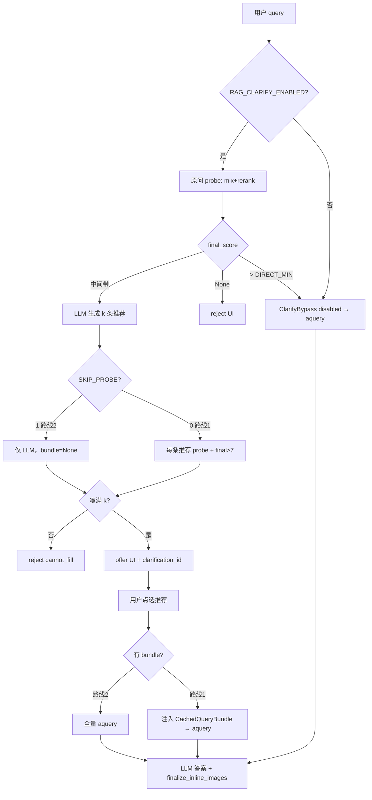

# 澄清门控 v4 — 实现说明

> **版本**：`GATE_VERSION=v4`（`raganything/clarify_gate.py`）
> **设计规格**：[`澄清门控设计方案_v4.md`](澄清门控设计方案_v4.md)
> **优化路线**：[`澄清门控优化路线.md`](澄清门控优化路线.md)（路线 1 / 路线 2）
> **Qwen rerank 性能**：[`澄清门控Qwen_rerank优化方案.md`](澄清门控Qwen_rerank优化方案.md)（P0 release + P1 predict）
> **历史**：v3 实现见 [`澄清门控实现说明_v3.md`](澄清门控实现说明_v3.md)（已废弃）

本文档描述 **当前 as-built 行为**，供开发、批测与运维对照。与旧版 v3 的核心差异：**门控只看 CrossEncoder `rerank_score` 聚合的 `final_score`**，不再用 naive 向量分档。

---

## 1. 能力总览

| 能力 | 状态 | 主要文件 |
|------|------|----------|
| 三分支门控（拒答 / 直答 / 澄清推荐） | ✅ | `raganything/clarify_gate.py` |
| 原问 mix + rerank probe（`only_need_context`） | ✅ | `probe_llm_retrieval_full` |
| KG 按 LLM chunk `source_id` 裁剪 | ✅ | `raganything/clarify_context.py` |
| 推荐问 LLM 生成（基于原问 probe 的 chunk 预览） | ✅ | `_generate_candidate_lines` |
| 路线 1：推荐问 probe + `final>阈值` + bundle 缓存 | ✅ | `_collect_high_confidence_candidates` |
| 路线 2：推荐问仅 LLM、不 probe（`SKIP_PROBE`） | ✅ | 同上 |
| Web 两阶段请求（gate → 点选 → answer） | ✅ | `scripts/rag_web_server.py`、`web/static/app.js` |
| 点选后 bundle 注入（路线 1）或全量 aquery（路线 2） | ✅ | `resolve_clarify_bundle` + `set_clarify_context_injection` |
| 答题阶段 inline 配图 | ✅ | `finalize_inline_images`（仅 answer 请求） |
| gate / answer 分阶段批测 | ✅ | `scripts/bench_clarify_green8.py` |
| Qwen rerank 题间 release | ✅ | `raganything/pipeline_rerank.py` |

**刻意不做**

- 用领域词表 / 正则决定澄清（见 `.cursor/rules/rag-image-matching.mdc`）
- 门控阶段返回配图（配图只在最终 `aquery` 后）
- `run_web_path_q1_17.py` 不走门控（shili17 预期全直答，脚本测答题+配图）

---

## 2. 门控三分支（`final_score`）

对 **用户原问** 跑一次 `probe_llm_retrieval_full`（mix 检索 + rerank，**不调用答题 LLM**），从进入 LLM 的 document chunks 中取：

```text
final_score = max( rerank_score )  其中 rerank_score >= MIN_RERANK_SCORE
```

若无 chunk 达标 → `final_score is None`。

| 条件 | `gate_outcome` | Web 行为 |
|------|----------------|----------|
| `final_score is None` | **reject** | 展示拒答文案，**不**跑答题 LLM |
| `final_score > CLARIFY_DIRECT_RERANK_MIN`（默认 7） | **direct**（`ClarifyBypass`） | 同一次请求继续 `aquery` 生成答案 |
| 否则 | **offer** | 返回 `clarification_required` + k 条推荐问；用户点选后 **第二次请求** 再 `aquery` |

阈值说明：

- `MIN_RERANK_SCORE` / `CLARIFY_CANDIDATE_MIN_RERANK_SCORE`：chunk 是否「达标」计入 `final_score`（Qwen 模型下常为 `2.0` 量级）
- `CLARIFY_DIRECT_RERANK_MIN`：直答带（默认 `7.0`）；shili17 完整问句通常落在此带之上

实现入口：`evaluate_clarify_gate` → `_evaluate_clarify_gate_probed`。

---

## 3. 端到端流程



**Web 实际是两次 HTTP 请求**（流式 `/api/query/stream`）：

1. **Gate 请求**：`query=原问`，无 `clarify_choice` → `clarification_required` 或直答/拒答
2. **Answer 请求**（offer 时）：`query=推荐句`，`clarify_choice=use_candidate`，`clarification_id`，`candidate_id`

直答时 gate 与 answer 在 **同一次** stream 请求内完成。

---

## 4. Probe 实现

### 4.1 `probe_llm_retrieval_full`

- 调用 `lightrag.aquery_data(query, QueryParam(mode=mix, only_need_context=True, enable_rerank=...))`
- 在 `query_progress_hooks()` 内执行，与 Web 答题共用 hook 链（含 KG scope、rerank）
- 从 hook 读取：`get_llm_input_chunks()`、`get_retrieval_context()`、`get_last_probe_raw_data()`
- 用 `build_cached_bundle` 生成 `CachedQueryBundle`（KG 已按 chunk 过滤）

### 4.2 `final_score` 计算

- 只认 chunk 上的 **`rerank_score`**（CrossEncoder），**不用**向量 `score` 回退
- `_summarize_llm_chunks` 汇总达标 chunk 数与 `final_score`

### 4.3 澄清内存 store

- `_CLARIFICATION_STORE`：进程内 dict，`clarification_id` → 原问、候选文案、`options`（含 bundle）
- TTL：**3600s**；`validate_use_candidate` 校验 id + candidate_id + query 文本一致

---

## 5. 推荐问：路线 1 vs 路线 2

由 `CLARIFY_CANDIDATE_SKIP_PROBE` 控制（`clarify_candidate_skip_probe()`）。

| | 路线 1（默认 `0`） | 路线 2（`1`，当前生产常用） |
|--|-------------------|---------------------------|
| 推荐生成 | LLM + 原问 probe 的 chunk 预览 | 同左 |
| 推荐验收 | 每条 **再 probe**；须 `final > CLARIFY_DIRECT_RERANK_MIN` 且有 bundle | **不 probe**；`final=None`，`bundle=None` |
| 生成条数 | 多请求缓冲（`need+2`） | 只生成 **k 条** |
| 点选后答题 | `resolve_clarify_bundle` → **注入 bundle**，跳过检索/rerank | **全量 `aquery`**（检索 + rerank + LLM） |
| gate 耗时 | 高（N 次推荐 probe） | 低（仅原问 probe + 推荐 LLM ~10–18s） |
| answer 耗时 | 较低（有缓存） | 较高（再走一遍检索） |

路线 2 下批测报告常见：`probes=0`，候选 `final=None chunks=None`。

相关 env：

```env
CLARIFY_CANDIDATE_K=2
CLARIFY_CANDIDATE_MAX_ROUNDS=1
CLARIFY_CANDIDATE_MAX_PROBES=3    # 仅路线 1
CLARIFY_CANDIDATE_STRATEGY=fill_k
CLARIFY_CANDIDATE_SKIP_PROBE=1    # 路线 2
```

凑不满 k 条可答推荐 → `gate_outcome=reject`，`gate_reason=cannot_fill_high_confidence_candidates`。

---

## 6. Web 集成

### 6.1 API 字段（`QueryBody`）

| 字段 | 说明 |
|------|------|
| `query` | 原问或点选后的推荐句 |
| `clarify_choice` | 点选时：`use_candidate` |
| `clarification_id` | gate 返回的 UUID |
| `candidate_id` | 如 `c1`、`c2` |

### 6.2 Gate 之后

- **reject**：返回 `clarification_required` + `gate_outcome=reject`，前端展示 message
- **offer**：返回候选列表 + `clarification_id`
- **direct / use_candidate**：进入 `query_progress_hooks` → `rag.aquery` → 流式 token → **`finalize_inline_images`** → SSE `inline_images`

bundle 注入（`scripts/rag_web_server.py`）：

```python
# 路线 1: inject probe cache. 路线 2: full aquery.
if bundle is not None:
    set_clarify_context_injection(bundle)
```

`query_progress_hooks._build_query_context` 若检测到 injection，**跳过检索/rerank**，直接用缓存 context。

### 6.3 配图

- **门控 / 推荐列表**：无配图
- **最终答题**（直答或点选后）：与普通过问答相同，`finalize_inline_images` 基于 **当次 query + 答案 + 当次检索 chunk** 选图（`scripts/image_query_refs.py`）

### 6.4 与 `run_web_path_q1_17.py` 的关系

该脚本 **不经过** `evaluate_clarify_gate`，直接 `aquery` + 配图批测。用于 shili17 文字/配图回归；**不能**代替澄清门控批测。

---

## 7. 环境变量速查

| 变量 | 默认 | 含义 |
|------|------|------|
| `RAG_CLARIFY_ENABLED` | `0` | 总开关 |
| `CLARIFY_ONLY_NAIVE_MODE` | `0` | `1` 时仅 `mode=naive` 走门控 |
| `MIN_RERANK_SCORE` | 见 env | chunk 达标阈值 |
| `CLARIFY_CANDIDATE_MIN_RERANK_SCORE` | 同 `MIN_RERANK_SCORE` | probe 用 |
| `CLARIFY_DIRECT_RERANK_MIN` | `7` | 直答 / 路线 1 推荐过关线 |
| `CLARIFY_CANDIDATE_K` | `2` | 推荐条数 |
| `CLARIFY_CANDIDATE_MAX_ROUNDS` | `3` | 推荐生成轮数 |
| `CLARIFY_CANDIDATE_MAX_PROBES` | 无上限 | 路线 1 推荐 probe 上限 |
| `CLARIFY_CANDIDATE_STRATEGY` | `fill_k` | `fill_k` / `first` |
| `CLARIFY_CANDIDATE_SKIP_PROBE` | `0` | `1` = 路线 2 |
| `RERANK_RELEASE_AFTER_PREDICT` | — | 每次 rerank 后释放 CrossEncoder（P0） |
| `RERANK_RELEASE_AFTER_GATE` | — | gate 结束再释放（P0） |
| `RERANK_HF_DEVICE` | auto cuda | rerank 设备 |

完整模板见 `config/env.example`。

---

## 8. 主要代码索引

| 模块 | 路径 | 职责 |
|------|------|------|
| 门控主逻辑 | `raganything/clarify_gate.py` | `evaluate_clarify_gate`、probe、推荐、store |
| 缓存 bundle / KG | `raganything/clarify_context.py` | `CachedQueryBundle`、`scope_kg_to_llm_chunks` |
| Rerank | `raganything/pipeline_rerank.py` | CrossEncoder、release、P1 predict |
| Query hooks | `scripts/query_progress_hooks.py` | 检索/rerank hook、injection、KG scope |
| Web | `scripts/rag_web_server.py` | `/api/query/stream`、gate 评估、配图 |
| 前端 | `web/static/app.js` | 澄清 UI、点选二次请求 |

公开 API（`raganything/__init__.py`）：`evaluate_clarify_gate`、`is_clarify_gate_enabled`。

---

## 9. 批测与诊断

| 脚本 | 用途 |
|------|------|
| `scripts/bench_clarify_green8.py` | gate + answer 分阶段计时；`--source green8\|shili17\|voice29`；`--gate-only` |
| `scripts/replay_clarify_gate_green8.py` | 澄清 replay + query dump；可 `--gate-only` |
| `scripts/bench_probe_timing_green8.py` | 仅原问 probe 耗时 / VRAM；`--repeat-each 2` |
| `scripts/run_web_path_q1_17.py` | Web 答题+配图（**无门控**）shili17 Q1–17 |

报告字段（bench）：

- `gate_s` / `answer_s` / `total_s`
- `generation.gate_timing.original_probe_s` — 原问 probe
- `candidate_gen_rounds` / `candidate_probes` — 推荐阶段（路线 2 后者为空）

调试：`RAG_QUERY_DEBUG_DUMP=1` → `logs/query_dumps/`（含 `clarify_gate`、rerank、配图 debug）。

---

## 10. 典型数据集预期（v4）

| 数据集 | 预期门控 | 说明 |
|--------|----------|------|
| shili17（`docs/测试例.txt`） | 17/17 **direct** | 完整问句，`final` 通常 > 7 |
| green8 | reject / offer / direct 混合 | 口语短句，中间带多 |
| voice29 | 视题而定 | 技术话术，与 green8 部分重叠 |

---

## 11. 已知限制与注意点

1. **澄清 store 在进程内存**：多 worker / 重启后 `clarification_id` 失效；单进程 Web 正常。
2. **路线 2 answer 较慢**：点选后再跑完整检索+rERANK+LLM；gate 快、answer 慢是预期 tradeoff。
3. **直答未复用 gate probe bundle**：direct 路径仍全量 `aquery`（与原问 probe 重复检索）；可优化但未实现。
4. **批测 `bench_clarify_green8` 不含配图**；配图需 Web 或 `run_web_path_q1_17.py`。
5. **gate 耗时**曾受 Qwen 长进程 rerank 劣化影响；P0 `RERANK_RELEASE_AFTER_PREDICT/GATE` 已缓解（见 [`澄清门控Qwen_rerank优化实现说明.md`](./澄清门控Qwen_rerank优化实现说明.md)）。
6. **mix 关键词随机性**仍会导致同问 probe 波动（如 green8 #7），与 rerank release 正交。

---

## 12. 相关文档

| 文档 | 内容 |
|------|------|
| [`澄清门控设计方案_v4.md`](澄清门控设计方案_v4.md) | 产品与阈值设计 |
| [`澄清门控优化路线.md`](澄清门控优化路线.md) | 路线 1/2、诊断命令 |
| [`澄清门控gate耗时诊断报告_20260629.md`](澄清门控gate耗时诊断报告_20260629.md) | 耗时根因分析 |
| [`澄清门控Qwen_rerank优化方案.md`](澄清门控Qwen_rerank优化方案.md) | P0/P1 实施与验收 |
| [`网页问答界面.md`](网页问答界面.md) | 前端 SSE、inline_images |

---

*文档版本：impl-v4-20260630 · 对应当前 `lhq-rag-dev` + tag `Qwen_rerank_optimized_P0+P1`*
