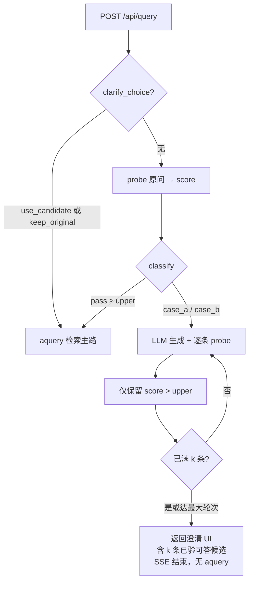
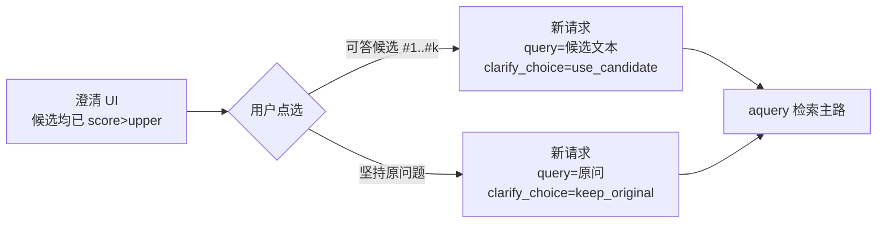

# 澄清门控设计方案（v1）

> **需求来源**：[`澄清需求.txt`](澄清需求.txt)  
> **标定讨论存档**：[`clarify_gate_discussion_export.md`](clarify_gate_discussion_export.md)（shili17 / green8 分数分布、SVM/决策树实验；**本方案 v1 不采用**其中的长度/名单门控，仅作日后扩展参考）  
> **相关代码（实施前基线）**：`raganything/naive_relevance.py`、`scripts/query_progress_hooks.py`、`scripts/rag_web_server.py`  
> **状态**：**Phase 1 已实施**（2026-06-12）；代码见 `raganything/clarify_gate.py`、`scripts/rag_web_server.py`、`web/static/app.js`

---

## 0. 术语

| 说法 | 含义 |
|------|------|
| **score** | 用户原问对 `chunks_vdb` 向量检索的 **最高 cosine**（与 naive relevance 的 query 分同源） |
| **threshold_lower** | 较低阈值（宽松），默认 **0.63** |
| **threshold_upper** | 较高阈值（严格），默认 **0.65**；`threshold_lower < threshold_upper` |
| **直通（pass）** | `score ≥ threshold_upper`，不澄清，走正常问答 |
| **情况 A（case_a）** | `score < threshold_lower`，匹配度极低 |
| **情况 B（case_b）** | `threshold_lower ≤ score < threshold_upper`，略模糊但有指向性 |
| **候选问句** | LLM 生成的问句，经 probe 校验后供用户点选；默认目标 **k = 4** 条 **可答候选** |
| **可答候选** | probe 分 **> threshold_upper** 的候选；视为库内有足够依据、**可走正常问答产出有依据答案** |
| **坚持原问题** | 澄清 UI 固定提供的额外选项；用户仍用原问作答（见 §4.6） |
| **probe** | `probe_chunk_vector_score`：检索时 cosine 门槛暂为 0，取 top_k 内 max cosine |

**与 `COSINE_THRESHOLD`（通常 0.33）的关系**：后者是库内 chunk **能否进候选池** 的拒答线；澄清双阈值 **独立**，用于「要不要先让用户澄清」，数值更高（0.63 / 0.65）。

---

## 1. 要解决的问题

智能客服用户常输入 **短句、报警码、口语碎片**（如「漏胶」「气压报警？」），直接检索易答偏或胡扯。希望在 **完整 mix/naive 问答之前**，用 **最简单的向量相关度** 判断是否需要 **澄清追问**。

### 1.1 v1 范围（明确做）

- 仅用 **query 分**（`max_cosine_similarity`），**不考虑** high_level / low_level 做门控。
- 双阈值三档，处理逻辑 **严格按** [`澄清需求.txt`](澄清需求.txt)。
- Web 问答入口：需澄清时 **不启动** `aquery`，返回 **可答候选 + 坚持原问** UI；用户点选后 **重新提问**或 **坚持原问直通**。

### 1.2 v1 不做 / Phase 3 暂缓

以下 **当前均不做**（Phase 3 先不考虑，见 §10）：

- 题干长度、green8 名单、spread / 关键词失真（见讨论纪要）。
- 澄清多轮 session 记忆（选中后仍走同一门控）。
- h/l 分数参与门控。
- 非 Web 入口的完整澄清 UI（dump/CLI 可只记录档位）。

---

## 2. 需求复述（来自 澄清需求.txt）

### 步骤 1：计算 score

原始问题与数据库的匹配度 = **naive 模式下 query 向量 probe 的最高 cosine**。

### 步骤 2：分情况处理

| 档位 | 条件 | 说明 |
|------|------|------|
| **情况 A** | `score < threshold_lower` | 与库几乎不相关，probe 信息无效 |
| **情况 B** | `threshold_lower ≤ score < threshold_upper` | 模糊，但有一定参考价值 |
| **直通** | `score ≥ threshold_upper` | 不澄清，正常问答 |

默认：`threshold_lower = 0.63`，`threshold_upper = 0.65`。

### 情况 A 处理

1. **仅**将原始问题发给大模型。
2. 生成 **k** 个语义类似的问题。
3. 将 k 个问题 **逐个** 与数据库做向量匹配（probe）。
4. 返回匹配度 **> threshold_upper** 的问句；或按策略返回 **第一个** 满足的。

### 情况 B 处理

1. 将 **原始问题 + 搜索出的相关信息** 发给大模型。
2. 生成 k 个语义类似的问题。
3. 逐个 probe。
4. 返回策略：**所有** `> threshold_upper` 的候选（需求写明）；实现上保留 env 切换 `first`。

### 直通（需求文档未单独成章，逻辑隐含）

`score ≥ threshold_upper` → 不进入澄清流程，直接 `aquery`。

---

## 3. 判定逻辑（实现规格）

### 3.1 分类函数

```python
def classify_query_relevance(
    score: float | None,
    *,
    lower: float,
    upper: float,
) -> Literal["pass", "case_a", "case_b"]:
    if score is None:
        return "case_a"  # 无法探测时保守澄清
    if score >= upper:
        return "pass"
    if score >= lower:
        return "case_b"
    return "case_a"
```

**区间约定**（左闭右开）：

- `pass`：`[upper, +∞)`
- `case_b`：`[lower, upper)`
- `case_a`：`(-∞, lower)`

### 3.2 score 计算

复用 `raganything/naive_relevance.py` 中：

```text
probe_chunk_vector_score(chunks_vdb, query_text) → max_cosine_similarity
```

- `probe_top_k`：env `NAIVE_RELEVANCE_TOP_K`（默认与 `TOP_K` 一致，标定时常用 20）。
- probe 时 `cosine_better_than_threshold = 0`，与批量打分报告一致。

**v1 优化**：门控阶段 **只 probe query**，**不**为门控单独调用 LLM 抽 high/low 关键词（与 `score_naive_relevance` 全量打分解耦，减少延迟）。若 `RAG_NAIVE_RELEVANCE=1`，检索 hook 内仍可额外写完整三路分到 dump。

---

## 4. 澄清流程

### 4.0 总览（评分只做一次）

**可答校验（`score > upper`）只在「展示选项之前」完成**。UI 上的 k 条候选在下发时 **已全部过线**。

用户点选之后 **两条路都旁路澄清门控**，直接进入检索主路（`aquery`），**不再** probe / classify，**不再**判断 `> upper`：

| 用户操作 | 下一次请求 | 澄清门控 | 检索主路 |
|----------|------------|----------|----------|
| **点选某条可答候选** | `query` = 该候选全文 + **`clarify_choice=use_candidate`**（+ 可选 `clarification_id` / `candidate_id`） | **跳过** | **直接 `aquery`** |
| **坚持原问题** | `query` = 原问 + **`clarify_choice=keep_original`** | **跳过** | **直接 `aquery`** |
| **输入框自行改写** | 新 `query`，无上述 flag | **完整门控** | 通过后再 `aquery` |

说明：hooks 内若开启 `RAG_NAIVE_RELEVANCE` 仍可为 **dump 观测** 写分，但 **不得** 用该分再次触发澄清 UI。

**无限循环**只会在错误实现时出现（例如点选候选仍走 `classify` → 再次弹澄清）。正确实现：`use_candidate` 与 `keep_original` 在门控入口 **一并旁路**。

### 4.1 第一次请求（触发澄清）



### 4.2 用户选择之后（第二次请求，均旁路门控）



**不再**存在「点选候选 → 再 probe → 再 classify」支路。可答性已在第一次响应里算完；用户选择只决定 **用哪句话进主路**。

### 4.3 情况 A：LLM 输入（生成候选时）

- **只有**用户原问。
- **不**附带 probe top_hits（视为无效上下文）。

### 4.4 情况 B：LLM 输入（生成候选时）

- 用户原问 + **query probe 的 `top_hits`**（preview 文本，默认最多 3 条）。
- **不**跑完整 mix 检索 / rerank（v1 用 probe 结果作「搜索出的相关信息」）。

### 4.5 候选生成（k 条，默认 4）

- 默认 **`k = 4`**（env `CLARIFY_CANDIDATE_K=4`）。
- LLM 每次可多生成若干条（如 `k` 或 `k+2`），经 §4.6 过滤后 **只保留可答候选**。
- 若不足 k 条可答候选：**追加生成轮次**（见 §4.6），直至凑满 k 条或达到最大轮次。
- 输出：**完整中文疑问句**，不是答案；每行一条或 JSON 数组，由实现选定一种并写死 prompt。
- 使用项目现有 LLM 配置（与 LightRAG 一致），不新增模型。

### 4.6 可答校验（展示前唯一评分点）

**原则**：`score > upper` 的 probe **只发生在把选项交给用户之前**。呈现给用户的 **每一条** 候选（最多 k 条）均已通过；**禁止**先展示再验、或用户点选后再验。

**可答判定**（与需求「匹配度 > threshold_upper」一致）：

```text
对每个候选 c_i：
  probe_chunk_vector_score(c_i) → score_i
  可答 ⇔ score_i > threshold_upper
```

**生成—过滤—补全循环**：

1. LLM 生成一批问句（建议每轮 ≥ `k` 条）。
2. 逐条 probe，收集 `score_i > upper` 的 **可答候选**（去重、不与原问完全相同）。
3. 若可答候选 **< k** 且未达 `CLARIFY_CANDIDATE_MAX_ROUNDS`（默认 3）→ 再调 LLM 生成下一批（prompt 中排除已试过的句子）。
4. 结束时：
   - **优先**：凑满 **k 条**可答候选再返回；
   - **降级**：若多轮后仍不足 k 条，返回 **1～(k−1) 条**可答候选（**全部**仍须 `> upper`）；
   - **禁止**：为凑数展示 `≤ upper` 的候选。

**「有正确答案」在 v1 的操作定义**：

| 层级 | 含义 |
|------|------|
| **检索门（唯一卡点）** | 下发 UI 前：`score_i > threshold_upper`；用户点选后 **不再重复** |
| **不保证** | v1 不在澄清阶段跑完整 `aquery` 验答案；点选后直接进入主路 |

env `CLARIFY_CANDIDATE_STRATEGY`（**仅影响多轮停止后的条数**，不改变可答门槛）：

| 值 | 行为 |
|----|------|
| `fill_k`（默认，替代原 `all`） | 尽量凑满 k 条可答候选；不足 k 时返回已有可答条数（≥1 时仍出澄清 UI） |
| `first` | 有 **1 条**可答即停生成轮次，UI 只展示该 1 条（仍须 `> upper`） |

若 **0 条**可答候选：仍展示澄清 UI，但 **仅「坚持原问题」** + 提示「暂未生成可检索的推荐问法」；不展示空候选按钮。

### 4.7 用户确认后（旁路门控，防循环）

**点选可答候选**（UI 上 k 条均已验过 `> upper`）：

- 新发 `/api/query`：
  - `query` = 所选候选 **全文**；
  - `clarify_choice: "use_candidate"`；
  - 建议同时带 `clarification_id`（首轮澄清响应 id）与 `candidate_id`（如 `c1`…`c4`），供服务端校验「确为上一轮下发的候选」而 **无需再 probe**（v1 最低实现可仅信 flag + 文本一致）。
- 服务端在门控入口与 `keep_original` **同级旁路** → **直接** `query_progress_hooks + aquery`。
- **禁止**对用户已选的候选再问 `score > upper`。

**点选「坚持原问题」**（固定 UI 项，**不计入 k**）：

- 新发 `/api/query`：`query` = **原问原文**，`clarify_choice: "keep_original"`。
- 同样 **旁路门控** → 直接 `aquery`（原问可能仍 `< upper`，由用户自担）。

**门控入口伪代码**：

```python
if request.clarify_choice in ("use_candidate", "keep_original"):
    return ClarifyBypass()  # 不 probe、不 classify、不生成候选
# 否则：probe 原问 → classify → pass | 澄清 UI
```

**防无限循环（实现必达）**：

1. `use_candidate` / `keep_original` **永不**进入 `classify` 的 case_a/b。  
2. 同一 HTTP 请求内澄清只发生 **0 或 1 次**（返回 UI 即结束，不并发 aquery）。  
3. 用户 **自行改写** 输入框发送（无上述 flag）→ 视为全新问题，走完整门控。

**其他**：

---

## 5. 管线接入点

### 5.1 时机

门控必须在 `_run_aquery` **之前**执行，且 **最先**处理用户已确认之旁路。

```text
POST /api/query
  → if clarify_choice in (use_candidate, keep_original):
        直接 query_progress_hooks + aquery（跳过 clarify_gate）
  → else clarify_gate.run(query)
        → pass → aquery
        → case_a/b → 生成并 probe 候选 → 仅下发 score>upper → 返回澄清 UI（无 aquery）
```

### 5.2 计划新增/修改模块

| 路径 | 职责 |
|------|------|
| **`raganything/clarify_gate.py`**（新） | 开关、阈值读取、`classify`、A/B 生成、候选 probe、组装 `ClarificationResult` |
| **`raganything/naive_relevance.py`** | 可选：导出 `async probe_query_score(lightrag, query)` 薄封装 |
| **`scripts/rag_web_server.py`** | stream / 同步 query 入口分支；SSE 事件 |
| **`web/static/app.js`** | 澄清面板（样式见 `styles.css` `.clarification-panel`） |
| **`scripts/query_debug_dump.py`** | 增加 `clarify_gate` 段 |
| **`config/env.example`** | 新 env 说明 |
| **`raganything/__init__.py`** | 按需导出公共 API |

---

## 6. API / SSE 契约

### 6.1 直通

与现网一致：`thinking` / `answer` / 可选 `naive_relevance` 等。

### 6.2 需澄清（新事件）

在 **任何 answer token 之前** 结束流（或同步 JSON 无 `answer`）：

```json
{
  "type": "clarification_required",
  "data": {
    "clarification_id": "8f3c2a1b-...",
    "original_query": "漏胶",
    "relevance_score": 0.6007,
    "band": "case_a",
    "threshold_lower": 0.63,
    "threshold_upper": 0.65,
    "candidates": [
      {
        "id": "c1",
        "text": "高速封边机涂胶系统漏胶如何排查？",
        "score": 0.72,
        "answerable": true
      }
    ],
    "keep_original": {
      "label": "坚持原问题",
      "text": "漏胶",
      "relevance_score": 0.6007,
      "clarify_choice": "keep_original"
    },
    "generation": {
      "k_requested": 4,
      "k_answerable": 4,
      "rounds_used": 1,
      "strategy": "fill_k"
    }
  }
}
```

同步响应建议字段：

```json
{
  "clarification_required": true,
  "clarification": { "...": "同上 data" },
  "query": "漏胶",
  "mode": "mix"
}
```

### 6.3 前端（v1）

1. 收到 `clarification_required` → 渲染澄清卡片：
   - 简介（原问偏模糊，请选用更易检索的问法）；
   - **最多 k 条可答候选**按钮（均 `score > upper`，可展示 score）；
   - **固定最后一项：「坚持原问题」**（展示原问原文，样式与候选区分）。
2. 点击 **可答候选** → `sendQuery(候选全文, { clarify_choice: "use_candidate", clarification_id, candidate_id })`，**旁路门控**，直接检索主路。
3. 点击 **坚持原问题** → `sendQuery(原问, { clarify_choice: "keep_original" })`，旁路门控，直接检索主路。
4. 输入框自行改写后发送 → 新 query，**无 flag**，走完整门控。

**展示约束**：`candidates` 中每一项在 **下发前** 已 `score > upper` 且 `answerable: true`；用户点选后 **不再** 为此问做第二次评分门控。

---

## 7. 配置项（env）

```bash
# ── 澄清门控 v1 ──────────────────────────────────────────
# 总开关（0=关闭，走现有问答）
RAG_CLARIFY_ENABLED=1

# 双阈值（默认与 澄清需求.txt 一致）
CLARIFY_THRESHOLD_LOWER=0.63
CLARIFY_THRESHOLD_UPPER=0.65

# LLM 生成候选目标条数（默认可答 4 条）
CLARIFY_CANDIDATE_K=4

# 不足 k 条可答时，最多追加生成轮次
CLARIFY_CANDIDATE_MAX_ROUNDS=3

# 可答条数策略：fill_k（尽量凑满 k）| first（1 条可答即停）
CLARIFY_CANDIDATE_STRATEGY=fill_k

# 仅 naive 模式启用澄清（0=mix 等所有模式也启用）
CLARIFY_ONLY_NAIVE_MODE=0

# probe top_k（与 naive 标定共用）
# NAIVE_RELEVANCE_TOP_K=20
```

**启用澄清不强制** `RAG_NAIVE_RELEVANCE=1`；门控自带 query probe。

---

## 8. LLM Prompt 草案

### 8.1 情况 A

```text
你是设备手册问答助手。用户原问可能与手册表述不一致。
仅根据用户原问，生成 {n} 条中文、完整、适合检索设备手册的疑问句。
问句应能在设备维护/故障手册中找到明确依据。
不要回答问题，不要解释，每行只输出一条问句。

用户原问：{query}
```

### 8.2 情况 B

```text
你是设备手册问答助手。用户原问较模糊。
根据用户原问和下列检索片段，生成 {n} 条更明确的中文疑问句。
问句须与下列片段主题一致，且适合在手册中检索到依据。
不要回答问题，不要解释，每行只输出一条问句。

用户原问：{query}

检索片段：
{top_hit_1}
{top_hit_2}
...
```

解析：按行拆分、去空；过滤与 `已有候选/原问` 重复项；解析失败时重试该轮，不计入 `MAX_ROUNDS`。

---

## 9. 与标定数据的关系（预期，非 v1 验收标准）

在 `lower=0.63`、`upper=0.65` 下，对已有 `logs/relevance_*.jsonl` 粗算：

| 集合 | 直通 (≥0.65) | 情况 B [0.63,0.65) | 情况 A (<0.63) |
|------|-------------|-------------------|----------------|
| shili17（17 题） | 多数 | 如 Q16 (0.658) | 0 |
| green8（8 题） | 如 G3 气压报警 (0.854) | 若干中间分 | 如 G1 漏胶 (0.601) |
| voice29 | 多数 ≥0.65；4 条 <0.60 | 窄带少量 | 齐头烂板等 |

**说明**：

- 此阈值组合 **不能** 同时满足「shili17 零澄清 + green8 全澄清」（见讨论纪要）；v1 **忠实实现需求文档**，不以该二元目标验收。
- 高分短句（气压报警 0.854）会 **直通**，可能仍答偏——日后可加名单/形态层，**不在 v1**。

---

## 10. 实施分期

### Phase 1（已完成）

- [x] `raganything/clarify_gate.py`
- [x] `rag_web_server.py` 门控 + SSE / 同步 JSON
- [x] `web/static/app.js` 澄清面板
- [x] `query_debug_dump.py` 记录 `clarify_gate`
- [x] `config/env.example` 更新

### Phase 2（优化）

- [ ] `scripts/replay_clarify_gate.py`：对 shili17 / green8 / voice29 统计三档分布
- [ ] 门控与 `RAG_NAIVE_RELEVANCE` dump 字段对齐文档

### Phase 3（暂缓，当前不考虑）

> 以下能力见 [`clarify_gate_discussion_export.md`](clarify_gate_discussion_export.md)，**暂不纳入路线图**；若日后要做单独立项再评审。

- ~~题干长度 / green8 名单前置~~
- ~~h/l、spread 辅助灰色地带~~
- ~~澄清 session、跳过二次门控策略~~

---

## 11. 测试计划（实施后执行）

| 类型 | 内容 |
|------|------|
| 单元 | `classify` 边界：0.62 / 0.63 / 0.649 / 0.65 / 0.66；`score is None` |
| 集成 | mock LLM 固定候选 → 断言无 `aquery`、有 `clarification_required`；候选均 `> upper`；0 可答时仅有 `keep_original` |
| 回归 | `score ≥ 0.65` 的长问句（shili Q1）直通，配图链路不变 |
| 手测 | 漏胶 → 澄清 UI 仅含已验可答候选；点选候选 **不再** 弹澄清、直接出答案；坚持原问同理 |

---

## 12. 待确认项（实施前可勾选）

记录在案，避免日后遗忘：

| # | 问题 | 结论 |
|---|------|------|
| 1 | 阈值是否固定 0.63 / 0.65？ | 是，与需求文档一致；调参只改 env |
| 2 | 0 条可答候选时 UI？ | **仅「坚持原问题」** + 提示，不展示未过线候选 |
| 3 | 澄清是否对 mix 模式默认开启？ | 是（`CLARIFY_ONLY_NAIVE_MODE=0`） |
| 4 | case_b 上下文仅用 probe top_hits？ | 是（v1）；不够再拉 chunk 全文 |
| 5 | CLI `dump_query_context` 是否打印档位？ | Phase 2，可选 |
| 6 | 默认 k 与坚持原问？ | **k=4** 可答候选；UI **固定**「坚持原问题」（不计入 k） |
| 7 | 何谓候选项「有正确答案」？ | 下发 UI **前** `score > upper`；点选后 **不再** 重复评分 |
| 8 | 点选候选是否再走门控？ | **否**；`use_candidate` 与 `keep_original` 均旁路，直接 `aquery` |

---

## 13. 变更记录

| 日期 | 说明 |
|------|------|
| 2026-06-12 | 初稿：基于 `澄清需求.txt` 与 naive query 分双阈值方案；标定讨论见 `clarify_gate_discussion_export.md`，v1 不纳入长度/名单门控 |
| 2026-06-12 | 修订：默认 **k=4**；UI 增加 **坚持原问题**；候选 **仅展示可答**（`score > upper`），多轮生成凑满 k |
| 2026-06-12 | Phase 1 实施：`clarify_gate.py`、Web 门控/SSE、澄清 UI、`clarify_gate` dump 字段 |
| 2026-06-12 | 约定：**Phase 3 暂缓**，不做长度/名单/h·l 辅助/session 等扩展 |
| 2026-06-12 | 修订：可答校验 **仅展示前一次**；点选候选 `use_candidate` **旁路门控**，直接检索主路，不再二次 `> upper` |

---

*实施完成后请在本文件顶部更新 **状态** 行，并链到实现说明或 PR。*
