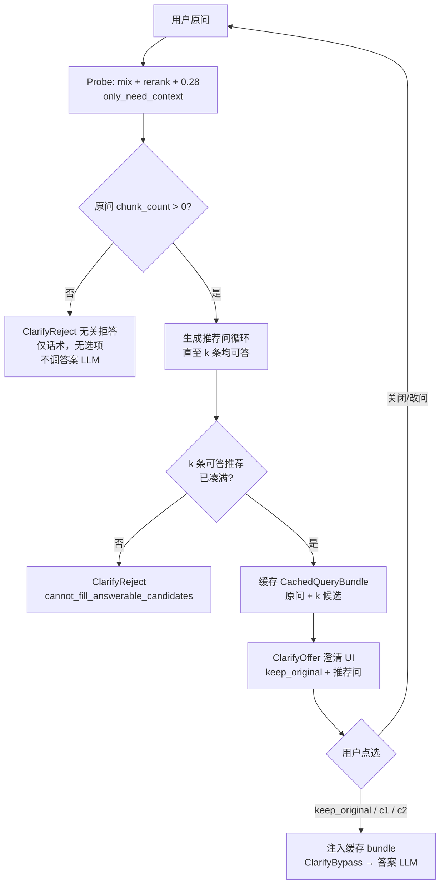

# 澄清门控设计方案（v3）

> **需求来源**：[`澄清需求.txt`](澄清需求.txt) 第 79–84 行（2026-06-22）  
> **替代关系**：本方案 **取代** v1/v2 中以 naive 向量分（`CLARIFY_THRESHOLD`）分档的逻辑；v1/v2 文档与代码仅作对照。  
> **实施基线 tag**：`0622naive_mode_one_threshold`（v3 代码未单独打 tag）  
> **状态**：**已实施**（2026-06-22；green8 批测通过，见 §12）

---

## 0. 术语（v3 统一口径）

| 说法 | 含义 |
|------|------|
| **document chunks** | merge（向量 C + 实体反查 E + 关系反查 R）→ rerank → **`rerank_score ≥ MIN_RERANK_SCORE`（默认 0.28）** → token 截断后，进入 LightRAG **Document Chunks** 段的文档块 |
| **llm_chunks** | 本工程 hook 快照的、与 document chunks **同一批**（见 `get_llm_input_chunks()`；配图路径在 doc filter 下可能为其子集） |
| **qualifying chunks** | 满足 `rerank_score ≥ CLARIFY_CANDIDATE_MIN_RERANK_SCORE`（默认与 `MIN_RERANK_SCORE` 同为 0.28）的 document chunks |
| **可答** | `len(qualifying chunks) > 0` |
| **无关拒答** | 原问 probe 后 **无可答 document chunks**（`chunk_count == 0`）→ **只显示拒答文案**，无推荐按钮、无「保持原问」、**不调答案 LLM** |
| **澄清 UI** | 原问 **可答** 且 **已凑满 k 条可答推荐问**（默认 k=2）→ 展示：**保持原问** + **k 条**推荐问（**禁止 0 条推荐**） |
| **CachedQueryBundle** | 某条问句在门控阶段 probe 得到的 **document chunks + 过滤后 KG JSON + reference 列表 + 预拼 context**，用户点选后 **不再检索** |

### 0.1 门控两种结果（产品 vs 代码）

v3 对外只有 **两种用户可见结果**，不要与 v2 内部类型名 `ClarifyRequired` 混为一谈：

| 产品结果 | 条件 | 用户看到什么 | 是否调答案 LLM | v3 代码返回类型（建议） |
|----------|------|--------------|----------------|-------------------------|
| **无关拒答** | 原问 `chunk_count == 0` | 固定拒答话术 + 原问预览；**无**可点选项 | **否** | **`ClarifyReject`** |
| **澄清 UI** | `chunk_count > 0` **且** `k_answerable == CLARIFY_CANDIDATE_K` | keep_original + **k 条**推荐（每条已 probe 可答） | 点选后才调 | **`ClarifyOffer`** |
| **推荐凑不齐** | 原问可答，但用尽生成轮次仍 **`< k` 条可答推荐** | 拒答话术（引导换说法）；**无** keep_original、**无**推荐按钮 | **否** | **`ClarifyReject`**（`gate_reason: cannot_fill_answerable_candidates`） |

**与 v2 代码名的关系（实施时注意）：**

- v2 里 **`ClarifyRequired` 是一个「拦截正常 aquery」的统称**，既用于无关拒答（`unrelated=true`），也用于真澄清 UI（有 `candidates`）。
- Web 已靠 `unrelated` / `unanswerable` 区分 UI：`app.js` 在 `unrelated` 时 **不渲染** `clarify-options` 按钮。
- v3 **建议**拆成两个 dataclass，语义与产品一致：
  - `ClarifyReject` → API payload：`unrelated=true`, `candidates=[]`, `keep_original=null`
  - `ClarifyOffer` → API payload：`unrelated=false`, 含 `keep_original` + `candidates`
- HTTP 字段 **`clarification_required: true` 在拒答路径仍可能出现**（历史兼容：表示「未进入正常问答」），**不等于**「需要用户做澄清选择」。v3 可选增加顶层 **`gate_outcome: "reject" | "offer"`** 便于前端与 dump 阅读（非必须）。

**`ClarifyBypass`**：用户已点选 keep_original / 候选，或门控关闭 → 走缓存 injection 或正常 `aquery`，**不再** probe 门控。

**明确取消（v3 不再用于门控）：**

- naive 向量 **score** / `CLARIFY_THRESHOLD` 分档（无关 vs 澄清）
- 原问 naive 低但靠推荐问「捞回来」的路径（原 v2 情况 A 思路）
- **KG-only 答题**（document chunks = 0 仍把 KG JSON 送给答案 LLM）

**保留（与 mix 主链路一致）：**

- 检索模式默认 **mix**（不是取消 LightRAG 的 `naive` 模式 API，而是 **产品门控不再读 naive score**）
- rerank、`MIN_RERANK_SCORE=0.28`、`CHUNK_TOP_K` 等现有 env

---

## 1. 要解决的问题

v2 及现网 mix 存在三类问题（已在 dump 中验证）：

1. **门控与可答性脱节**：naive score 看 chunk 向量相似度，不能保证 **document chunks 非空**；「今天天气不错」可放行，「修边不好」keep_original 可 KG-only 长答。  
2. **KG JSON 与 chunk 脱节**：rerank 滤光 document chunks 后，**KG Entity/Relationship JSON 仍完整进 Context**，LLM 可能仅凭图谱摘要作答且无 Reference。  
3. **点选后重复检索**：用户选推荐问或 keep_original 后 **整路 mix 再跑一遍**，结果可能与门控 probe 不一致，且 **再次触发澄清**。

v3 目标：**以 document chunks 为唯一「能否基于库作答」的硬条件**；**KG 仅作有 chunk 支撑的结构化补充**；**澄清阶段缓存三路上下文，点选即答**。

---

## 2. 需求映射（澄清需求.txt 79–84）

| # | 需求摘要 | v3 设计要点 |
|---|----------|-------------|
| 1 | 取消 naive 评分；按 document chunks 判断；有可答 chunks 则「原问 + 2 推荐」；三路 **缓存 chunks**，点选 **直送 LLM** | §3.2、§5；**推荐问必须全部可答**，凑满 k 才出 UI |
| 2 | 原问无 document chunks → **直接拒答** | §3.1 |
| 3 | **管控 KG JSON**：仅保留「反查 chunk 仍在 document chunks 中」的 entity/relation | §6 |
| 4 | 点选推荐问 / keep_original **不再触发澄清** | §5.4、§7 |

> 需求第 4 条「不会再次除法」按 **「不会再次触发（澄清）」** 理解。

---

## 3. 门控状态机（v3）



### 3.1 原问 probe（唯一进门条件）

- 调用与 Web 一致的 mix 检索：**merge → rerank → `min_rerank_score` → document chunks**（复用/扩展 `probe_llm_retrieval` + hooks）。  
- 得到 **`chunk_count`**（= qualifying document chunks 条数，与 dump 里 `llm_input.counts.chunks` 同源）。

#### 3.1.1 `chunk_count == 0` → **无关拒答**（`ClarifyReject`）

**产品行为（与需求第 2 条一致）：**

1. **直接拒绝回答** — 不调答案 LLM，不跑 KG-only 生成。  
2. 前端 **只显示** `CLARIFY_UNRELATED_MESSAGE`（可带原问预览）。  
3. **不**生成推荐问、**不**展示「保持原问」按钮、**不**写入 CachedQueryBundle。  
4. **不**尝试「原问不行但候选行」的补救（需求明确：用户问题无 document chunks 即拒答）。

**代码/API：**

- 返回类型：**`ClarifyReject`**（v3 新名；v2 等价于 `ClarifyRequired` + `unrelated=true` + `candidates=[]`）。  
- 示例 payload 见 §7.1「无关拒答」；`keep_original` 为 **null**，`candidates` 为 **[]**。

> **与 v2 差异**：「修边不好」「今天天气不错」原问 chunk=0 → v3 **在此结束**，不再出现 keep_original 后 KG-only 长答。

#### 3.1.2 `chunk_count > 0` → 进入 §3.2 澄清 UI

- **不再**读 naive score，**无**「分数高则直通、不弹 UI」档。  
- 原问 probe 结果 **立即缓存** 为 `options.keep_original.bundle`（含 KG 过滤后的 context）。

### 3.2 原问可答 → 澄清 UI（`ClarifyOffer`）

**进入条件（须同时满足）：**

1. §3.1.2：原问 `chunk_count > 0`（已缓存 `keep_original.bundle`）。  
2. §3.2.1：推荐问生成循环结束，**`k_answerable == CLARIFY_CANDIDATE_K`（默认 2）** — 每条均已 probe 可答并已缓存 bundle。

**禁止出现的形态：**

- **禁止** `ClarifyOffer` 且 `candidates.length === 0`（「原问可答但 0 条推荐」）。  
- **禁止** UI 上展示 **未通过 probe** 的推荐问（不可答问句不得进入 `candidates`）。  
- **禁止**「仅 keep_original、无推荐」的 ClarifyOffer（推荐未凑满 k 时不走 Offer，见 §3.2.2）。

**ClarifyOffer 展示内容：**

- **保持原问题**（原问文本 + chunk 统计；bundle 已缓存）。  
- **恰好 k 条**推荐问（默认 2），每条含 `chunk_count` / `max_rerank_score` 等 probe 摘要。

#### 3.2.1 推荐问生成与校验（必须可答才收录）

目标：凑满 **`k = CLARIFY_CANDIDATE_K`（默认 2）** 条 **可答** 推荐问。与 v2 不同：**不允许**「有几条展示几条」或「0 条也出 UI」。

**可答判定（与现网一致）：** 对该问句执行 mix probe → `qualifying document chunks > 0`（`rerank_score ≥ CLARIFY_CANDIDATE_MIN_RERANK_SCORE`，默认 0.28）。

**循环算法：**

```text
answerable ← []
seen ← {原问}
rounds ← 0

WHILE len(answerable) < k AND rounds < CLARIFY_CANDIDATE_MAX_ROUNDS:
    rounds += 1
    batch ← LLM 生成一批中文问句（排除 seen；上下文 = 原问 document chunk 摘要）
    FOR line IN batch:
        IF line IN seen: CONTINUE
        seen.add(line)
        probe ← mix probe(line)
        IF probe.chunk_count == 0: CONTINUE   # 不可答 → 丢弃，继续尝试
        answerable.append({text, probe, bundle})  # 可答 → 收录并缓存 bundle
        IF len(answerable) >= k: BREAK
    # 本轮 batch 用尽仍未凑满 → 进入下一轮生成

IF len(answerable) >= k:
    → ClarifyOffer（keep_original + answerable[0..k-1]）
ELSE:
    → ClarifyReject（§3.2.2）
```

**要点：**

- 不可答的生成结果 **不展示、不缓存、不计入 candidates**；同一轮或下一轮 **继续生成** 直至凑满 k 或轮次用尽。  
- 推荐问 LLM 上下文：**原问 document chunk 摘要**（非 naive top_hits）。  
- `CLARIFY_CANDIDATE_STRATEGY=fill_k`：每轮 batch 大小应 **≥ 剩余缺口 + 缓冲**（与 v2 类似，保证凑 k 的效率）。  
- 可选 env **`CLARIFY_CANDIDATE_MAX_PROBES`**（总 probe 上限，防止极端问句死循环）；默认可在 `MAX_ROUNDS × batch_size` 量级。

#### 3.2.2 原问可答但推荐未凑满 k → **ClarifyReject**

若 **`CLARIFY_CANDIDATE_MAX_ROUNDS`（及可选 MAX_PROBES）用尽** 后仍 **`len(answerable) < k`**（含 **0 条** 可答推荐）：

- **不**进入 ClarifyOffer（**不提供** keep_original 按钮 — 避免「原问可答但无合格推荐」的产品形态）。  
- 返回 **`ClarifyReject`**，`gate_reason: "cannot_fill_answerable_candidates"`。  
- 话术示例：「暂无法为您的问法生成足够明确、且能在知识库中找到依据的推荐问法，请换种说法或联系技术支持。」（文案可 env 配置）。  
- **不调答案 LLM**。

> 若线上此路径过多，应 **加大 `CLARIFY_CANDIDATE_MAX_ROUNDS` / batch 大小** 或优化推荐 prompt，而不是降级为「0 推荐 + keep_original」。

### 3.3 取消的行为

| v2 行为 | v3 |
|---------|-----|
| `naive_score < 0.6` → 无关 | **删除** |
| `naive_score ≥ 0.6` → 澄清 UI | 改为 **`原问 chunk_count > 0` → ClarifyOffer**；**`chunk_count == 0` → ClarifyReject** |
| 原问不可答仍 generate 候选（情况 A） | **删除**（原问不可答即拒答） |
| v2「有几条展示几条」/ fill_k 未满 k 仍出 UI | **删除**；未满 k → §3.2.2 ClarifyReject |
| v2「0 推荐 + keep_original」 | **删除**（禁止 ClarifyOffer 且 candidates 为空） |
| keep_original 后全量 re-retrieval | **改为注入缓存** |

---

## 4. Probe 输出：RetrievalProbeResult

门控阶段每次 probe（原问 + 每个候选）应产出 **结构化包**，供缓存与 KG 过滤使用：

```python
@dataclass
class RetrievalProbeResult:
    query: str
    mode: str
    answerable: bool              # len(qualifying_chunks) > 0
    chunk_count: int
    max_rerank_score: float | None
    min_rerank_threshold: float

    # 送 LLM 的 document 侧
    document_chunks: list[dict]   # 含 content, file_path, chunk_id, rerank_score, reference_id(后填)

    # KG 侧（probe 时 LightRAG raw_data 全量，过滤前）
    entities_raw: list[dict]
    relationships_raw: list[dict]

    # 过滤后（§6）
    entities_filtered: list[dict]
    relationships_filtered: list[dict]

    # 溯源（§6）
    chunk_ids: set[str]           # 最终 document chunk_id 集合
    chunk_sources: dict[str, str] # chunk_id -> "C"|"E"|"R"（来自 LightRAG chunk_tracking）

    reference_list: list[dict]
    context_str: str              # 与 kg_query_context 一致的 Context 正文（可选预拼）
```

**Hook 扩展**（`query_progress_hooks.py`）：

- 在 `_build_query_context` / `_process_chunks_unified` 后捕获：  
  - `get_llm_input_chunks()`  
  - `QueryContextResult.raw_data` 中 entities / relationships  
  - `chunk_tracking`（日志同源字段写入 ContextVar）  
- 新增 `get_last_probe_result()` 或在 probe 函数内一次性读取 hook snapshot。

---

## 5. 缓存与点选答题（CachedQueryBundle）

### 5.1 服务端存储

扩展 `_CLARIFICATION_STORE[clarification_id]`：

```python
{
  "created": float,
  "original_query": str,
  "options": {
    "keep_original": {
      "query": str,
      "bundle": CachedQueryBundle,  # 原问 probe 结果（已 KG 过滤）
    },
    "c1": { "query": str, "bundle": ... },
    "c2": { "query": str, "bundle": ... },
  },
  "generation": { ... },  # k、rounds、probes 等元数据
}
```

- **TTL**：沿用 3600s。  
- **不**在 store 外持久化；重启丢失可接受（用户需重新提问）。

### 5.2 CachedQueryBundle 内容

与 §4 `RetrievalProbeResult` 过滤后字段一致，至少包含：

- `document_chunks`（带 `reference_id`）  
- `entities_filtered` / `relationships_filtered`  
- `reference_list`  
- `context_str`：**预拼好的** `kg_query_context` 段（Document Chunks + 过滤后 KG + Reference List）

### 5.3 点选后答案路径

用户请求携带（与现 API 一致）：

- `clarify_choice`: `keep_original` | `use_candidate`  
- `clarification_id`  
- `candidate_id`: `c1` | `c2`（use_candidate 时）  
- `query`: 所选问句文本（校验用）

**流程：**

1. `validate_clarify_selection(...)` 校验 id + 文本 + bundle 存在。  
2. **`ClarifyBypass("cached_answer")`** — **不再**调用 `evaluate_clarify_gate` 的 probe 分支。  
3. `set_clarify_context_injection(bundle)`（ContextVar）。  
4. `async with query_progress_hooks()` 内 `aquery(selected_query, mode=mix)`。  
5. Hook **`_build_query_context`**：若检测到 injection → **跳过** `_perform_kg_search` / merge / rerank，直接返回：

   ```python
   QueryContextResult(context=bundle.context_str, raw_data=bundle.to_raw_data())
   ```

6. 后续 `kg_query` 与现网相同：`context_data` → 答案 LLM → References 来自 bundle 内 reference_list。  
7. 清除 injection ContextVar（finally）。

**效果**：点选问题的 document chunks / KG / References 与门控 probe **字节级一致**（除 LLM 随机性）。

### 5.4 不再二次触发澄清

- 点选请求 **必须**带有效 `clarification_id` + `clarify_choice` → 门控入口 **第一分支 bypass**（先于 probe）。  
- bypass 后 **禁止**再次 `ClarifyRequired`。  
- Web 前端：点选后 **仅发一次** `/api/query`（或 stream），不再带「未澄清的原问」重入。

---

## 6. KG JSON 管控

### 6.1 原则

- **无 document chunks** → **不**向答案 LLM 发送任何 KG JSON（拒答在 §3.1 已拦截）。  
- **有 document chunks** → 仅发送与 ** surviving document chunks ** 有溯源关系的 entity/relation。

### 6.2 过滤规则（v3.0 推荐实现）

输入：

- `S` = 最终 document chunks 的 `chunk_id` 集合（非空）。  
- `entities_raw` / `relationships_raw` 来自同一次 probe 的 `raw_data`（`convert_to_user_format` 格式，含 `source_id`）。

**实体保留**当且仅当：

```text
entity.source_id 拆分（`<SEP>`）后，至少一个 id ∈ S
```

**关系保留**当且仅当：

```text
relation.source_id 拆分后，至少一个 id ∈ S
```

**可选加强（v3.1，env 开关）**：

- 若 `chunk_sources[cid] == "E"` 才允许该 chunk 支撑 entity；`"R"` 支撑 relation；`"C"` 不单独支撑 KG 行（仅支撑 Document Chunks）。  
- 默认 **v3.0 仅用 source_id ∈ S**，实现简单且与「反查 chunk 在 document chunks 里」一致。

**丢弃**：未通过过滤的 entity/relation **不**进入 `context_str`、**不**进入 dump `llm_input.entities/relationships`。

### 6.3 Context 拼装

复用 LightRAG `PROMPTS["kg_query_context"]` 模板：

- `entities_str` = 过滤后 entity 的 JSON 行  
- `relations_str` = 过滤后 relation 的 JSON 行  
- `text_chunks_str` = document chunks 的 JSON 行（含 `reference_id`）  
- `reference_list_str` = 由 document chunks 生成的列表  

**禁止**在 chunk=0 时仍拼 KG 段（v3 拒答路径不调 LLM；injection 路径 bundle 已保证 chunk>0）。

---

## 7. API 与 Web 契约（相对 v2 变更）

### 7.0 字段说明：`clarification_required` 不等于「澄清 UI」

| 字段 | 无关拒答 A<br/>`no_document_chunks` | 推荐凑不齐 B<br/>`cannot_fill_answerable_candidates` | 澄清 UI<br/>`ClarifyOffer` |
|------|-------------------------------------|-----------------------------------------------------|------------------------------|
| `clarification_required` | 可为 `true` | 可为 `true` | `true` |
| `gate_outcome` | `"reject"` | `"reject"` | `"offer"` |
| `unrelated` | **`true`** | **`true`**（或 `unanswerable=true`） | **`false`** |
| `candidates` | **`[]`** | **`[]`** | **恰好 k 条**（均可答） |
| `keep_original` | **`null`** | **`null`** | 必有 |
| 前端按钮 | **无** | **无** | keep_original + k 个候选 |

前端判定：**`gate_outcome === "offer"`**（或 `unrelated === false` 且 `candidates.length === k`）才渲染选项。

### 7.1 `POST /api/query`（首次原问）

**A. 无关拒答 — 原问 `chunk_count == 0`（`ClarifyReject`）：**

```json
{
  "clarification_required": true,
  "gate_outcome": "reject",
  "clarification": {
    "clarification_id": "...",
    "unrelated": true,
    "unanswerable": true,
    "gate_reason": "no_document_chunks",
    "original_probe": {
      "chunk_count": 0,
      "max_rerank_score": null,
      "min_rerank_threshold": 0.28
    },
    "message": "您的问题与当前知识库内容关联度较低...",
    "candidates": [],
    "keep_original": null
  }
}
```

**A′. 推荐凑不齐 — 原问可答但 `< k` 条可答推荐（`ClarifyReject`）：**

```json
{
  "clarification_required": true,
  "gate_outcome": "reject",
  "clarification": {
    "clarification_id": "...",
    "unrelated": true,
    "unanswerable": true,
    "gate_reason": "cannot_fill_answerable_candidates",
    "original_probe": {
      "chunk_count": 4,
      "max_rerank_score": 0.91,
      "min_rerank_threshold": 0.28
    },
    "message": "暂无法为您的问法生成足够明确、且能在知识库中找到依据的推荐问法...",
    "candidates": [],
    "keep_original": null,
    "generation": {
      "k_requested": 2,
      "k_answerable": 0,
      "rounds_used": 3,
      "probes_used": 12,
      "reason": "cannot_fill_answerable_candidates"
    }
  }
}
```

**B. 澄清 UI — 原问可答且 **已凑满 k 条可答推荐**（`ClarifyOffer`）：**

```json
{
  "clarification_required": true,
  "gate_outcome": "offer",
  "clarification": {
    "clarification_id": "...",
    "unrelated": false,
    "original_query": "修边不好",
    "gate_reason": "has_document_chunks",
    "original_probe": {
      "chunk_count": 4,
      "max_rerank_score": 0.91,
      "min_rerank_threshold": 0.28
    },
    "keep_original": {
      "label": "保持原问题",
      "text": "修边不好",
      "chunk_count": 4,
      "max_rerank_score": 0.91
    },
    "candidates": [
      { "id": "c1", "text": "...", "chunk_count": 18, "max_rerank_score": 1.27 },
      { "id": "c2", "text": "...", "chunk_count": 15, "max_rerank_score": 1.16 }
    ],
    "generation": {
      "k_requested": 2,
      "k_answerable": 2,
      "rounds_used": 1,
      "probes_used": 3,
      "reason": "filled_k"
    }
  }
}
```

**移除字段**：`relevance_score`、`band`、`threshold`（naive 分档）；dump 可保留 `naive_relevance` 作 **可选诊断**（`RAG_NAIVE_RELEVANCE=1`），**不参与门控**。

### 7.2 点选请求（不变字段名）

```json
{
  "query": "修边效果不佳时如何检查刮边刀的锋利度？",
  "clarify_choice": "use_candidate",
  "clarification_id": "...",
  "candidate_id": "c1"
}
```

响应：正常 `thinking` + `answer` + References（来自缓存 chunks）。

---

## 8. 模块与文件改动清单

| 模块 | 改动 | 状态 |
|------|------|------|
| **`raganything/clarify_gate.py`** | v3 状态机；`ClarifyRequired.gate_outcome`；删除 naive 分档；bundle store；`probe_llm_retrieval_full()` | ✅ 已完成 |
| **`raganything/clarify_context.py`**（新） | KG 过滤（`source_id ∈ chunk_ids`）、`rebuild_kg_context_str()`、`CachedQueryBundle` | ✅ 已完成 |
| **`scripts/query_progress_hooks.py`** | 捕获 `raw_data`；`set/get_clarify_context_injection()`；`_build_query_context` 短路 | ✅ 已完成 |
| **`scripts/rag_web_server.py`** | 门控分支、`gate_outcome`、点选 injection、dump | ✅ 已完成 |
| **`web/static/app.js`** | 按 `gate_outcome` 渲染；拒答/澄清文案 | ✅ 已完成 |
| **`config/env.example`** | v3 说明；移除 `CLARIFY_THRESHOLD` 门控依赖 | ✅ 已完成 |
| **`scripts/replay_clarify_gate_green8.py`** | chunk_count / `gate_outcome`；缓存 injection 答题 | ✅ 已完成 |
| **`docs/澄清门控设计方案.md`** | 顶部加「已被 v3 取代」说明 | ⬜ 未做 |
| **`scripts/query_debug_dump.py`** | 可选：`gate_outcome` / `gate_reason` 字段对齐 | ⬜ 未做（现有 dump 已含 clarify_gate 段） |

**不改动**：`query_doc_steering`、配图主逻辑、灌库 KG 构建、LightRAG 核心 merge/rerank 算法（仅 hook 层管控输出）。

---

## 9. 环境变量（v3）

| 变量 | 默认 | 说明 |
|------|------|------|
| `RAG_CLARIFY_ENABLED` | `0` | 总开关 |
| `CLARIFY_CANDIDATE_K` | `2` | 推荐问条数 |
| `CLARIFY_CANDIDATE_MAX_ROUNDS` | `3` | 推荐问生成 **外层轮次**；未满 k 则继续，用尽仍 `< k` → §3.2.2 拒答 |
| `CLARIFY_CANDIDATE_MAX_PROBES` | （可选，如 `24`） | 推荐 probe **总次数**上限，防止极端死循环 |
| `CLARIFY_CANDIDATE_STRATEGY` | `fill_k` | 每轮 batch 宜 **≥ 剩余缺口 + 缓冲** |
| `CLARIFY_CANDIDATE_MIN_RERANK_SCORE` | 同 `MIN_RERANK_SCORE` | 可答判定 |
| `MIN_RERANK_SCORE` | `0.28` | document chunks 硬门槛 |
| `RAG_NAIVE_RELEVANCE` | `0` | **仅 dump/诊断**，门控不用 |

**废弃（v3 忽略）**：`CLARIFY_THRESHOLD`、`CLARIFY_THRESHOLD_LOWER/UPPER`、`CLARIFY_ONLY_NAIVE_MODE`。

---

## 10. 测试计划

### 10.1 门控

| 用例 | 期望 |
|------|------|
| 歪比巴布 | 原问 chunk=0 → **无关拒答**，无澄清 UI |
| 今天天气不错 | 原问 chunk=0 → **无关拒答**（v2 曾放行并 KG-only） |
| 修边不好 | 原问 chunk=0 → **拒答 A**；若某环境原问 chunk>0 且凑满 2 可答推荐 → **Offer B** |
| 漏胶（green8） | 原问 chunk=0 → **拒答 A**；原问可答时须 **k=2 凑满** 才 Offer |
| 仿形效果不好 | 原问 chunk>0 且凑满 2 可答推荐 → **Offer B**（keep_original + c1 + c2） |
| 推荐生成全不可答 | 原问 chunk>0 但 rounds 用尽仍 `< k` → **拒答 A′**（无 keep_original） |

---

### 10.2 缓存与 References

| 用例 | 期望 |
|------|------|
| 选 c1 后 | dump `llm_input.chunks` 与门控 probe c1 **一致**；有 References |
| 选 keep_original | 与门控原问 bundle 一致；**不**二次澄清 |
| 对比 injection 前后 | 无第二次 `Final context` 检索日志（或日志标记 `clarify_cache_hit`） |

### 10.3 KG 过滤

| 用例 | 期望 |
|------|------|
| chunk>0 且 KG 实体 source_id 不在 chunk 集 | dump `llm_input.entities` **不含**该实体 |
| chunk=0 拒答路径 | 不调答案 LLM，`llm_input` 为空或仅 probe 诊断 |

### 10.4 回归

- shili17 / green8 replay 脚本更新基线报告。  
- 配图：`llm_chunk_count>0` 时 inline 图逻辑与 v2 一致。

---

## 11. 风险与边界

1. **延迟**：原问可答时 **1 +（至多 MAX_PROBES 次）候选 probe**；必须凑满 k 才出 UI，最坏情况比 v2「有几条展示几条」更慢；缓存后点选 **省** 一次检索。  
2. **原问必澄清且推荐必满 k**：chunk>0 且凑满 k 可答推荐才 Offer；**不存在 0 推荐 Offer**；凑不齐 → 拒答 A′。  
3. **KG 过滤精度**：v3.0 用 `source_id ∈ chunk_ids`；极端情况 entity 经多 chunk 链接可能仍留噪声，可后续开 v3.1 `chunk_sources` 加强。  
4. **进程内 store**：多 worker 部署时 clarification_id 不共享（与 v2 相同限制）。  
5. **doc filter 与 llm_chunks**：injection 以 **probe 时 document chunks** 为准；若 `RAG_QUERY_DOC_FILTER` 在 hook 内缩小 `_llm_chunks_for_images`，injection 应使用 **未缩小** 的 document chunks（与 LightRAG 实际 Context 一致）。

---

## 12. 实施顺序与进度

| 步骤 | 内容 | 状态 | 备注 |
|------|------|------|------|
| 1 | Hook：`RetrievalProbeResult` + `raw_data` 捕获 + injection 短路 | ✅ | `query_progress_hooks.py`；`chunk_tracking` 写入 dump 仍为可选增强 |
| 2 | `clarify_context.py`：KG 过滤 + context 预拼 | ✅ | v3.0 规则 `source_id ∈ chunk_ids` |
| 3 | `clarify_gate.py` v3 状态机 + bundle store | ✅ | `ClarifyRequired` + `gate_outcome`；凑满 k 才 Offer |
| 4 | `rag_web_server.py` + Web 文案 | ✅ | `app.js` 按 `gate_outcome` 渲染 |
| 5 | replay / 批测 / 文档同步 | ✅ 部分 | green8 全量 replay 通过（§12.1）；v1 文档 superseded 标记未做 |
| 6 | shili17 批测 + Web 手测 + git tag | ⬜ 待做 | 建议 tag：`0622_clarify_v3_chunk_gate` |

### 12.1 green8 批测结果（2026-06-22）

报告：[`logs/clarify_gate_green8_replay_20260622_203639.txt`](../logs/clarify_gate_green8_replay_20260622_203639.txt)

| 指标 | 结果 |
|------|------|
| 总题 | 8 |
| reject（`no_document_chunks`） | 1（#2 漏胶） |
| offer（k=2 凑满） | 7 |
| `cannot_fill_answerable_candidates` | 0 |
| 禁止形态「0 推荐 Offer」 | 未出现 |

Offer 路径 replay 自动选 c1 后 **7/7 有答案且带 References**；`grade_ok` 全 FAIL 为推荐问与标准答案关键词偏差，非门控问题。

---

## 13. 待确认 / 后续开项

1. **原问 chunk>0 是否一律尝试凑满 k 再出 ClarifyOffer** —— **已按设计实施**。  
2. **原问 chunk=0 是否绝不展示推荐问** —— **已按设计实施**（green8 #2 漏胶验证）。  
3. **推荐未满 k 是否一律 ClarifyReject（A′）** —— **已按设计实施**（green8 未触发该路径）。  
4. KG 过滤 v3.0 **`source_id ∈ chunk_ids`** —— **已实施**；v3.1 `chunk_sources` C/E/R 分型仍为可选增强。  
5. **v1 设计文档 superseded 标记**、**shili17 批测**、**git tag** —— 待做。

---

**文档版本**：v3-implemented-20260622（§12 实施进度 + green8 批测）  
**下一步**：shili17 批测 + Web 手测（修边不好 / 今天天气不错 / 仿形效果不好）→ 打 tag `0622_clarify_v3_chunk_gate`。
