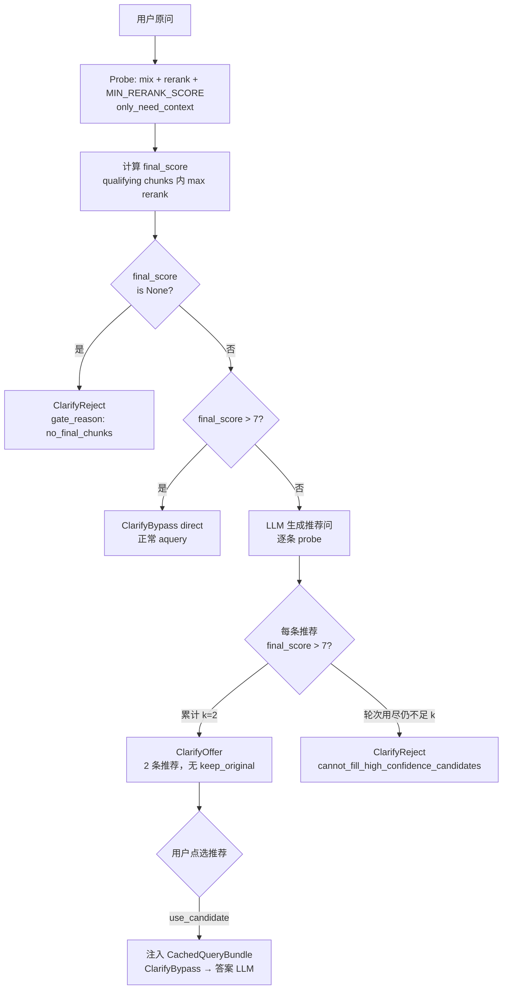

# 澄清门控设计方案（v4）

> **需求来源**：rerank 三组批测（`logs/rerank_groups_20260628_103219.jsonl`）及后续讨论  
> **替代关系**：在 v3（document chunks + `MIN_RERANK_SCORE` 可答判定）基础上，引入 **`final` 分数三档门控**；不再「原问只要有 chunk 就出澄清 UI」  
> **状态**：**已实施**（2026-06-28）

---

## 0. 术语（v4 统一口径）

| 说法 | 含义 |
|------|------|
| **CE max** | CrossEncoder 重排后 top-1 的 `rerank_score`（调试/分析用，**不用于 v4 门控**） |
| **final** / **`final_score`** | 经 mix 检索 → rerank → **`rerank_score ≥ MIN_RERANK_SCORE`（默认 2）** → doc steering → token 截断后，**进入 LLM 的 document chunks** 中的 **最高 rerank 分**；若无任何 chunk 过关则为 **`None`** |
| **qualifying chunks** | 与 v3 相同：`rerank_score ≥ CLARIFY_CANDIDATE_MIN_RERANK_SCORE`（默认与 `MIN_RERANK_SCORE` 同为 2） |
| **直接作答** | 原问 `final_score > CLARIFY_DIRECT_RERANK_MIN`（默认 **7**）→ **不出澄清 UI**，走正常 `aquery` |
| **澄清 UI** | 原问 `final_score` 不为 `None` 且 **≤ 7** → 生成 **k=2** 条推荐问；**每条推荐问 probe 后 `final_score > 7`** 才入选 |
| **无关拒答** | 原问 `final_score is None`（无任何 qualifying chunk）→ 固定拒答话术，**不调答案 LLM** |

### 0.1 与批测脚本 `score_rerank_groups.py` 的对齐

批测 JSONL 字段 **`max_rerank_final`** 即本方案的 **`final_score`**。  
v3 probe 的 **`max_rerank_score`** 目前是 hook 返回 chunks 的 **全局 max（含未过关 chunk）**，与批测 **不一致**——v4 实施时必须改为以 **qualifying 集合内的 max** 作为门控分数（见 §6.1）。

### 0.2 三档门控（产品结果）

| 档位 | 条件 | 用户看到 | 是否调答案 LLM | 代码返回 |
|------|------|----------|----------------|----------|
| **直接作答** | `final_score > 7` | 正常问答流 | **是**（正常 aquery） | `ClarifyBypass("direct")` |
| **澄清 UI** | `final_score is not None` 且 `≤ 7` | **2 条**推荐问（无「保持原问」） | 点选推荐后才调 | `ClarifyRequired(gate_outcome="offer")` |
| **无关拒答** | `final_score is None` | 固定拒答话术 | **否** | `ClarifyRequired(gate_outcome="reject")` |
| **推荐凑不齐** | 中间档，但无法凑满 2 条 `final > 7` 的推荐 | 拒答话术（引导换说法） | **否** | `ClarifyRequired(gate_outcome="reject")` |

**v4 相对 v3 的产品变化：**

- 原问 **高置信**（final > 7）→ **跳过澄清**，与 shili17 批测一致（17/17 直答）。
- 原问 **低置信但有片段**（0 < final ≤ 7）→ **才出澄清**；**不再提供「保持原问」**（原问已判定不够好，避免 KG-only / 低分 chunk 硬答）。
- 原问 **无片段**（final = None）→ 拒答；与 v3 `no_document_chunks` 一致，但判定字段改为 **`final_score`**。

**比较符**：直接作答与推荐问验收均为 **`>` 7**（不含 7.0 本身）。边界值 7.0 归入澄清档。

---

## 1. 要解决的问题

v3 门控仅区分「有无 qualifying chunk」：

- shili17 标准问（final 7.1–10.5）仍会进入澄清 UI + keep_original，增加无谓延迟。
- green8 / voice 短句中，**6/8 green8 有 final 但 ≤ 7**，v3 会 keep_original 放行，与「口语模糊应澄清」不符。
- v3 推荐问仅要求 `answerable`（≥ 2），V24 类「全体 2.62」也会过线，推荐质量无保障。

v4 目标：**用 rerank final 分数三档**，在批测已验证的可分区间上，统一「直答 / 澄清 / 拒答」策略。

### 1.1 批测依据摘要（`rerank_groups_20260628_103219`）

| 组 | final 分布 | v4 预期 |
|----|------------|---------|
| shili17 (17) | 全部 final > 7.09 | **17/17 直答** |
| green8 (8) | 2 个 None；6 个有 final，仅 G3=8.28 > 7 | 2 拒答；1 直答；5 澄清 |
| voice29−green8 (21) | 6 个 None；15 个有 final，仅 V13=7.54 > 7 | 6 拒答；1 直答；14 澄清 |

---

## 2. 门控状态机（v4）



---

## 3. 规则详述

### 3.1 原问 probe

- 路径与 v3 / Web 一致：`aquery_data` + `query_progress_hooks` + `get_llm_input_chunks()`。
- 从返回 chunks 中：
  1. 筛 **qualifying**（`rerank_score ≥ CLARIFY_CANDIDATE_MIN_RERANK_SCORE`）。
  2. **`final_score = max(rerank_score)`** over qualifying；若 qualifying 为空则 **`None`**。
- **`CachedQueryBundle`**：仅当 `final_score is not None` 时构建（与 v3 相同，供澄清点选后 injection）。

### 3.2 直接作答（Bypass）

```python
if final_score is not None and final_score > clarify_direct_rerank_min():
    return ClarifyBypass("direct")
```

- **不**注册 clarification store、**不**调推荐问 LLM。
- Web / SSE 与 `ClarifyBypass("disabled")` 一样进入正常 `aquery`（无 `clarification_required`）。

### 3.3 澄清 UI（中间档）

条件：`final_score is not None` 且 `final_score ≤ clarify_direct_rerank_min()`。

1. 用 v3 同款 LLM prompt 生成推荐问（可复用 `_generate_candidate_lines`）。
2. 每条推荐问 **probe**，验收条件改为：

   ```python
   probe.final_score is not None and probe.final_score > clarify_direct_rerank_min()
   ```

   （不再使用 v3 的 `probe.answerable` 即 ≥2 即可。）

3. 凑满 **`CLARIFY_CANDIDATE_K=2`** 条后出 UI。
4. **不提供 `keep_original`**：原问已在中间档，禁止用户选原问直答。
5. 用户仅能 `use_candidate`；选中后 injection 缓存 bundle，**不再 probe 门控**（与 v3 相同）。

### 3.4 拒答

| `gate_reason` | 条件 |
|---------------|------|
| `no_final_chunks` | `final_score is None` |
| `cannot_fill_high_confidence_candidates` | 中间档，用尽 `CLARIFY_CANDIDATE_MAX_ROUNDS` / `MAX_PROBES` 仍 `< k` 条推荐满足 `final > 7` |

话术可复用 v3 的 `CLARIFY_UNRELATED_MESSAGE` / `CLARIFY_CANNOT_FILL_MESSAGE`，dump 中 **`gate_reason` 区分**即可。

---

## 4. 配置项（env）

| 变量 | 默认 | 说明 |
|------|------|------|
| `RAG_CLARIFY_ENABLED` | `0` | 总开关（同 v3） |
| `CLARIFY_DIRECT_RERANK_MIN` | **`7`** | **v4 新增**：原问 / 推荐问的 final 直答阈值（**不含等于**） |
| `MIN_RERANK_SCORE` | `2` | chunk 过关门槛；final 为 None 当且仅当无 chunk ≥ 此值 |
| `CLARIFY_CANDIDATE_MIN_RERANK_SCORE` | 同 `MIN_RERANK_SCORE` | qualifying 判定（同 v3） |
| `CLARIFY_CANDIDATE_K` | `2` | 推荐条数（v4 固定语义：必须 2 条均 `final > 7`） |
| `CLARIFY_CANDIDATE_MAX_ROUNDS` | `3` | 生成轮次上限（同 v3） |
| `CLARIFY_CANDIDATE_MAX_PROBES` | `24` | probe 次数上限（同 v3） |
| `CLARIFY_CANDIDATE_STRATEGY` | `fill_k` | 同 v3 |

> v3 的 `CLARIFY_THRESHOLD` / naive 分档 **继续不使用**。

---

## 5. API / 前端契约变化

### 5.1 新增 Bypass 原因

| `ClarifyBypass.reason` | 含义 |
|------------------------|------|
| `direct` | **v4 新增**：原问 final > 7，直答 |
| `disabled` | 门控关闭 |
| `use_candidate` | 用户点选推荐 |
| ~~`keep_original`~~ | v4 中间档 **不再产生**；若客户端仍发送，仅兼容历史 session |

### 5.2 澄清 payload

```json
{
  "gate_outcome": "offer",
  "gate_reason": "filled_k",
  "gate_version": "v4",
  "original_probe": {
    "final_score": 3.38,
    "max_rerank_score": 3.38,
    "chunk_count": 3,
    "direct_rerank_min": 7.0
  },
  "keep_original": null,
  "candidates": [
    { "id": "c1", "text": "…", "final_score": 8.2, "max_rerank_score": 8.2 },
    { "id": "c2", "text": "…", "final_score": 7.5, "max_rerank_score": 7.5 }
  ]
}
```

- 字段 **`final_score`** 写入 probe stats（与批测同名）；`max_rerank_score` 可保留为 alias 或仅表示 final（实施时二选一，dump 文档写清）。
- **`keep_original` 恒为 `null`**（中间档 offer 路径）。

### 5.3 Web UI（`static/app.js` 或等价前端）

- **`gate_outcome=offer` 且 `keep_original=null`**：只渲染 2 个推荐按钮。
- **`ClarifyBypass(direct)`**：无澄清卡片，直接进入流式回答。

---

## 6. 代码修改清单

### 6.1 `raganything/clarify_gate.py`（**核心**）

| 位置 | 现状 (v3) | v4 改动 |
|------|-----------|---------|
| 模块 docstring L1–8 | 描述 v3 | 改为 v4，引用本文档 |
| `_summarize_llm_chunks()` L154–185 | `max_rerank_score = max(全部 scored)`；`answerable = len(qualifying)>0` | 新增 **`final_score`**：`max(qualifying rerank)` 或 `None`；门控 **只读 final_score** |
| 新增 `clarify_direct_rerank_min()` | 无 | 读 `CLARIFY_DIRECT_RERANK_MIN`，默认 `7.0` |
| `probe_llm_retrieval_full()` L254–264 | 填充 `RetrievalProbeResult.max_rerank_score` | 增加 **`final_score`** 字段；`bundle` 仅在 `final_score is not None` 时保留 |
| `evaluate_clarify_gate()` L638–728 | ① 不可答→拒答 ② 可答→生成推荐+keep_original ③ 凑不齐→拒答 | **重写分支**：<br>• `final is None` → reject<br>• `final > 7` → **`ClarifyBypass("direct")`**<br>• else → 生成推荐，**去掉 keep_original**<br>• 凑不齐 → reject |
| `_collect_answerable_candidates()` L525–527 | `if not probe.answerable` | 改为 **`probe.final_score is None or probe.final_score <= min`** |
| candidate dict L530–538 | 记录 `max_rerank_score` | 增加 **`final_score`** |
| `_register_clarification_v3` / store | 含 `keep_original` | offer 路径 **`keep_original=None`**；store 可保留字段但为 null |
| `validate_keep_original` / `resolve` | 支持 keep_original | **保留函数**供旧 session 兼容，v4 新 offer 不写入 keep_original |
| `build_clarification_payload()` | 可带 keep_original | 中间档 **`keep_original=None`** |

### 6.2 `raganything/clarify_context.py`

| 位置 | 改动 |
|------|------|
| `RetrievalProbeResult` L108–118 | 新增 **`final_score: float | None`** |
| `as_stats()` L120–129 | 输出 **`final_score`**、`direct_rerank_min`（可选） |

### 6.3 `scripts/rag_web_server.py`

| 位置 | 改动 |
|------|------|
| `_evaluate_clarify_gate()` L253–300 | 处理 **`ClarifyBypass("direct")`**：与 disabled 相同，不注入 bundle，直接 aquery |
| query / stream handler L808+ | 响应 meta 可增加 **`clarify_gate_skipped: "direct"`** 便于 dump |

### 6.4 `scripts/query_progress_hooks.py`

- **通常无需改**；若 dump 需区分 CE vs final，可选增加 hook 暴露 post-CE top-1（非必须）。

### 6.5 `config/env.example`

- 增加 **`CLARIFY_DIRECT_RERANK_MIN=7`** 及 v4 三档说明注释。

### 6.6 测试 / 回放脚本

| 文件 | 改动 |
|------|------|
| `scripts/replay_clarify_gate_green8.py` | 期望：shili17 → **bypass direct**；green8 → reject / offer / direct 按 §1.1；统计 **`final_score`** |
| `scripts/score_rerank_groups.py` | 可选：probe 路径对齐后用于回归对比 |
| `scripts/query_debug_dump.py` | `clarify_gate` 段记录 **`gate_version: v4`**、`final_score` |

### 6.7 文档

| 文件 | 改动 |
|------|------|
| `docs/澄清门控设计方案_v4.md` | 本文 |
| `docs/澄清门控实现说明_v3.md` | 顶部注明 v4  supersede 门控分支；或新建 v4 实现说明 |

### 6.8 前端

| 文件 | 改动 |
|------|------|
| Web `app.js`（澄清卡片） | offer 时 **不渲染 keep_original**；处理无澄清直答 |

---

## 7. 实施顺序与状态

| # | 步骤 | 状态 | 说明 |
|---|------|------|------|
| 1 | `_summarize_llm_chunks` → `final_score` | ✅ | qualifying chunks 内 max；与批测 `max_rerank_final` 对齐 |
| 2 | `evaluate_clarify_gate` 三档 + env | ✅ | `CLARIFY_DIRECT_RERANK_MIN=7` |
| 3 | 候选 `final > 7`；去掉 keep_original | ✅ | `_collect_high_confidence_candidates` |
| 4 | Web direct bypass + 前端 | ✅ | `rag_web_server.py`、`web/static/app.js` |
| 5 | replay / batch 脚本 | ✅ | `replay_clarify_gate_green8.py`、`test_clarify_gate_batch.py` |
| 6 | env.example + 文档 | ✅ | v3 实现说明顶部注明 superseded |
| — | query dump 直答 meta | ✅ | `gate_skipped: direct` + `original_probe` |
| — | 批测对拍 / 全量 replay §9 | ⏳ | 需本地跑 `score_rerank_groups` / `replay_* --gate-only` |

### 7.1 原实施顺序（对照）

1. **对齐指标**：`_summarize_llm_chunks` → `final_score`；与 `score_rerank_groups` 对拍 G2/G1/Q1 三条。
2. **改 `evaluate_clarify_gate` 三分支** + env。
3. **改候选验收** + 去掉 keep_original。
4. **Web bypass(direct)** + 前端去 keep_original 按钮。
5. **replay shili17 / green8 / voice29** 出报告，对照 §1.1 预期。
6. 更新 env.example 与实现说明。

---

## 8. 风险与边界

| 项 | 说明 |
|----|------|
| **G3 / V13 直答** | 短句但 final > 7（命中报警原文），v4 会直答——与批测一致；若产品仍希望澄清，需额外规则（如 query 长度），**不在 v4 首版** |
| **Q16/Q17 边界** | final ≈ 7.09–7.24，**> 7 仍直答**；若需保守可将来把阈值提到 7.5 |
| **推荐凑不齐** | 中间档口语题可能无法生成 2 条 final > 7 的问句 → 走拒答；比 v3 keep_original 硬答更安全 |
| **指标一致性** | 实施前必须修复 v3 probe「max 含未过关 chunk」与批测 final 的差异，否则门控与报告不可比 |
| **性能** | shili17 类高置信问 **少 1 次推荐 LLM + N 次 probe**，Web 首屏更快 |

---

## 9. 验收标准

| 数据集 | 验收 |
|--------|------|
| shili17 (17) | 门控 **17/17 `ClarifyBypass(direct)`**，无澄清 UI |
| green8 (8) | 与 §1.1 一致：2 reject(None)、1 direct(G3)、5 offer 或 reject(凑不齐) |
| voice29−green8 (21) | 6 reject(None)；V13 direct；其余 offer 或 reject |
| 澄清 offer | 每条 candidate **`final_score > 7`**（dump 可审计） |
| 点选推荐 | 不再 probe，`CachedQueryBundle` injection 正常 |

---

## 10. 参考

- 批测数据：`logs/rerank_groups_20260628_103219.jsonl`、`.analysis.txt`
- v3 设计：`docs/澄清门控设计方案_v3.md`
- 现行实现：`raganything/clarify_gate.py`（`GATE_VERSION=v4`）
