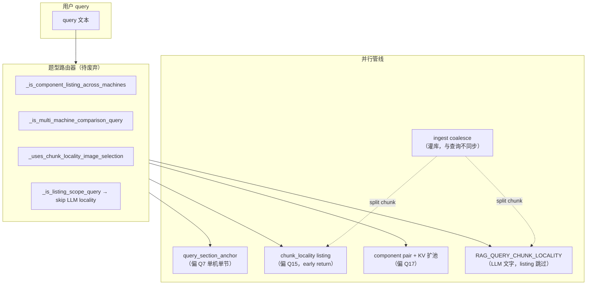
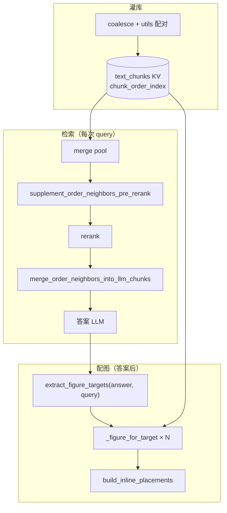

# 统一图文关联架构实施方案

> **状态**：**阶段 0–2 已完成并回归**；**阶段 3–4 暂缓（按需）**；**阶段 5 文档/env 已收尾**；阶段 6 可选  
> **动机**：避免「一题一机制、换题集即过拟合」；Q7 / Q15 / Q17 暴露的并非单点 bug，而是 **题型路由 + 多套并行管线** 的架构债。  
> **关联文档**：[`查询配图实现说明.md`](./查询配图实现说明.md) · [`检索阶段图文关联扩池方案.md`](./检索阶段图文关联扩池方案.md) · [`.cursor/rules/rag-image-matching.mdc`](../.cursor/rules/rag-image-matching.mdc) · [`测试例参考答案.md`](./测试例参考答案.md)  
> **主要代码**：`raganything/utils.py` · `scripts/image_query_refs.py` · `scripts/query_progress_hooks.py` · `scripts/query_doc_steering.py`  
> **回归脚本**：`scripts/run_web_path_q1_17.py`（当前 green 集）；后续扩展独立 holdout 集（见 §6）

---

## 1. 为什么要做（产品层面）

| 现状 | 后果 |
|------|------|
| 配图 / LLM 上下文按 **query 句式** 分流（listing、component listing、multi-machine comparison…） | 新问法落在两条 regex 之间 → **全新失败模式**（Q15 即例） |
| 同一能力（`chunk_order_index` 邻居）在 LLM、配图 chunk_locality、ingest coalesce 各写一遍 | 修 Q7 文字 **不** 自动修 Q15 图 |
| chunk_locality **early return** 绕过 KV 扩池、component pair、query_section_anchor | Q17 稳、Q15 崩 —— 不是题目难度，是 **走错门** |
| green8 / Q1–17 当 **规格** 迭代 | 对外产品无法承诺泛化，只能「对着题库调参」 |

**目标**：一套 **结构驱动** 的图文关联算法，green 集仅作 **回归**，不作 **路由规格**。

---

## 2. 设计原则（与仓库规则一致）

1. **禁止领域 hardcode**：不用「电控板 / 步骤 / 型号」等词表做分流或匹配；用 parser 字段、节号结构、term overlap、chunk 序。
2. **灌库与查询共用** `raganything/utils.py`：`text_term_alignment_symmetric`、`context_text_for_image`、`best_image_for_text_item` 等。
3. **答案结构决定配几张图**，query 只提供 **主题词 / 节号加权**，不决定走哪条 pipeline。
4. **邻居扩池只实现一次**：检索 pre-rerank、LLM top-k 后、配图 anchor 后 **同一套** `_order_neighbor_*` + `_resolve_doc_with_order_index`。
5. **阈值走 env**，不走 `if Q15`。
6. **可观测**：每阶段保留 / 扩展 `query_dumps` 字段，便于对比而非靠肉眼记题号。

---

## 3. 现状：碎片化架构（待拆除）



### 3.1 关键互斥点（Q15 暴雷根因）

| 位置 | 行为 | 问题 |
|------|------|------|
| `images_for_api` / `explain_query_images` | `_uses_chunk_locality` → **直接 return** | 下方 Q17 管线永不执行 |
| `_should_expand_cited_manual_kv_pool` | chunk_locality 时 `return False` | cite pool 窄，anchor 误选附表 |
| `_refs_from_chunk_locality_listing` | anchor 来自 cite pool，**未** `_resolve_doc_with_order_index` | `anchor_idx: null`，邻居查找失效 |
| `_llm_chunk_locality_skipped` | listing / catalog **整类跳过** | Q15 文字只能靠 cite，无法 neighbor 补步骤 |
| `_best_anchor_doc_for_machine` | 纯 citation overlap | 巨型 `[Table]` chunk 压过 `3.2 电控板` 短标题 |

### 3.2 已有可复用资产（不推倒重来）

| 模块 | 用途 | 统一后角色 |
|------|------|------------|
| `_load_manual_chunks_for_locality` | 按手册加载全 chunk 序 | **统一 chunk 索引源** |
| `_resolve_doc_with_order_index` | KV 回填 order_index | **所有 anchor 必走** |
| `_order_neighbor_candidates_for_anchor` | ±window 邻居 | LLM + 配图 + pre-rerank **共用** |
| `_figure_doc_for_anchor_neighbor` | anchor 无图则找邻居 | 并入统一 `_figure_for_target` |
| `_machine_component_listing_pair_targets` | (机型, 部件) 目标 | 改为 **目标提取器之一** |
| `_machine_bullet_lines_from_answer` | 机型 bullet | 改为 **目标提取器之一** |
| `best_image_for_text_item` (utils) | content_list 配对 | 邻居仍无图时的 **兜底** |
| `supplement_table_matrix_before_rerank` | 表矩阵 pre-rerank | **仿照**做 figure sibling |

---

## 4. 目标架构：单一核心，多种目标个数

### 4.1 统一数据模型：`FigureTarget`

逻辑结构（实施时可命名 `FigureTarget` 或等价 dict）：

```python
# 概念模型 — 实施时放在 image_query_refs.py 或独立小模块
FigureTarget(
    manual_hint: str,       # 手册 / 机型 hint（file_path stem 或规范机型名）
    anchor_text: str,       # bullet 行 + query 主题 overlap 文本
    section_hint: str | None,  # 可选，来自 query 节号或 chunk 前缀
    kind: str,              # "single" | "machine_bullet" | "machine_component_pair"
)
```

**目标提取**（只读 **答案 Markdown 结构**，不读题号）：

| 条件 | 提取方式 | 典型题 |
|------|----------|--------|
| 答案含 ≥2 条 `**机型**` bullet | `_machine_bullet_lines_from_answer` | Q15 |
| 答案含 ≥2 个 (机型, 部件) pair | `_machine_component_listing_pair_targets` | Q17 |
| 否则 | 单 target：`query` + 主 cite 合成 `anchor_text` | Q7 |

提取器可以 **并存**：若 pair 数 ≥2 用 pair；elif 机型 bullet ≥2 用 bullet；else 单 target。**不再**用 query regex 在 pipeline 级 if/else。

### 4.2 统一核心：`_figure_for_target(target) -> FigureRef | None`

对每个 `FigureTarget` 执行 **同一算法**（与灌库优先级一致，见 `.cursor/rules/rag-image-matching.mdc`）：

```text
1. manual_chunks ← _load_manual_chunks_for_locality(manual_hint)
2. anchor ← _best_anchor_chunk(manual_chunks, anchor_text, section_hint)
     打分 = term_symmetric_align + section_compatible + citation_overlap
           − table_mega_penalty − toc_penalty
     （anchor 必须 _resolve_doc_with_order_index）
3. figure ← 若 anchor 含 [图片] → anchor
           elif _figure_doc_for_anchor_neighbor(anchor, manual_chunks, window)
           elif content_list 路径：best_image_for_text_item（同 utils 灌库逻辑）
4. align ← text_term_alignment_symmetric(anchor_text, figure_label_or_context)
           若 align < RAG_IMAGE_MIN_REF_ALIGN → 丢弃
5. 返回 ref + debug meta（anchor_id, source=anchor|neighbor|content_list）
```

### 4.3 统一检索：邻居扩池（一个开关、一个挂点）

合并现有：

- `RAG_QUERY_CHUNK_LOCALITY`（LLM pre/post rerank）
- `RAG_IMAGE_CHUNK_LOCALITY`（配图 listing 专用）
- 归档文档 [`检索阶段图文关联扩池方案.md`](./检索阶段图文关联扩池方案.md) 方案 B

为 **单一阶段** `RAG_CHUNK_ORDER_NEIGHBOR`（名称实施时定，可先保留旧 env 别名）：

```text
merge pool
  → supplement_order_neighbors_pre_rerank   # 与 supplement_table_matrix 同级
  → rerank
  → merge_order_neighbors_into_llm_chunks # top-k 后再补，受 MAX_ADD 限制
  → LLM
答案后
  → extract FigureTargets
  → 每个 target 调 _figure_for_target（不再 early return）
```

**listing 不再 skip** neighbor；listing 与 non-listing 的差别仅是 `len(targets)` 和 `image limit`。

### 4.4 query_section_anchor 的新角色

保留为 **anchor 打分的加分项**（query 中出现 `3.1.3` 等节号时提高对应 chunk 分），**不是** Q7 专用旁路，不 bypass 统一 `_figure_for_target`。

### 4.5 目标数据流（实施后）



---

## 5. 分阶段实施计划

> **执行约定**：每阶段完成后更新本文 **Checkpoint** 表、跑 green 回归、在 `docs/查询配图实现说明.md` 补一句「统一架构阶段 X」；未通过 regression **不进入下一阶段**。

### 阶段 0 — 基线与观测（1 次性）✅ 已完成

**目的**：固化「改前改后」对比，避免凭记忆。

| 项 | 内容 |
|----|------|
| 操作 | 跑 `scripts/run_web_path_q1_17.py`，保存报告到 `logs/web_path_q1_17/` |
| 记录 | 文字 pass 数、配图 pass 数、已知失败题 |
| dump | 确认 `RAG_QUERY_DEBUG_DUMP=1` 可出 `logs/query_dumps/` |
| 产出 | 本文 Checkpoint「阶段 0」行 |

**基线报告**（2026-07-05）：[`logs/web_path_q1_17/20260705_185813_all.md`](../logs/web_path_q1_17/20260705_185813_all.md)

| 指标 | 结果 |
|------|------|
| 文字 + 配图 | **15/17** |
| 仅文字 | **17/17** |
| Gate direct | **17/17** |
| 批测时间 | 2026-07-05T19:19:01+08:00 |
| 工作目录 | `data/rag_storage` |

**配图失败（2 题）**：

| ID | 文字 | 问题 | 与统一架构关系 |
|----|------|------|----------------|
| **Q15** | ✓ | `image_count:1<4`，仅高速智能「检查电控板设备」 | **阶段 1–2 主目标**（chunk_locality 路由 / anchor_idx） |
| **Q3** | ✓ | 图注「机床外部清洁」≠ 期望「清洁机器床身」 | 标签对齐问题；阶段 2 后顺带观察，非本方案首要 |

**已通过、后续阶段需防回归**：Q7（文字+配图 ✓）、Q16（3 图）、Q17（8 图）。

**代表 dump**：Q15 → `logs/query_dumps/20260705_191616_Q15_这四种封边机的电控板的保养周期分别是多久_56ef5469.json`

**验收**：✅ 已有 dated 报告 + 失败题清单。

---

### 阶段 1 — 统一 order_index 与 anchor 池（配图侧，小步）✅ 代码完成

**目的**：去掉 Q15 上 **half-implemented** 的 chunk_locality；暂不删路由，先 **修齐** 共用 primitive。

**改动要点**（已实现）：

1. `_refs_from_chunk_locality_listing`：anchor / neighbor 均 `_resolve_doc_with_order_index`。
2. 新增 `_best_anchor_chunk`：候选池 **manual_chunks 全量** + cite pool 加权；`_chunk_anchor_structural_adjustment` 惩罚 `[Table]`/附表/超长块，加分短节标题。
3. `_should_expand_cited_manual_kv_pool`：已删除 chunk_locality 互斥 `return False`。
4. 单测：`tests/test_chunk_locality_anchor.py`（8 用例）。

**批测 follow-up（2026-07-05 204717）**：chunk_locality 已能选 4 图，但 `build_inline_placements` 在仅 1 条 semantic placement 时把 `images` 裁成 1 张；且 `_build_machine_bullet_manual_placements` 未接入。已修复：多机型 bullet 走 manual placement + `keep_unplaced=True`。

**离线 smoke**（真实 KB，无 cite pool）：

```text
picked 4/4 · 四机 anchor_idx 均非 null（chunk-d6fc… / chunk-728d… / chunk-67666… / chunk-e7f4…）
```

**验收**：

| 用例 | 期望 |
|------|------|
| Q15 配图 | 4/4 图（或 ≥3/4 且 dump 中四机 `anchor_idx` 非 null） |
| Q17 配图 | 无回归 |
| Q7 配图 | 无回归 |

**Env**：沿用 `RAG_IMAGE_CHUNK_LOCALITY*`；无需新开关。

**回退**：revert 本阶段 commit；`RAG_IMAGE_CHUNK_LOCALITY=0` 临时回旧行为。

---

### 阶段 2 — 去掉 chunk_locality early return，引入 `_figure_for_target` ✅ 代码完成

**目的**：Q15 与 Q17 **走同一出口**；chunk_locality 从「独立 pipeline」降为「多 target 循环」。

**改动要点**（已实现）：

1. `images_for_api` / `explain_query_images`：多 target（≥2 bullet 或 pair）→ **`_refs_from_unified_figure_targets` early return**（替代旧 `chunk_locality` 独立管线）；单 target → legacy + **`_refs_from_unified_single_target_augment`** 合并。
2. `extract_figure_targets(query, answer)`：bullet ≥2 / pair ≥2 / else single（§4.1 优先级）。
3. `_figure_for_target`：scoped cite → anchor → neighbor；pair 走 `_best_figure_doc_for_component`。
4. `_manual_scoped_cite_pool` + `_best_anchor_chunk(..., manual_hint=)`：防 cross-manual cite 污染 anchor。
5. `_figure_ref_passes_align_gate(..., doc_content=)`：neighbor 图用 anchor+chunk 文本对齐。
6. `_uses_chunk_locality_image_selection` → deprecated alias；debug 标签 `unified_figure_targets`。
7. 单测：`tests/test_chunk_locality_anchor.py`（12 用例，含 Q17 gate / single augment）。

**离线 smoke**（真实 KB，2026-07-05）：

| 用例 | cite pool | 结果 |
|------|-----------|------|
| Q15 四机 bullet | 无 / dump 24 条 | **4/4**，四机 anchor 各自手册 scoped |
| Q17 pair gate | — | `extract_figure_targets` → `machine_component_pair` ≥2 |
| Q7 类 single | — | augment gate True，不走 full unified |

**验收**（Web 批测由人工执行）：

| 用例 | 期望 |
|------|------|
| Q15 | 配图 4/4 |
| Q17 | 配图无回归（pair 目标数 = 图数） |
| Q7 | 配图 1/1；文字仍 OK |
| Q16 | 多手册列举无回归 |

**Env**：沿用 `RAG_IMAGE_CHUNK_LOCALITY*`；无需新开关。

**回退**：`RAG_IMAGE_CHUNK_LOCALITY=0` + revert。

**Web 批测**（2026-07-06）：[`20260706_110213_all.md`](../logs/web_path_q1_17/20260706_110213_all.md) — 文字 **17/17**，配图 **13/17**；**Q15 ✓ 4/4**；配图失败 Q3、Q11、Q16、Q17。

---

### 阶段 3 — 统一 LLM 邻居扩池（取消 listing skip）⏸ 暂缓

**目的**：Q7 式 **标题 chunk + 步骤 sibling** 对 **所有** 题型生效；与配图共用 window / resolve。

> **当前决策**：手测与批测文字 17/17、配图 13/17 已可接受；listing skip 取消可能引入 catalog 噪声，**暂不实施**，待 holdout 或新失败模式再开。

**改动要点**：

1. 删除或收窄 `_llm_chunk_locality_skipped` 中 `listing_or_catalog` **整类跳过**；若需防 catalog 噪声，改为 **结构检测**（如无 answer bullet、retrieve 仅目录页）而非 query 句式。
2. `supplement_unique_chunks_with_order_neighbors` 与 `_figure_doc_for_anchor_neighbor` 共用 `_llm_chunk_locality_window` / `_chunk_locality_window`（单一 env，旧名 alias）。
3. 确认 `merge_order_neighbors_into_llm_chunks` 在 listing 题仍受 `MAX_ADD` 限制，避免 context 爆炸。

**主要文件**：`scripts/image_query_refs.py`、`scripts/query_progress_hooks.py`

**验收**：

| 用例 | 期望 |
|------|------|
| Q7 文字 | 含百分表 / 0.15mm（或 merged chunk 进 LLM） |
| Q15 文字 | 保持 OK |
| Q17 文字 | 无回归 |

**Env**：`RAG_QUERY_CHUNK_LOCALITY=1`（默认）

---

### 阶段 4 — Pre-rerank figure sibling 扩池（方案 B 落地）⏸ 暂缓

**目的**：从 **检索链** 治本「有字无图 split chunk」，减少答案后补救压力。

> **当前决策**：未实现 `supplement_figure_siblings_before_rerank`；与阶段 6 ingest coalesce 叠加收益更大，**按需再开**。

**改动要点**（详见 [`检索阶段图文关联扩池方案.md`](./检索阶段图文关联扩池方案.md) §3.2）：

1. 在 `query_progress_hooks._apply_rerank_if_enabled` 内，与 `supplement_table_matrix_before_rerank` **同级** 增加 `supplement_figure_siblings_before_rerank`。
2. 对每个无 `[图片]` 的 hit：在同手册 `manual_chunks` 中按 **caption/footnote align → 阅读顺序 → bbox** 找 sibling（复用 `utils.py`）。
3. 并入 rerank pool，受 `MAX_TOTAL` 限制。

**建议 env**（写入 `config/env.example`）：

```env
# RAG_FIGURE_SIBLING_PRE_RERANK=1
# RAG_FIGURE_SIBLING_MAX_PER_HIT=1
# RAG_FIGURE_SIBLING_MAX_TOTAL=8
# RAG_FIGURE_SIBLING_MIN_ALIGN=0.28
```

**验收**：

| 用例 | 期望 |
|------|------|
| Q7 | 即使无 neighbor 后补，top chunk 也更常 inline 含图 |
| 灌库 split 手册 | 配图 / 文字双改善 |
| 全局 | green 集配图 pass ≥ 阶段 2 水平，latency 可接受 |

**注意**：本阶段 **不强制** 重灌；与阶段 6 ingest 优化叠加效果更好。

---

### 阶段 5 — 配置与代码清理（完成统一）🔧 部分完成

**目的**：防止新同事再写「第三套 pipeline」。

**已做（2026-07-06 临时收尾）**：

1. `config/env.example`：删除主代码已无读取点的 `RAG_QUERY_ALIGN_*` 死项；**显式开启** `RAG_IMAGE_CHUNK_LOCALITY=1`（统一多 target 路径门控）；补充阶段 4 未实现 env 注释块。
2. [`查询配图实现说明.md`](./查询配图实现说明.md)：状态与 §6 统一入口（`extract_figure_targets` → `_figure_for_target`）已对齐本方案。
3. 删除无调用点的 `_uses_chunk_locality_image_selection` alias；`_refs_from_chunk_locality_listing` 保留为 smoke 脚本兼容 wrapper。

**待后续 PR**：

1. 合并 env 别名（`RAG_CHUNK_ORDER_WINDOW` 等）与代码侧统一读取。
2. 删除 `_refs_from_chunk_locality_listing` wrapper（改 smoke 脚本直调 unified）。
3. 更新 [`.cursor/rules/rag-image-matching.mdc`](../.cursor/rules/rag-image-matching.mdc) 查询侧入口表。

**改动要点（原计划）**：

1. ~~删除 deprecated：`_uses_chunk_locality_image_selection`~~ ✅；`RAG_UNIFIED_FIGURE_TARGETS` 从未入代码。
2. 合并 env 文档：

   | 新（推荐） | 旧（alias 保留一版） |
   |------------|----------------------|
   | `RAG_CHUNK_ORDER_WINDOW` | `RAG_QUERY_CHUNK_LOCALITY_WINDOW` / `RAG_IMAGE_CHUNK_LOCALITY_WINDOW` |
   | `RAG_CHUNK_ORDER_MAX_ADD` | `RAG_QUERY_CHUNK_LOCALITY_MAX_ADD` |

3. ~~更新 [`查询配图实现说明.md`](./查询配图实现说明.md) §1 流程图~~ ✅（2026-07-06 全文重写）
4. ~~更新 [`.cursor/rules/rag-image-matching.mdc`](../.cursor/rules/rag-image-matching.mdc)~~ ✅

**验收**：grep 无 `chunk_locality` early return；green 全量 ≥ 阶段 4；文档与代码一致。

---

### 阶段 6（可选）— 灌库 coalesce 加强

**目的**：减少 split chunk 发生频率；**需重灌**。

**改动要点**：优化 `coalesce_text_image_segments` / `build_table_aware_ingest_segments`；对「节标题 + 步骤 + 图」模式扩大合并窗口（结构信号，非领域词）。

**验收**：抽样 audit Q7/Q15 相关 chunk idx；重灌后阶段 4 压力下降。

**与产品沟通**：重灌窗口、手册范围、耗时。

---

## 6. 测试策略

### 6.1 回归集（禁止当规格）

| 集 | 用途 |
|----|------|
| Q1–Q17 (`run_web_path_q1_17.py`) | **主回归**，每阶段必跑 |
| green8 clarify replay | 澄清门控不回归 |
| 手工 dump | Q7 / Q15 / Q17 各保留 1 个 `query_dumps` 对比 |

### 6.2 Holdout（实施后应加）

从 [`测试例参考答案.md`](./测试例参考答案.md) 外 **新写 5–10 题**：

- 换问法：「四款设备电控板分别多久保养一次」（非「四种封边机」）
- 单机多节、双机对比、部件列举变体
- **不** 为新 holdout 加 if 分支；只调 env / 共用打分

### 6.3 单元测试（每阶段增量）

| 测试文件 | 覆盖 |
|----------|------|
| `tests/test_llm_chunk_locality.py` | 已有；扩展 listing 不 skip |
| `tests/test_figure_targets.py`（新） | target 提取、anchor 惩罚、[Table] |
| `tests/test_figure_for_target.py`（新） | neighbor、resolve order_index |

### 6.4 Debug 字段（统一 meta）

答案后配图 debug 建议统一：

```json
{
  "image_selection": "unified_figure_targets",
  "targets": [
    {
      "manual_hint": "...",
      "anchor_id": "chunk-...",
      "anchor_idx": 42,
      "figure_source": "neighbor",
      "align_score": 0.61
    }
  ]
}
```

---

## 7. 风险与缓解

| 风险 | 缓解 |
|------|------|
| 统一后 Q17 回归 | 阶段 2 保留 pair extractor；逐 target 对比旧 dump path |
| listing neighbor 引入噪声 | MAX_ADD、MIN_ALIGN、toc/table 惩罚；monitor dump |
| pre-rerank 扩池拖慢 rerank | `MAX_TOTAL` cap；仅对 top-N hit 扩 sibling |
| 巨型 refactor 难 review | **严格按阶段 1→5** 提交，每阶段独立 PR |
| ingest 未重灌 | 阶段 1–5 不依赖重灌；阶段 6 可选 |

---

## 8. 实施 Checkpoint（实施时更新本表）

| 阶段 | 日期 | Git commit | Q1–17 文字 | Q1–17 配图 | 备注 |
|------|------|------------|------------|------------|------|
| 0 基线 | 2026-07-05 | `ebe7d0e` | **17/17** | **15/17** | 报告 [`20260705_185813_all.md`](../logs/web_path_q1_17/20260705_185813_all.md)；配图失败 **Q3、Q15** |
| 1 order_index + anchor 池 | 2026-07-05 | （工作区） | **17/17** | — | 单测 12/12；Q15 smoke **4/4**、`anchor_idx` 全非 null |
| 2 统一 `_figure_for_target` | 2026-07-06 | （工作区） | **17/17** | **13/17** | 报告 [`20260706_110213_all.md`](../logs/web_path_q1_17/20260706_110213_all.md)；**Q15 ✓ 4/4**；配图失败 **Q3、Q11、Q16、Q17** |
| 3 LLM neighbor 不 skip listing | — | — | — | — | **暂缓**；`_llm_chunk_locality_skipped` 仍跳过 listing |
| 4 pre-rerank figure sibling | — | — | — | — | **暂缓**；env 注释已写入 `config/env.example` |
| 5 清理 + 文档 | 2026-07-06 | （工作区） | — | — | env 死项删除、配图说明更新、删 `_uses_chunk_locality_image_selection` |
| 6 ingest（可选） | 2026-07-06 | — | — | — | 用户已手动重灌四手册；coalesce 代码优化未做 |

回退通用：

```bash
git revert <phase-commit>
# 或临时关闭
# RAG_QUERY_CHUNK_LOCALITY=0
# RAG_IMAGE_CHUNK_LOCALITY=0
# RAG_FIGURE_SIBLING_PRE_RERANK=0
```

---

## 9. 执行顺序速查

```text
阶段 0  跑批测、记 baseline
   ↓
阶段 1  resolve order_index + 全 manual 池 anchor + 去 KV 互斥  （最小改动修 Q15）
   ↓
阶段 2  extract_figure_targets + _figure_for_target，删 early return  （架构核心）
   ↓
阶段 3  LLM neighbor 与配图共用，取消 listing skip
   ↓
阶段 4  pre-rerank figure sibling  （检索链治本）
   ↓
阶段 5  删 deprecated、合并 env、更新文档
   ↓
阶段 6  ingest coalesce（可选，重灌）
```

**下一步（按需）**：

- **配图回归**：Q3（图注对齐）、Q11（列举 span）、Q16（grader 脚注解析）、Q17（自动/熔胶盒 pair）— 见 [`20260706_110213_all.md`](../logs/web_path_q1_17/20260706_110213_all.md)。
- **架构**：阶段 3–4 有新失败模式或 holdout 再开；阶段 5 剩余 env 别名合并可单独小 PR。
- **重灌**：阶段 6 与 split-chunk 治本叠加时再规划。

---

## 10. 对话引用

后续在 Cursor 中继续实施时，可直接说：

> 按 `docs/统一图文关联架构实施方案.md` **阶段 N** 执行。

并附上该阶段验收表中的用例编号。
