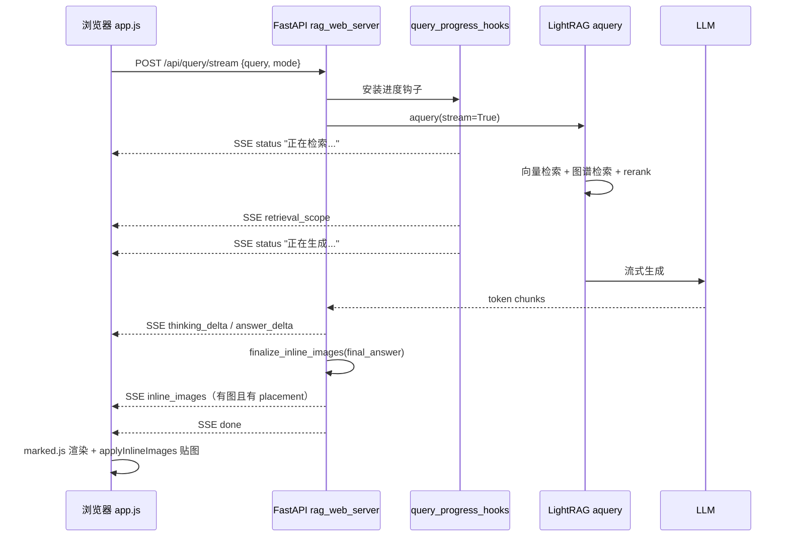

# 网页问答界面

在浏览器中使用**南兴知识库问答助手**进行**对话问答**与**上传灌库**，后端复用 [`scripts/rag_pipeline_parse_graph_chat.py`](../scripts/rag_pipeline_parse_graph_chat.py) 的 `_build_rag` / `aquery` / `_ingest_folder`。

## 安装

在仓库根目录：

```bash
uv sync --extra web --extra local-embed
```

`web` 已包含 `sentence-transformers`；`local-embed` 与 CLI 灌库/问答一致，建议一并安装。若 `.env` 使用 `EMBEDDING_BACKEND=hf` 却未装上述依赖，界面会显示「就绪：否」及安装提示。

## 启动

1. 配置根目录 **`.env`**（与命令行 pipeline 相同：LLM、Embedding、检索参数等）。
2. 指定知识库工作目录（须与当初灌库时 **`-w`** 一致），例如 `rag_storage_run`：

```bash
# PowerShell 示例
$env:RAG_WEB_WORKING_DIR = "rag_storage_run"
uv run python scripts/rag_web_server.py
```

3. 浏览器打开终端提示的地址，默认：**http://127.0.0.1:8765/**

## 环境变量（Web 专用）

| 变量 | 默认 | 说明 |
|------|------|------|
| `RAG_WEB_HOST` | `127.0.0.1` | 监听地址 |
| `RAG_WEB_PORT` | `8765` | 端口 |
| `RAG_WEB_WORKING_DIR` | `rag_storage_run` | LightRAG 工作目录（相对仓库根或绝对路径） |
| `RAG_WEB_PARSER_OUTPUT_DIR` | `output/pipeline_parse` | MinerU 解析输出目录 |
| `RAG_WEB_SKIP_MULTIMODAL` | `true` | 与 pipeline 默认一致，文本优先灌库 |

查询模式、检索 token、`MIN_RERANK_SCORE` 等仍由 **`.env` 中 LightRAG 相关变量** 控制（如 `RAG_QUERY_MODE`、`MAX_TOTAL_TOKENS`）。

## 界面功能

- **对话**：选择 RAG 模式（默认 `mix`），输入问题后通过 **SSE 流式**（`/api/query/stream`）逐字显示回答；等待阶段有动态提示（检索 / 重排 / 生成）。
- **上传灌库**：选择或拖拽 PDF/Office 等文件，调用 `/api/ingest`（解析 + 写入当前工作目录；耗时较长）。
- **侧栏状态**：显示引擎是否就绪、当前工作目录与默认查询模式。

## 前后端连接与接口说明

### 整体架构

本项目采用**同域单体服务**：前端无独立构建工具（React/Vue 等），也无跨域代理。浏览器、静态页面、API 均由同一个 FastAPI 进程提供。

```text
浏览器
  ↓ 打开 http://127.0.0.1:8765/
FastAPI (scripts/rag_web_server.py)
  ├── GET  /              → 返回 web/index.html
  ├── /static/*           → 静态资源 (app.js, styles.css, logo, marked.js…)
  └── /api/*              → JSON / SSE / 文件上传
        ↓
scripts/rag_pipeline_parse_graph_chat.py
  ├── _build_rag()        → 初始化 LightRAG 实例
  ├── _ingest_folder()    → 解析 + 灌库
  └── rag.aquery()        → 检索 + 生成回答
```

前端 [`web/static/app.js`](../web/static/app.js) 中所有请求均使用**相对路径**（如 `/api/health`），与页面同源，因此无需配置 API 基地址。

### 后端启动时做了什么

服务启动时（`lifespan`）会：

1. 读取 `.env` 与 `RAG_WEB_*` 环境变量；
2. 调用 `_build_rag()` 加载知识库（默认 `rag_storage_run`）；
3. 将 RAG 实例存入全局 `state.rag`；
4. 挂载静态目录 `/static`。

若初始化失败，`state.ready = false`，前端侧栏显示「就绪：否」，发送按钮禁用。

相关代码：[`scripts/rag_web_server.py`](../scripts/rag_web_server.py) 中 `lifespan` 与 `AppState`。

### 接口一览

| 接口 | 方法 | 前端调用位置 | 作用 |
|------|------|--------------|------|
| `/` | GET | 浏览器直接访问 | 返回 `web/index.html` |
| `/static/*` | GET | HTML 引用 | CSS/JS/logo/vendor 库 |
| `/api/health` | GET | `refreshStatus()` | 服务是否就绪、工作目录、默认查询模式 |
| `/api/query/stream` | POST | `streamQuery()` | **流式问答（主路径）** |
| `/api/query` | POST | 未使用 | 非流式问答（一次性返回） |
| `/api/ingest` | POST | `btnIngest` 点击 | 上传文件并灌库 |

### 接口在代码里怎么注册

所有 `/api/*` 接口都在 [`scripts/rag_web_server.py`](../scripts/rag_web_server.py) 里，使用 **FastAPI** 的 `@app.get` / `@app.post` 装饰器注册。可以把该文件理解成「小型 Web 服务器」：浏览器访问 URL，FastAPI 根据路径调用对应 Python 函数。

| 路径 | 装饰器 | 函数名 | 作用 |
|------|--------|--------|------|
| `/` | `@app.get("/")` | `index_page()` | 返回 `web/index.html` |
| `/api/health` | `@app.get("/api/health")` | `health()` | 返回 JSON 状态 |
| `/api/query` | `@app.post("/api/query")` | `api_query()` | 一次性返回完整答案 |
| `/api/query/stream` | `@app.post("/api/query/stream")` | `api_query_stream()` | SSE 流式问答（主路径） |
| `/api/ingest` | `@app.post("/api/ingest")` | `api_ingest()` | 接收上传文件并灌库 |

静态资源不是手写接口，而是通过挂载目录提供：

```python
app.mount("/static", StaticFiles(directory=_WEB_DIR / "static"), name="static")
```

浏览器请求 `/static/app.js` 时，FastAPI 直接从 `web/static/app.js` 读文件返回。

**全局状态 `state`：** 启动时在 `lifespan` 里创建 RAG 实例，存入 `state.rag`；各接口函数通过 `state.rag` 调用问答/灌库。`state.lock`（`asyncio.Lock`）保证同一时刻只有一个问答或灌库在执行。

**RAG 业务不在 `rag_web_server.py` 里写死**，而是通过 `_load_rpc()` 动态加载 [`rag_pipeline_parse_graph_chat.py`](../scripts/rag_pipeline_parse_graph_chat.py)：

| 函数 | 作用 |
|------|------|
| `_build_rag()` | 启动时：读 `.env`，创建 LightRAG / RAGAnything 实例 |
| `state.rag.aquery()` | 问答：检索 + 调用 LLM 生成 |
| `_ingest_folder()` | 灌库：解析 PDF 等并写入知识库 |
| `_query_extras_from_env(q)` | 从 `.env` 和机型规则拼 `user_prompt` 等额外参数 |

前端 `app.js` 里的路径字符串（如 `"/api/health"`）必须与后端装饰器里的路径**完全一致**，否则会 404。

### 1. 健康检查：`GET /api/health`

页面加载时调用一次，之后每 15 秒轮询（`setInterval(refreshStatus, 15000)`）。

**响应示例：**

```json
{
  "ready": true,
  "init_error": null,
  "working_dir": "D:\\dev\\RAGdemo\\RAG-Anything\\rag_storage_run",
  "parser_output_dir": "D:\\dev\\RAGdemo\\RAG-Anything\\output\\pipeline_parse",
  "query_mode": "mix",
  "skip_multimodal": true
}
```

前端根据 `ready` 决定是否禁用发送按钮；`init_error` 非空时在侧栏显示错误信息。

### 2. 流式问答：`POST /api/query/stream`（核心）

用户点击「发送」后的主流程：

1. 前端 `appendMessage("user", q)` 显示用户问题；
2. 创建 loading 气泡；
3. `fetch("/api/query/stream", { method: "POST", body: JSON.stringify({...}) })`；
4. 用 `ReadableStream` 逐块读取 SSE，解析 `data:` 行并更新 UI。

**请求体：**

```json
{
  "query": "高速智能封边机输送链条怎么保养？",
  "mode": "mix",
  "stream": true
}
```

对应后端 `QueryBody`：`query` 必填；`mode` 来自侧栏下拉框，缺省则用 `.env` 的 `RAG_QUERY_MODE`；`stream` 固定为 `true`。

**响应格式：** `Content-Type: text/event-stream`，每行形如：

```text
data: {"type":"status","phase":"retrieve","text":"正在检索知识库…"}

data: {"type":"retrieval_scope","active":true,"text":"...","kept_sources":[...],"removed_sources":[...]}

data: {"type":"thinking_delta","text":"..."}

data: {"type":"answer_delta","text":"根据手册..."}

data: {"type":"inline_images","images":[...],"placements":[...]}

data: {"type":"query_debug_saved","name":"..."}

data: {"type":"done","mode":"mix"}
```

**SSE 事件类型：**

| type | 含义 | 前端表现 |
|------|------|----------|
| `status` | 检索 / 重排 / 生成阶段 | 更新 loading 文案 |
| `retrieval_scope` | 文档过滤范围（机型规则） | 显示「参考 / 已排除」哪些手册 |
| `thinking_delta` | 思考过程 token | 折叠块「思考过程」 |
| `answer_delta` | 正式回答 token | Markdown 流式渲染 |
| `inline_images` | 答案内联配图（`images` + `placements`） | `applyInlineImages`：插在对应段落后 |
| `related_images` | 仅图片列表、无 placement | 答案上方参考资料图网格（兜底路径） |
| `query_debug_saved` | 开启 dump 时写入 `logs/query_dumps/` | 系统提示 + 开发面板刷新 |
| `error` | 出错 | 系统错误消息 |
| `done` | 结束 | 停止光标动画、折叠思考块 |

### 答案内联配图（inline_images）

流式 **`answer_delta` 全部结束后**、**`done` 之前**，服务端调用 `finalize_inline_images()`，若有图且有 placement 则推送 `inline_images`。

前端 [`web/static/app.js`](../web/static/app.js)（`app.js?v=20260614b` 起）处理顺序：

1. 重新 `renderMarkdown` 答案区；
2. 按 `placements[].match_start` 找对应 `<p>` / `<li>`，用 `insertFigureAfterAnchor` 插在**块级元素之后**（避免图落在段内 text 节点后被浏览器吞掉）；
3. **三层兜底**（内联失败时）：答案区末尾追加 → 「回答」上方的 `related-images` 网格。

偏移计算会剥掉 `### References`，与后端 placement 一致。改前端后需**硬刷新**（Ctrl+F5）。调试：`RAG_QUERY_DEBUG_DUMP=1` 或侧栏「开发」面板；详见 [`查询配图实现说明.md`](查询配图实现说明.md)。

**注意**：`done` 时若已成功插入图（`inlineFiguresApplied`），不再全量 `renderMarkdown`，避免覆盖已插入的 `<figure>`。

**后端内部调用链：**

1. `_query_stream_events()` 安装 [`query_progress_hooks()`](../scripts/query_progress_hooks.py)，在 LightRAG 检索/重排/生成节点注入进度事件；
2. 调用 `state.rag.aquery(q, mode=mode, stream=True, **rpc._query_extras_from_env(q))`；
3. 用 [`StreamCotParser`](../scripts/stream_cot_parser.py) 将 LLM 输出拆成 `thinking_delta` 与 `answer_delta` 两路；
4. 文档过滤与 KG 清洗由 [`query_doc_steering.py`](../scripts/query_doc_steering.py) 在 rerank 后生效，并产生 `retrieval_scope` 事件。

进度钩子通过 monkeypatch LightRAG 内部函数实现，例如：

- `_build_query_context` → `正在检索知识库…`
- `apply_rerank_if_enabled` → `正在重排序文档片段…`
- 进入生成阶段 → `正在生成回答…`

### 3. 文件灌库：`POST /api/ingest`

左侧「上传灌库」使用 `FormData` multipart 上传：

```javascript
const fd = new FormData();
pendingFiles.forEach((f) => fd.append("files", f));
await fetch("/api/ingest", { method: "POST", body: fd });
```

后端流程：

1. 将文件保存到临时目录；
2. 调用 `_ingest_folder()` 解析 PDF 等并写入知识库；
3. 返回 `{ "ok": 3, "fail": 0, "files": ["a.pdf", ...] }`。

灌库与问答共用同一个 `state.rag`，并通过 `asyncio.Lock` 串行化，避免并发冲突。

### 问答数据流（时序）



### 小结

- **连接方式**：前后端同端口，纯 `fetch` + SSE，无 WebSocket、无独立前端 dev server。
- **问答主接口**：`POST /api/query/stream`，JSON 进、SSE 出。
- **状态接口**：`GET /api/health`，轮询检查 RAG 是否就绪。
- **灌库接口**：`POST /api/ingest`，`FormData` 上传文件。
- **业务逻辑**不在前端，全在后端 pipeline + LightRAG；前端只负责展示、流式渲染和用户交互。

## 点击「发送」后的完整代码路径（逐步学习）

本节按时间顺序，从用户点击「发送」到页面显示回答，逐步说明**哪段代码在干什么**。适合不熟悉前端、想理解全链路的读者。

### 总览

```text
你点「发送」
    │
    ▼
app.js: appendMessage(用户问题) + createLoadingMessage()
    │
    ▼
app.js: fetch POST /api/query/stream  {query, mode}
    │
    ▼
rag_web_server.py: api_query_stream()
    │
    ├── 安装 query_progress_hooks（监听 LightRAG 各阶段）
    │
    └── 启动 worker → _run_aquery() → state.rag.aquery()
              │
              ▼
         LightRAG（.venv 内第三方库）
              ├── 抽关键词（LLM）
              ├── 向量 + 图谱检索
              ├── rerank + 机型文档过滤
              └── LLM 流式生成
              │
              ▼
         progress_queue ──→ SSE status / retrieval_scope
         LLM token 流   ──→ SSE thinking_delta / answer_delta
              │
              ▼
app.js: 逐条解析 SSE → 更新 loading / 思考块 / 回答 Markdown
              │
              ▼
         SSE done → 恢复发送按钮
```

### 第 0 步：服务启动时（只做一次）

运行 `uv run python scripts/rag_web_server.py` 时，FastAPI 先执行 `lifespan`，加载 RAG 引擎：

```python
# scripts/rag_web_server.py — lifespan 片段
rag, config, _logger = await rpc._build_rag(wd, pod, skip_multimodal=skip_mm)
state.rag = rag
state.config = config
state.ready = True
```

`_build_rag()`（在 `rag_pipeline_parse_graph_chat.py`）会：

- 读取 `.env`（LLM、Embedding、`TOP_K`、`MAX_TOTAL_TOKENS` 等）；
- 创建 `LightRAG` / `RAGAnything` 实例；
- 指向 `RAG_WEB_WORKING_DIR`（默认 `rag_storage_run`）知识库目录。

之后每次问答都复用同一个 `state.rag`，无需重复加载。

### 第 1 步：用户点「发送」—— 前端 `app.js`

输入框提交时触发 `composer` 的 `submit` 事件（`web/static/app.js`）：

```javascript
composer.addEventListener("submit", async (e) => {
  e.preventDefault();
  const q = queryInput.value.trim();
  appendMessage("user", q);           // 右侧显示用户问题气泡
  queryInput.value = "";              // 清空输入框
  btnSend.disabled = true;            // 禁用发送按钮
  const loading = createLoadingMessage();  // 左侧 loading「正在检索知识库…」
  await streamQuery(q, loading);      // 发起 HTTP 请求
});
```

此时页面上：右边是你的问题，左边是带三个小点的 loading 气泡。

### 第 2 步：前端发出 HTTP 请求

`streamQuery()` 向同源地址 POST JSON：

```javascript
const res = await fetch("/api/query/stream", {
  method: "POST",
  headers: { "Content-Type": "application/json" },
  body: JSON.stringify({ query, mode: queryMode.value, stream: true }),
});
```

请求体示例：

```json
{
  "query": "高速智能封边机输送链条怎么保养？",
  "mode": "mix",
  "stream": true
}
```

- `query`：用户问题；
- `mode`：侧栏「RAG模式」下拉框（mix / hybrid / local / global / naive）；
- `stream: true`：要求流式返回。

### 第 3 步：后端接收 —— `api_query_stream()`

FastAPI 根据 `@app.post("/api/query/stream")` 调用 `api_query_stream()`：

```python
# scripts/rag_web_server.py
@app.post("/api/query/stream")
async def api_query_stream(body: QueryBody):
    if not state.ready or state.rag is None:
        raise HTTPException(503, ...)
    mode = (body.mode or state.query_mode or "mix").strip()
    q = body.query.strip()
    return StreamingResponse(
        _query_stream_events(q, mode),
        media_type="text/event-stream",
        ...
    )
```

三件事：检查 RAG 是否就绪 → 取出问题与模式 → 返回 **SSE 流**（持续推送 `data: {...}`，而非一次性 JSON）。

请求体由 Pydantic 模型 `QueryBody` 校验（`query` 必填，长度 1–8000）。

### 第 4 步：后端并行两条线 —— `_query_stream_events()`

```python
async with query_progress_hooks() as progress_queue:
    async def _worker() -> None:
        result = await _run_aquery(q, mode, stream=True)
        await result_queue.put(("ok", result))

    worker = asyncio.create_task(_worker())
    # 主循环：progress_queue 与 result_queue 谁先有消息就处理谁
```

| 任务 | 职责 |
|------|------|
| **worker** | 在后台跑真正的 RAG 问答 |
| **progress_queue** | 接收进度钩子推送，转成 SSE 发给浏览器 |

`query_progress_hooks()` 在 LightRAG 内部函数上临时「打补丁」（monkeypatch），使检索/重排/生成各阶段能往队列里塞状态。

### 第 5 步：调用 LightRAG —— `_run_aquery()`

```python
async def _run_aquery(q: str, mode: str, *, stream: bool):
    rpc = _load_rpc()
    async with state.lock:
        return await state.rag.aquery(
            q,
            mode=mode,
            stream=stream,
            vlm_enhanced=False,
            **rpc._query_extras_from_env(q),
        )
```

- **`state.rag.aquery(...)`**：进入 LightRAG 库（`.venv` 内），RAG 核心入口；
- **`state.lock`**：串行化，避免问答与灌库并发写库；
- **`_query_extras_from_env(q)`**：合并 `.env` 与 [`query_doc_steering.py`](../scripts/query_doc_steering.py) 的机型提示词（`user_prompt`）、可选关键词等。

### 第 6 步：LightRAG 内部（以 `mix` 模式为例）

`aquery(mode="mix", stream=True)` 在 LightRAG 内大致顺序：

```text
1. LLM 从问题抽取关键词
      ↓
2. 检索（此时 hook → SSE "正在检索知识库…"）
   ├── 向量检索（embedding 相似 chunk）
   ├── 图谱检索（实体 / 关系）
   └── naive 检索
      ↓
3. 合并候选 + rerank（hook → "正在重排序文档片段…"）
      ↓
4. 机型文档过滤 query_doc_steering.filter_retrieved_docs_by_query
   └── hook → SSE retrieval_scope（参考 / 排除哪些手册）
      ↓
5. 拼 prompt，调用 LLM 流式生成（hook → "正在生成回答…"）
      ↓
6. 逐 token 输出（AsyncIterator）
```

进度钩子与过滤的对应关系（[`query_progress_hooks.py`](../scripts/query_progress_hooks.py)）：

| 被替换的 LightRAG 函数 | 触发事件 |
|------------------------|----------|
| `_build_query_context` / `naive_query` | `status`: 正在检索知识库… |
| `apply_rerank_if_enabled` | `status`: 正在重排序…；内部调用文档过滤 |
| `process_chunks_unified` | `status`: 正在生成回答…；可能推送 `retrieval_scope` |

LLM 与 Embedding 的具体调用由 `_build_rag()` 启动时绑定（`.env` 中 `LLM_MODEL`、DashScope 等）。

### 第 7 步：后端拆分 LLM 输出，推送 SSE

worker 拿到 LLM 的 token 流后，主循环用 [`StreamCotParser`](../scripts/stream_cot_parser.py) 区分「思考块」与「正式回答」：

```python
async for chunk in _iter_llm_chunks(payload):
    for kind, piece in cot_parser.feed(chunk):
        if kind == "thinking":
            yield _sse({"type": "thinking_delta", "text": piece})
        else:
            yield _sse({"type": "answer_delta", "text": piece})
yield _sse({"type": "done", "mode": mode})
```

进度事件并行推送：

```python
if ev.get("type") in ("status", "retrieval_scope"):
    yield _sse(ev)
```

每条 SSE 形如：`data: {"type":"...", ...}\n\n`

### 第 8 步：前端解析 SSE，更新界面

`streamQuery()` 用 `res.body.getReader()` 逐块读取，`parseSseLines()` 解析 `data:` 行，按 `type` 分支：

| SSE `type` | 前端函数 | UI 效果 |
|------------|----------|---------|
| `status` | `setLoadingStatus()` | 更新 loading 文案 |
| `retrieval_scope` | `showRetrievalScope()` | 绿色检索范围条 |
| `thinking_delta` | `appendThinkingDelta()` | 「思考过程」折叠块 |
| `answer_delta` | `appendAnswerDelta()` → `renderMarkdown()` | 回答区 Markdown 流式渲染 |
| `inline_images` | `applyInlineImages()` | 段落后插入配图；失败则末尾或顶部网格兜底 |
| `error` | 抛错 | 系统消息「错误：…」 |
| `done` | 移除 streaming 样式 | 折叠思考块，恢复发送按钮（不覆盖已贴图） |

流结束后 `btnSend.disabled = false`，焦点回到输入框。

### 阶段与文件对照表

| 阶段 | 文件 | 关键符号 |
|------|------|----------|
| 用户交互 | `web/static/app.js` | `composer` submit → `streamQuery()` |
| 注册 API | `scripts/rag_web_server.py` | `@app.post("/api/query/stream")` → `api_query_stream()` |
| 流式编排 | `scripts/rag_web_server.py` | `_query_stream_events()`、`_run_aquery()` |
| 进度 SSE | `scripts/query_progress_hooks.py` | `query_progress_hooks()` |
| 思考/回答拆分 | `scripts/stream_cot_parser.py` | `StreamCotParser` |
| 机型过滤 | `scripts/query_doc_steering.py` | `filter_retrieved_docs_by_query()`、`build_steering_user_prompt()` |
| RAG 核心 | LightRAG（`.venv`） | `aquery()` |
| 引擎初始化 | `scripts/rag_pipeline_parse_graph_chat.py` | `_build_rag()`、`_query_extras_from_env()` |

### 一句话总结

> 前端只负责「发问题 + 显示流式结果」；`rag_web_server.py` 负责「接 HTTP + 推 SSE」；检索与生成在 `state.rag.aquery()`（LightRAG）中完成；进度文案与机型过滤由 `query_progress_hooks` / `query_doc_steering` 插入。

### 与 CLI 问答的对应

Web 路径与命令行 [`rag_pipeline_parse_graph_chat.py`](../scripts/rag_pipeline_parse_graph_chat.py) 的 `--query-only` 交互模式共用同一套 `_build_rag` 和 `aquery`，区别仅在于：

- CLI：直接在终端打印文本；
- Web：FastAPI 包装成 SSE，前端 Markdown 渲染 + 进度/检索范围展示。

调试检索上下文仍建议用 CLI：完整工程中的 [`dump_query_context.py`](../scripts/dump_query_context.py)（只导出检索上下文、不调 LLM）。若当前检出没有该脚本，可用 [`rag_pipeline_parse_graph_chat.py`](../scripts/rag_pipeline_parse_graph_chat.py) 的 `--query-only` 做端到端兜底。

## API（简要）

| 方法 | 路径 | 说明 |
|------|------|------|
| GET | `/` | 静态页面 |
| GET | `/api/health` | 就绪状态与工作目录 |
| POST | `/api/query` | JSON 一次性返回 `{ thinking, answer, mode, query }` |
| POST | `/api/query/stream` | SSE：`status` / `retrieval_scope` / `thinking_delta` / `answer_delta` / `inline_images` / `related_images` / `query_debug_saved` / `done` / `error` |
| POST | `/api/ingest` | `multipart/form-data`，字段名 `files` |

## 与命令行对照

| 命令行 | Web |
|--------|-----|
| `--query-only -w ./rag_storage_run` + 交互 `Q>` | 启动服务后直接对话 |
| `--input-folder ... -w ...` | 侧栏上传灌库 |
| `dump_query_context.py`（tooling / 完整工程） | 仍用 CLI 做检索调试；缺失时用 `--query-only` |

## 文件结构

```text
web/
  index.html
  static/
    styles.css
    app.js
    images/
      nanxing-logo.png
    vendor/
      marked.min.js
      purify.min.js
docs/
  网页问答界面.md
scripts/
  rag_web_server.py
  query_progress_hooks.py
  stream_cot_parser.py
  query_doc_steering.py
```
