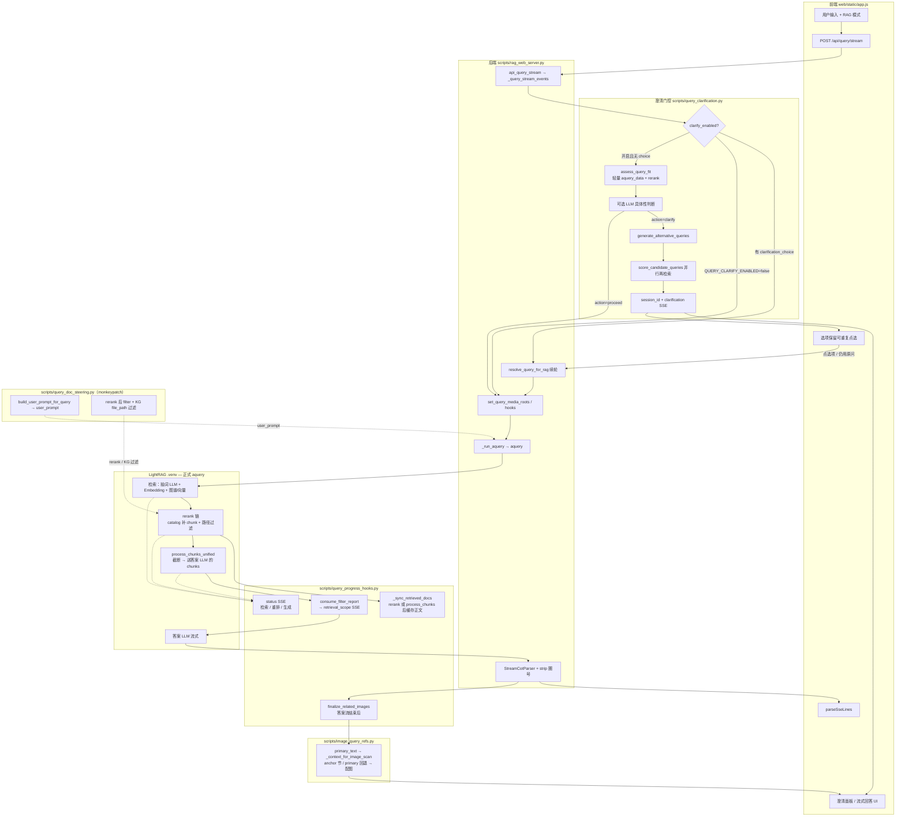
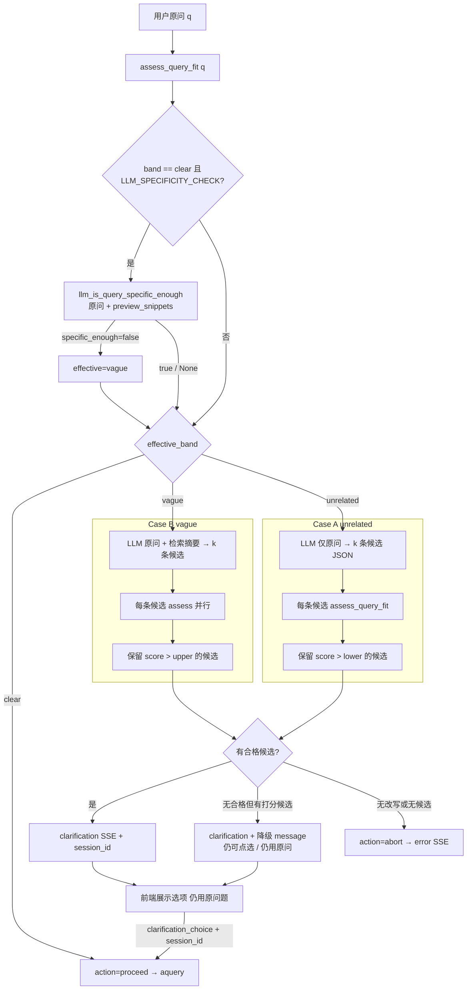
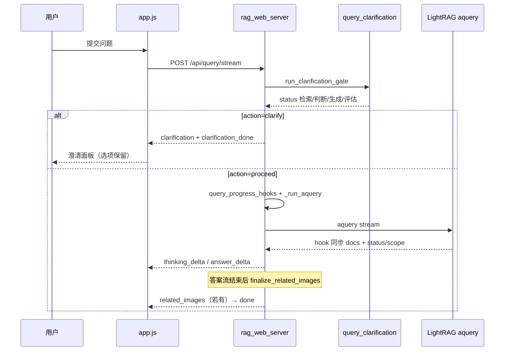
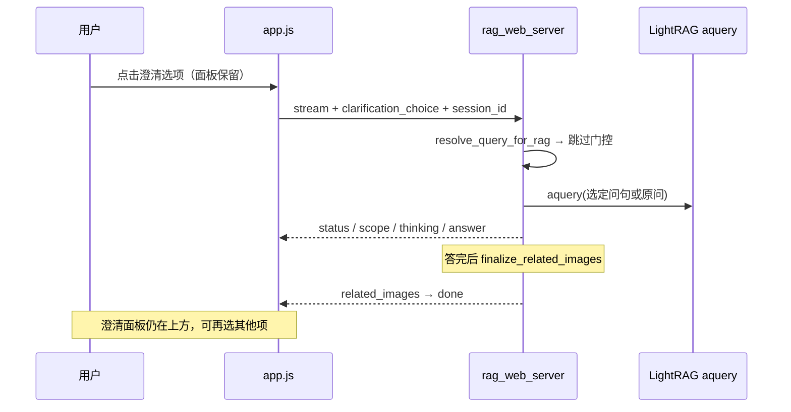
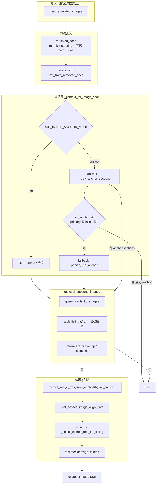
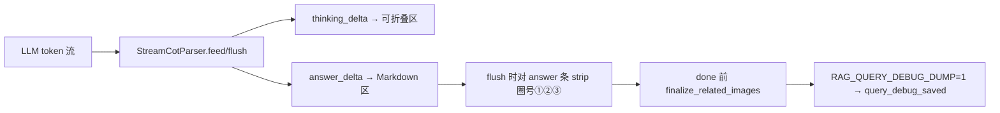
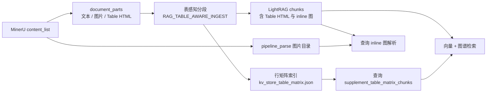

# RAG-Anything 问答全流程图

从用户提问 → **（可选）多轮澄清** → 检索 → 重排与文档过滤 → 配图 → LLM 生成 → 前端展示。

适用于 **Web 流式问答**（`POST /api/query/stream`）；CLI（`rag_pipeline_parse_graph_chat.py --query-only`）共用同一套 `aquery` 与 steering，**默认无澄清门控与 SSE 澄清 UI**（澄清逻辑在 `scripts/query_clarification.py`，由 Web 入口调用）。

详细规则见 `docs/多轮问答.txt`、`docs/多轮问答实现方案.md`。

---

## 1. 总览（端到端）



---

## 2. 多轮澄清门控

门控插在 **`aquery` 之前**，不修改 LightRAG 内部 `kg_query` / `process_chunks_unified`。澄清阶段 **不** 安装 `query_progress_hooks`， **不** 调用答案 LLM。

### 2.1 分数与 band

对 **每一条** 待评估问句（原问或候选）：

1. `lightrag.aquery_data`（门控默认 `QUERY_CLARIFY_ASSESS_MODE=naive`，较小 `top_k` / `chunk_top_k`）
2. 取 rerank 后 **`rerank_score`**，**主 score = top-3 平均**（日志另记 top-1）
3. 划分 band（阈值见 `env.example`）：

```text
score >= threshold_upper     →  clear      → 原则上直接 aquery
threshold_lower ≤ score < upper →  vague   →  Case B
score < threshold_lower      →  unrelated  →  Case A
```

默认：`threshold_lower=0.28`，`threshold_upper=0.45`。

### 2.2 门控主流程



| 环节 | 是否对话 LLM | 是否查库 |
|------|--------------|----------|
| `assess_query_fit` | 否 | 是（`aquery_data`） |
| `llm_is_query_specific_enough` | 是（可选） | 否 |
| `generate_alternative_queries` | 是 | 否 |
| `score_candidate_queries` | 否 | 是（每条候选 `assess_query_fit`） |
| 用户选定后的 `aquery` | 是（关键词 + 答案） | 是 |

### 2.3 前端澄清 UI（`app.js`）

- 收到 `clarification` → `showClarificationPanel`：展示匹配分、可选「检索摘要」、**k 个按钮**、「仍用原问题」。
- **选项持久保留**：用户点选后 **不替换** 澄清面板，在下方 **追加** 新的 loading/回答气泡；检索结束后可再点其他选项（`session_id` 复用，TTL 约 30 分钟）。
- 续轮请求体：`query`（原问）、`session_id`、`clarification_choice`（候选全文或 `"use_original"`）。

调试：`scripts/probe_query_clarify.py`；仅打分：`POST /api/query/assess`。

---

## 3. Web SSE 编排

### 3.1 首轮（可能澄清）



### 3.2 续轮（已选候选或仍用原问）



### 3.3 SSE 事件表

| `type` | 产生位置 | 前端效果 |
|--------|----------|----------|
| `status` | 门控 `on_status` 或 `query_progress_hooks` | Loading 文案 |
| `clarification` | `clarification_to_sse_payload` | 澄清面板 + 选项 |
| `clarification_done` | 门控结束（无答案流） | 结束本轮 stream |
| `gate_skip` | 门控 `proceed` 后、进入 aquery 前（`reason` 多为 band） | 前端默认不展示；续轮 **无** 此事件 |
| `retrieval_scope` | `process_chunks` hook 内 `consume_filter_report()` | 绿色「检索范围」条 |
| `query_debug_saved` | `_persist_query_debug_dump`（`RAG_QUERY_DEBUG_DUMP=1`） | 系统提示已落盘 |
| `related_images` | `finalize_related_images`（答案流结束后） | 回答下图 |
| `thinking_delta` / `answer_delta` | `StreamCotParser` | 思考/回答流式 |
| `done` | `_query_stream_events` 结束 | 恢复发送按钮 |
| `error` | 门控或查询异常 | 系统错误消息 |

澄清轮：**仅有** `status` → `clarification` → `clarification_done`，**无** `answer_delta`。

一次性 JSON：`POST /api/query` 当前 **不** 走澄清门控（仅 stream 路径集成）。

---

## 4. LightRAG 正式查询（侧栏 RAG 模式，通常 `mix`）

用户确认问句（或门控 `proceed`）后进入 `aquery`。与澄清阶段的轻量 `aquery_data` **不是同一次调用**。

Steering 在 `_build_rag()` 时 `install_query_steering_hooks()` 挂到 LightRAG；每次 Web 查询再套一层 `query_progress_hooks()`（status、正文缓存、`retrieval_scope`）。

```mermaid
flowchart TB
    subgraph In["进入 aquery"]
        E1[".env: LLM / Embedding / rerank"]
        E2["_query_extras_from_env(q)<br/>fidelity + catalog + steering → user_prompt"]
        E3["QueryParam 若带 hl/ll_keywords 可省抽词 LLM"]
    end

    subgraph Retrieve["检索 — status: 正在检索…"]
        R0["KG mix: filter_kg_search_by_query<br/>（install_kg_file_path_filter）"]
        R1["extract_keywords_only（mix）"]
        R2["Embedding + 实体/关系/向量 chunk"]
        R3["_build_query_context 合并上下文"]
    end

    subgraph Rerank["rerank 链（steering + progress 双层 patch）"]
        RR1["apply_rerank_if_enabled 原重排"]
        RR2["supplement_catalog_product_model_chunks"]
        RR3["filter_retrieved_docs_with_report<br/>暂存 FilterReport"]
        RR3b["supplement_table_matrix_chunks<br/>行矩阵 term 对齐补 table chunk"]
        RR4["progress hook: _sync_retrieved_docs_after_rerank"]
    end

    subgraph Chunks["process_chunks_unified 链"]
        CH1["catalog 查询临时降低 min_rerank_score"]
        CH1b["detect_table_filter_signal<br/>→ table listing user_prompt 注入"]
        CH2["截断 → 送入答案 LLM 的 chunk 列表"]
        CH3["_sync_chunks_for_images<br/>（mix 常在此更新配图缓存）"]
        CH4["consume_filter_report → retrieval_scope SSE"]
    end

    subgraph Answer["生成 — status: 正在生成…"]
        A1["答案 LLM stream"]
        A2["StreamCotParser → thinking/answer_delta"]
    end

    subgraph Post["rag_web_server 流结束"]
        F1["finalize_related_images"]
        F2["related_images SSE + done"]
        F3["可选 query_debug_saved"]
    end

    In --> Retrieve --> Rerank --> Chunks --> Answer --> Post
```



**模型参与（仅正式 `aquery`）**

| 阶段 | 模型 |
|------|------|
| 抽关键词 | 对话 LLM（`mix`；可被 env 固定关键词替代） |
| 向量检索 | Embedding |
| 图谱 / chunk 检索 | 无生成模型 |
| rerank | Rerank 交叉编码（可关） |
| steering / catalog 补 chunk | 规则 + `query_steering_profiles.json` |
| 写答案 | 对话 LLM |

**Steering**：`config/query_steering_profiles.json`（或 `RAG_QUERY_STEERING_PROFILES`）

- **生成前**：`build_user_prompt_for_query` → `user_prompt`（忠实度 + 目录列举 + 机型提示）
- **重排后**：`deny_path_substrings` 按 `file_path` 排除无关手册；报告经 `consume_filter_report` 推 `retrieval_scope`
- **mix KG**：`_apply_token_truncation` 前按 profile 过滤实体/关系 `file_path`

---

## 5. 配图子流程（与 LLM 答案同源正文）

### 5.1 时机与入口（易混点）

| 名称 | 何时执行 | 做什么 |
|------|----------|--------|
| `_sync_retrieved_docs_after_rerank` | rerank / `process_chunks_unified` **hook 内** | 把 rerank+steering 后的 `retrieved_docs` 写入 ContextVar；调用 `text_from_retrieved_docs` 得到 **`primary_text`** 并缓存。**不发 SSE、不配图**。 |
| `finalize_related_images` | **`rag_web_server` 在答案 LLM 流结束后**（`answer_delta` 完毕、`done` 之前） | 从 snapshot 读出 docs / `primary_text`，走 `resolve_query_images` → `images_for_api`，再 `yield related_images`。 |

> **旧版 `_emit_related_images` / `focus_text_for_images` 路径已废弃**。现网：**先同步 `primary_text` → 答完再 finalize**；扫描范围由 **`RAG_IMAGE_ANCHOR_MODE`** 控制（默认 Web/compare 为 `answer`）。

### 5.2 数据流（`primary_text` → anchor 扫描 → inline 图）

配图与 LLM 答案看 **同一批** rerank+steering 后 chunk（含行矩阵补入的 table chunk 若已进 top 列表，但 table 题本身通常 `expect_images=false`）。

1. **`primary_text`**：`text_from_retrieved_docs(retrieved_docs)` 拼接的全量检索正文；用于门控、`listing_source_text`、`source_hints`。
2. **`figure_context`**：`_context_for_image_scan(query, primary_text)` 裁出的扫描正文：
   - `RAG_IMAGE_ANCHOR_MODE=off` → 整段 `primary_text`
   - `answer` → 按 top 答案行 / 同节 chunk 取 anchor sections；**若 `no_anchor` 但 primary 含 inline `[图片]`，回退整段 primary**（`fallback: primary_no_anchor`，列举题如 Q11）
3. **收集 / 对齐 / 打分**：在 `figure_context` 上解析 inline `[图片]`（灌库 Route A 已写入 chunk）；列举题走 `_select_scored_refs_for_listing`（每 listing target 一张图）。



配图原则：parser 字段（caption/footnote/bbox）+ term overlap / 对称对齐；**不写**问句领域词表（见 `.cursor/rules/rag-image-matching.mdc`）。调试：`RAG_QUERY_DEBUG_DUMP=1` → `logs/query_dumps/`。

---

## 6. 答案后处理与调试



圈号剥离在 `rag_web_server` 的 `strip_manual_circled_step_markers`，**仅作用于 answer 通道**（思考区不 strip）。前端 `renderMarkdown` + `DOMPurify` 在 `app.js` 流式结束时渲染。

---

## 7. 关键文件对照

| 环节 | 文件 | 关键符号 |
|------|------|----------|
| 澄清门控 | `scripts/query_clarification.py` | `run_clarification_gate`, `assess_query_fit`, `generate_alternative_queries` |
| 澄清调试 | `scripts/probe_query_clarify.py` | CLI 打印 band/候选 |
| 用户交互 | `web/static/app.js` | `showClarificationPanel`, `resumeClarifiedQuery`, `streamQuery` |
| HTTP / SSE | `scripts/rag_web_server.py` | `_query_stream_events`, `api_query_assess`, `QueryBody.session_id` |
| 进度与配图 hook | `scripts/query_progress_hooks.py` | `_sync_retrieved_docs_after_rerank`, `finalize_related_images` |
| 机型/手册 | `scripts/query_doc_steering.py` | `filter_retrieved_docs_with_report`, `consume_filter_report`, `install_query_steering_hooks` |
| 表格补检索 | `raganything/table_matrix.py` + `query_doc_steering.py` | `persist_table_matrix_after_ingest`, `supplement_table_matrix_chunks` |
| 配图算法 | `scripts/image_query_refs.py` | `text_from_retrieved_docs`, `_context_for_image_scan`, `images_for_api` |
| CoT 拆分 | `scripts/stream_cot_parser.py` | `StreamCotParser` |
| env 注入 | `scripts/rag_pipeline_parse_graph_chat.py` | `_query_extras_from_env` |
| RAG 核心 | LightRAG（`.venv`） | `aquery`, `kg_query`, `extract_keywords_only` |
| 批测配图/检索 | `scripts/compare_query_tuning.py` | 对照 `docs/测试问题.txt` |
| 仅检索 | `scripts/dump_query_context.py` | `aquery_data` |

---

## 8. 与灌库的关系

问答不重复解析 PDF；依赖已灌库数据：



要点：

- **表 chunk**：每个 `[Table]` 块独立分段；超大表按 `<tr>` 切分且每段保留表头（见 `raganything/utils.py`）。
- **行矩阵**：灌库结束时解析 `headers + rows` 写入 `kv_store_table_matrix.json`，并回链 `chunk_ids`；查询侧 term 对齐补 table chunk（`RAG_TABLE_MATRIX_QUERY_BOOST`）。
- **同名 PDF 重灌**：CLI/Web 上传会先 `adelete` 同文件名的旧 doc 及对应 matrix 行，避免重复索引。
- **配图媒体**：`parser_output_dir` 下图片 + 灌库写入 chunk 的 `[图片]` 块；查询不再扫 content_list 补图（legacy 已禁用）。

Web 启动 `_build_rag()` 加载 `working_dir`；`state.parser_output_dir` 为 `media_roots`。

---

## 9. 测试用例提示（澄清 band）

| band | 示例问句（当前库实测参考） |
|------|---------------------------|
| **A unrelated** | 加什么油、油要不要加（score≈0） |
| **B vague** | 日常维护要注意什么、残胶怎么弄、多久换一次（0.28～0.45，少 chunk） |
| **clear（高分）** | 怎么保养、咋清理残胶（广检索，常需 `LLM_SPECIFICITY_CHECK` 才澄清） |
| **clear 直接答** | `docs/测试问题.txt` 注油泵等具体问法 |

---

## 10. 一句话记忆

> **Web 发问** → **（可选）澄清门控** → **正式 `aquery`**：抽词 → 检索 → rerank → **steering 滤手册** → **行矩阵补 table chunk** → hook **缓存** `primary_text` → 答案 LLM 流式 → **答完后** `finalize_related_images`：anchor 扫描（或 `primary_no_anchor` 回退）→ inline 图对齐/列举选题 → `related_images` SSE；配图与答案同源 **rerank+steering 后的 chunk**。
