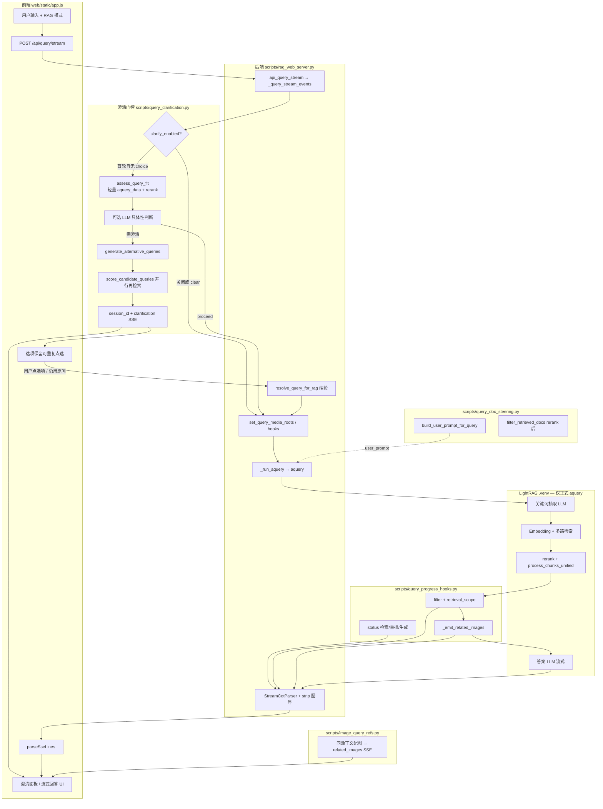
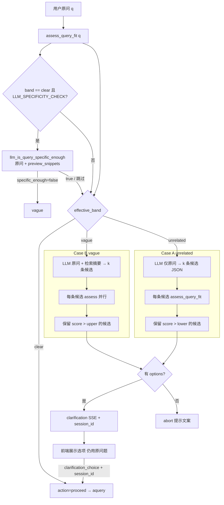
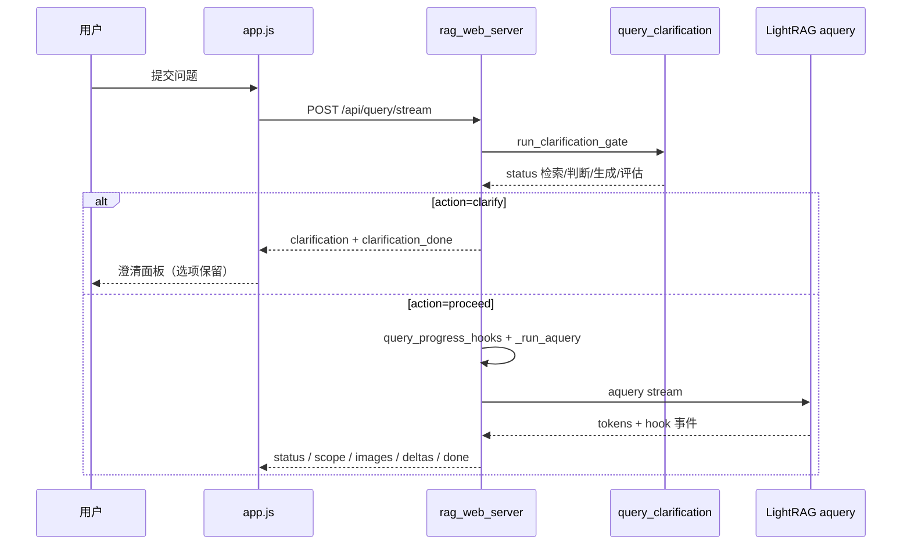
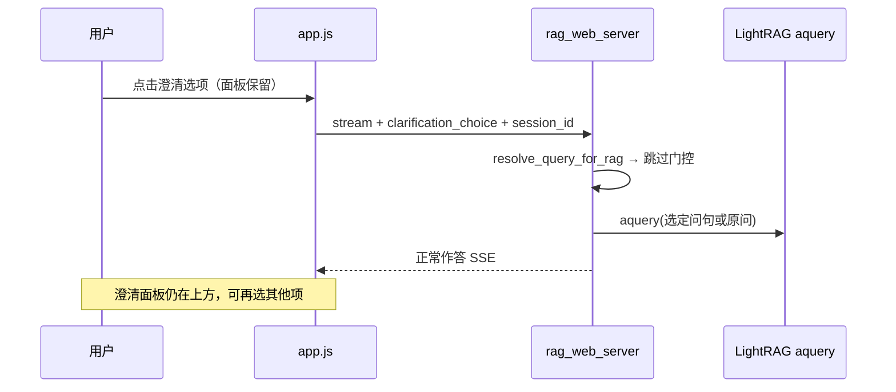
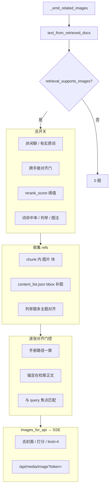
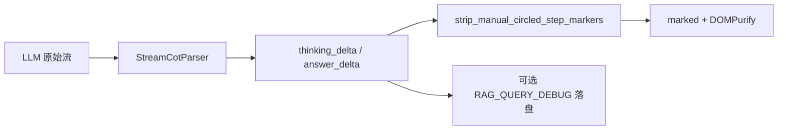

# RAG-Anything 问答全流程图

从用户提问 → **（可选）多轮澄清** → 检索 → 重排与文档过滤 → 配图 → LLM 生成 → 前端展示。

适用于 **Web 流式问答**（`POST /api/query/stream`）；CLI（`rag_pipeline_parse_graph_chat.py --query-only`）共用同一套 `aquery` 与 steering，**默认无澄清门控与 SSE 澄清 UI**（澄清逻辑在 `scripts/query_clarification.py`，由 Web 入口调用）。

详细规则见 `docs/多轮问答.txt`、`docs/多轮问答实现方案.md`。

---

## 1. 总览（端到端）



---

## 2. 多轮澄清门控

门控插在 **`aquery` 之前**，不修改 LightRAG 内部 `kg_query` / `process_chunks_unified`。澄清阶段 **不** 安装 `query_progress_hooks`， **不** 调用答案 LLM。

### 2.1 分数与 band

对 **每一条** 待评估问句（原问或候选）：

1. `lightrag.aquery_data`（门控默认 `QUERY_CLARIFY_ASSESS_MODE=naive`，较小 `top_k` / `chunk_top_k`）
2. 取 rerank 后 **`rerank_score`**，**主 score = top-3 平均**（日志另记 top-1）
3. 划分 band（阈值见 `env.example`）：

```text
score >= threshold_upper     →  clear      → 原则上直接 aquery
threshold_lower ≤ score < upper →  vague   →  Case B
score < threshold_lower      →  unrelated  →  Case A
```

默认：`threshold_lower=0.28`，`threshold_upper=0.45`。

### 2.2 门控主流程



| 环节 | 是否对话 LLM | 是否查库 |
|------|--------------|----------|
| `assess_query_fit` | 否 | 是（`aquery_data`） |
| `llm_is_query_specific_enough` | 是（可选） | 否 |
| `generate_alternative_queries` | 是 | 否 |
| `score_candidate_queries` | 否 | 是（每条候选 `assess_query_fit`） |
| 用户选定后的 `aquery` | 是（关键词 + 答案） | 是 |

### 2.3 前端澄清 UI（`app.js`）

- 收到 `clarification` → `showClarificationPanel`：展示匹配分、可选「检索摘要」、**k 个按钮**、「仍用原问题」。
- **选项持久保留**：用户点选后 **不替换** 澄清面板，在下方 **追加** 新的 loading/回答气泡；检索结束后可再点其他选项（`session_id` 复用，TTL 约 30 分钟）。
- 续轮请求体：`query`（原问）、`session_id`、`clarification_choice`（候选全文或 `"use_original"`）。

调试：`scripts/probe_query_clarify.py`；仅打分：`POST /api/query/assess`。

---

## 3. Web SSE 编排

### 3.1 首轮（可能澄清）



### 3.2 续轮（已选候选或仍用原问）



### 3.3 SSE 事件表

| `type` | 产生位置 | 前端效果 |
|--------|----------|----------|
| `status` | 门控 `on_status` 或 `query_progress_hooks` | Loading 文案 |
| `clarification` | `clarification_to_sse_payload` | 澄清面板 + 选项 |
| `clarification_done` | 门控结束（无答案流） | 结束本轮 stream |
| `gate_skip` | 门控 `proceed`（调试用） | 可选展示跳过原因/分数 |
| `retrieval_scope` | `query_doc_steering` | 绿色「检索范围」条 |
| `related_images` | `_emit_related_images` | 回答下图 |
| `thinking_delta` / `answer_delta` | `StreamCotParser` | 思考/回答流式 |
| `done` | `_query_stream_events` 结束 | 恢复发送按钮 |
| `error` | 门控或查询异常 | 系统错误消息 |

澄清轮：**仅有** `status` → `clarification` → `clarification_done`，**无** `answer_delta`。

一次性 JSON：`POST /api/query` 当前 **不** 走澄清门控（仅 stream 路径集成）。

---

## 4. LightRAG 正式查询（`mix`）

用户确认问句（或门控 `proceed`）后进入 `aquery`。与澄清阶段的轻量 `aquery_data` **不是同一次调用**。

```mermaid
flowchart LR
    subgraph In["进入 aquery"]
        E1[".env: LLM / Embedding / rerank"]
        E2["_query_extras_from_env(q)<br/>user_prompt ← steering"]
        E3["可选 hl_keywords / ll_keywords 跳过抽词 LLM"]
    end

    subgraph Retrieve["检索 — hook 正在检索…"]
        R1["LLM extract_keywords_only"]
        R2["Embedding 批量: 原问 / hl / ll"]
        R3["local 实体 + global 关系 + mix 向量 chunk"]
        R4["_build_query_context"]
    end

    subgraph Rerank["重排 — hook 正在重排序…"]
        RR1["apply_rerank_if_enabled"]
        RR2["catalog 型号补 chunk"]
        RR3["filter_retrieved_docs_by_query"]
        RR4["_emit_related_images"]
    end

    subgraph Gen["生成 — hook 正在生成…"]
        G1["process_chunks_unified 截断"]
        G2["答案 LLM stream"]
        G3["retrieval_scope SSE"]
    end

    In --> R1 --> R2 --> R3 --> R4 --> RR1 --> RR2 --> RR3 --> RR4 --> G1 --> G2 --> G3
```



**模型参与（仅正式 `aquery`）**

| 阶段 | 模型 |
|------|------|
| 抽关键词 | 对话 LLM |
| 向量检索 | Embedding |
| 图谱 / chunk 检索 | 无生成模型 |
| rerank | Rerank 交叉编码（可关） |
| steering 过滤 | 规则 + profile 配置 |
| 写答案 | 对话 LLM |

**Steering**：`config/query_steering_profiles.json`（或 `RAG_QUERY_STEERING_PROFILES`）

- **生成前**：`build_user_prompt_for_query` → `user_prompt`
- **重排后**：`active_deny_substrings` 按路径排除无关手册

---

## 5. 配图子流程（与 LLM 答案同源正文）

配图**只**使用 rerank + steering 之后的 chunk 正文：先 `text_from_retrieved_docs`，再 `focus_text_for_images`，**仅在 focus 正文**上解析/补图/对齐。



配图原则：用检索正文与对齐规则，**不写**问句领域词表硬编码（见 `docs/版本改动记录.md`）。

---

## 6. 答案后处理与调试



---

## 7. 关键文件对照

| 环节 | 文件 | 关键符号 |
|------|------|----------|
| 澄清门控 | `scripts/query_clarification.py` | `run_clarification_gate`, `assess_query_fit`, `generate_alternative_queries` |
| 澄清调试 | `scripts/probe_query_clarify.py` | CLI 打印 band/候选 |
| 用户交互 | `web/static/app.js` | `showClarificationPanel`, `resumeClarifiedQuery`, `streamQuery` |
| HTTP / SSE | `scripts/rag_web_server.py` | `_query_stream_events`, `api_query_assess`, `QueryBody.session_id` |
| 进度与配图 | `scripts/query_progress_hooks.py` | `query_progress_hooks`, `_emit_related_images` |
| 机型/手册 | `scripts/query_doc_steering.py` | `filter_retrieved_docs_by_query`, `build_user_prompt_for_query` |
| 配图 | `scripts/image_query_refs.py` | `images_for_api`, `retrieval_supports_images` |
| CoT 拆分 | `scripts/stream_cot_parser.py` | `StreamCotParser` |
| env 注入 | `scripts/rag_pipeline_parse_graph_chat.py` | `_query_extras_from_env` |
| RAG 核心 | LightRAG（`.venv`） | `aquery`, `kg_query`, `extract_keywords_only` |
| 批测配图 | `scripts/test_query_images_batch.py` | 对照 `docs/测试问题` |
| 仅检索 | `scripts/dump_query_context.py` | `aquery_data` |

---

## 8. 与灌库的关系

问答不重复解析 PDF；依赖已灌库数据：

```text
灌库: MinerU 解析 → insert_content_list → LightRAG 图+向量 (rag_storage)
配图媒体: parser_output_dir 图片 + *_content_list.json
```

Web 启动 `_build_rag()` 加载 `working_dir`；`state.parser_output_dir` 为 `media_roots`。

---

## 9. 测试用例提示（澄清 band）

| band | 示例问句（当前库实测参考） |
|------|---------------------------|
| **A unrelated** | 加什么油、油要不要加（score≈0） |
| **B vague** | 日常维护要注意什么、残胶怎么弄、多久换一次（0.28～0.45，少 chunk） |
| **clear（高分）** | 怎么保养、咋清理残胶（广检索，常需 `LLM_SPECIFICITY_CHECK` 才澄清） |
| **clear 直接答** | `docs/测试问题` 注油泵等具体问法 |

---

## 10. 一句话记忆

> **Web 发问** → **（可选）澄清门控**：轻量检索打分 → LLM 改写候选 → 再检索验证 → **面板选项可反复点** → **正式 `aquery`**：抽词 LLM → Embedding 检索 → rerank → **steering 滤手册** → **同源正文配图** → 答案 LLM → CoT 拆流；配图与答案都只看 **rerank+steering 后的 chunk**。
